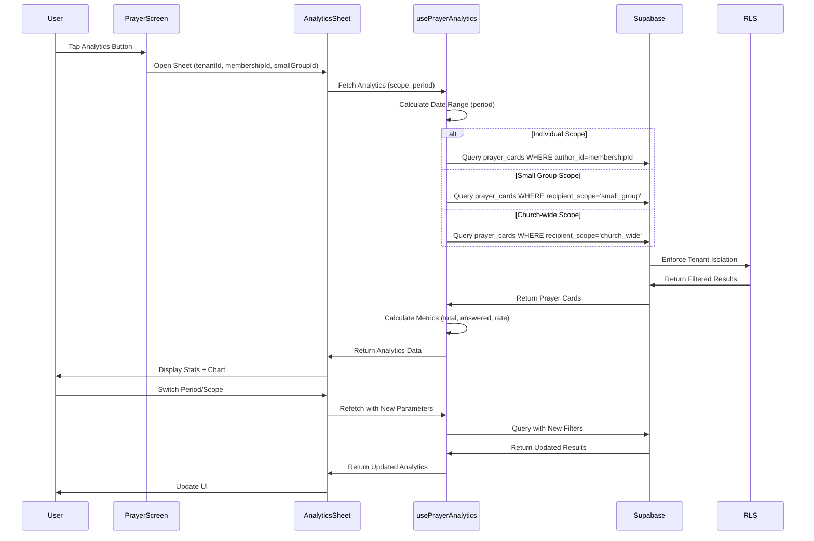

# Prayer Analytics SDD Specification

> **Last Updated:** 2025-01-05
> **Status:** Implemented (90% complete - documentation, test hardening, and optional enhancements)
> **Figma Reference:** https://www.figma.com/design/6gW1h8DfD1WYH29AmJqaeW/Gagyo?node-id=354-39531

---

## 1. Overview

**Objective:** Provide prayer statistics for individual, small group, and church-wide scopes across configurable time periods.

**Current State:** The prayer analytics feature is 90% complete with the `usePrayerAnalytics` hook, `PrayerAnalyticsSheet` component, database schema, and integration with the prayer screen fully functional. Unit tests and E2E tests exist with comprehensive coverage. Translation keys are present in both English and Korean.

**Remaining Work:**
1. SDD specification documentation (this document)
2. Charting library evaluation (optional enhancement)
3. Integration tests for analytics RLS enforcement
4. Verification of all test scenarios against Figma designs

---

## 2. Domain Concepts

### 2.1 Analytics Scope

| Scope | Description | Visibility Rules |
|-------|-------------|------------------|
| **Individual** | User's own authored prayers | User can only see prayers they authored (`author_id = membershipId`) |
| **Small Group** | Prayers addressed to user's small group | User can see prayers with `recipient_scope='small_group'` and RLS handles small group membership |
| **Church-wide** | All church-wide prayers | User can see all prayers with `recipient_scope='church_wide'` within their tenant |

### 2.2 Time Periods

| Period | Duration | Date Range Calculation |
|--------|----------|------------------------|
| **Weekly** | Last 7 days | `now - 7 days` to `now` |
| **Monthly** | Last 30 days | `now - 30 days` to `now` |
| **Quarterly** | Last 90 days | `now - 90 days` to `now` |
| **Semi-annual** | Last 6 months | `now - 6 months` to `now` |
| **Annual** | Last 12 months | `now - 12 months` to `now` |

**Note:** Date ranges are calculated as ISO strings and use `gte`/`lte` filters on `created_at` timestamp.

### 2.3 Metrics

| Metric | Type | Calculation Formula |
|--------|------|---------------------|
| **Total Prayers** | Count | `prayerCards.length` |
| **Answered Prayers** | Count | `prayerCards.filter(p => p.answered).length` |
| **Answer Rate** | Percentage | `totalPrayers > 0 ? Math.round((answeredPrayers / totalPrayers) * 100 * 10) / 10 : 0` |

**Edge Cases:**
- Zero prayers: `answerRate = 0` (not NaN or undefined)
- All answered: `answerRate = 100.0`
- None answered: `answerRate = 0.0`
- Rounding: 1 decimal place (e.g., 66.7%)

---

## 3. UI Components

### 3.1 Component Hierarchy

```
PrayerAnalyticsSheet (Bottom Sheet)
├── SheetOverlay (Pressable backdrop)
├── SheetContent (Stack)
│   ├── HandleBar (Drag indicator)
│   ├── Header (YStack)
│   │   ├── Title + Close Button
│   │   ├── Scope Tabs (XStack)
│   │   │   ├── TabButton: My Statistics
│   │   │   ├── TabButton: Small Group Statistics
│   │   │   └── TabButton: Church-wide Statistics
│   │   └── Period Selector (ScrollView)
│   │       ├── PeriodButton: Weekly
│   │       ├── PeriodButton: Monthly
│   │       ├── PeriodButton: Quarterly
│   │       ├── PeriodButton: Semi-annual
│   │       └── PeriodButton: Annual
│   └── Content (ScrollView)
│       ├── Loading State (ActivityIndicator)
│       ├── Error State
│       └── Analytics Content (YStack)
│           ├── StatCard: Total Prayers
│           ├── StatCard: Answered Prayers
│           ├── StatCard: Answer Rate
│           └── SimpleBarChart
│               ├── Bar: Total (gray background)
│               ├── Bar: Answered (green, proportional to rate)
│               └── Bar: Unanswered (yellow, proportional to 100-rate)
```

### 3.2 Component Props

```typescript
export interface PrayerAnalyticsSheetProps {
  tenantId: string;              // The tenant ID for analytics
  membershipId: string;          // The current user's membership ID
  smallGroupId: string | null;   // The current user's small group ID (optional)
  onClose: () => void;           // Callback when sheet is closed
  visible: boolean;              // Whether the sheet is visible
}
```

### 3.3 Test IDs for E2E Testing

| Element | Test ID |
|---------|---------|
| Sheet overlay | `analytics-sheet-overlay` |
| Sheet content | `analytics-sheet-content` |
| Analytics title | `analytics-title` |
| Close button | `close-analytics-button` |
| My Stats tab | `tab-my-stats` |
| Group Stats tab | `tab-group-stats` |
| Church Stats tab | `tab-church-stats` |
| Period buttons | `period-{weekly|monthly|...}` |
| Loading state | `analytics-loading` |
| Error state | `analytics-error` |
| Total stat | `stat-total` |
| Answered stat | `stat-answered` |
| Rate stat | `stat-rate` |
| Answered bar | `bar-answered` |
| Unanswered bar | `bar-unanswered` |
| Empty state | `analytics-empty` |

---

## 4. Data Layer

### 4.1 Database Schema

**Table: `prayer_cards`**

| Column | Type | Description |
|--------|------|-------------|
| `id` | UUID | Primary key |
| `tenant_id` | UUID | Foreign key to tenants (RLS enforced) |
| `author_id` | UUID | Foreign key to memberships (creator) |
| `recipient_scope` | enum | 'individual' \| 'small_group' \| 'church_wide' |
| `answered` | boolean | Whether prayer is marked as answered |
| `answered_at` | timestamp | When prayer was answered |
| `created_at` | timestamp | When prayer was created |
| `content` | text | Prayer content |
| `title` | text | Prayer title |

**RLS Policies:**
- `tenant_id` filtering is enforced at the database level
- Individual scope: `author_id = current_membership_id`
- Small group scope: RLS checks membership in `small_groups` table
- Church-wide scope: All tenant members can query

### 4.2 Query Patterns

#### Individual Scope

```typescript
supabase
  .from('prayer_cards')
  .select('id, answered, created_at')
  .eq('tenant_id', tenantId)
  .eq('author_id', membershipId)
  .gte('created_at', startDate)
  .lte('created_at', endDate)
```

#### Small Group Scope

```typescript
supabase
  .from('prayer_cards')
  .select('id, answered, created_at')
  .eq('tenant_id', tenantId)
  .eq('recipient_scope', 'small_group')
  .gte('created_at', startDate)
  .lte('created_at', endDate)
// RLS handles small group membership filtering
```

#### Church-wide Scope

```typescript
supabase
  .from('prayer_cards')
  .select('id, answered, created_at')
  .eq('tenant_id', tenantId)
  .eq('recipient_scope', 'church_wide')
  .gte('created_at', startDate)
  .lte('created_at', endDate)
```

### 4.3 Hook Interface

```typescript
export function usePrayerAnalytics(
  tenantId: string | null,
  scope: AnalyticsScope = 'church_wide',
  scopeId: string | null = null,
  period: AnalyticsPeriod = 'monthly'
): PrayerAnalyticsState

interface PrayerAnalyticsState {
  analytics: PrayerAnalytics | null;
  loading: boolean;
  error: Error | null;
  refetch: () => Promise<void>;
}

interface PrayerAnalytics {
  totalPrayers: number;
  answeredPrayers: number;
  answerRate: number;
  period: AnalyticsPeriod;
  scope: AnalyticsScope;
}
```

---

## 5. Internationalization

### 5.1 Translation Keys

| Key | English | Korean | Usage |
|-----|---------|--------|-------|
| `prayer.analytics_title` | Prayer Analytics | 기도 통계 | Sheet header |
| `prayer.my_statistics` | My Statistics | 내 통계 | Individual scope tab |
| `prayer.small_group_statistics` | Small Group Statistics | 소그룹 통계 | Small group scope tab |
| `prayer.church_wide_statistics` | Church-wide Statistics | 교회 전체 통계 | Church-wide scope tab |
| `prayer.total_prayers` | Total Prayers | 총 기도 | Stat card label |
| `prayer.answered_prayers` | Answered Prayers | 응답된 기도 | Stat card label |
| `prayer.answered_rate` | Answer Rate | 응답률 | Stat card label |
| `prayer.weekly` | Weekly | 주간 | Period button |
| `prayer.monthly` | Monthly | 월간 | Period button |
| `prayer.quarterly` | Quarterly | 분기 | Period button |
| `prayer.semi_annual` | Semi-annual | 반기 | Period button |
| `prayer.annual` | Annual | 연간 | Period button |
| `prayer.total` | Total | 전체 | Chart label |
| `prayer.answered` | Answered | 응답됨 | Chart label |
| `prayer.unanswered` | Unanswered | 기도 중 | Chart label |
| `prayer.no_prayers` | No prayer cards yet | 기도 카드가 없습니다 | Empty state |
| `prayer.start_praying` | Start by creating a prayer card | 기도 카드를 작성해 보세요 | Empty state |

---

## 6. Testing Requirements

### 6.1 Unit Tests

**Target:** `src/features/prayer/hooks/__tests__/usePrayerAnalytics.test.ts`

**Coverage Requirements:**
- Analytics calculations (total, answered, rate)
- Date range logic for all five periods
- Edge cases:
  - Zero prayers → answer rate = 0 (not NaN)
  - All prayers answered → answer rate = 100.0
  - No prayers answered → answer rate = 0.0
  - Rounding behavior (1 decimal place)
- Loading state transitions
- Error handling (network failures, invalid tenant ID)
- `refetch` function behavior

**Target Coverage:** ≥90% for analytics hooks

### 6.2 Integration Tests

**Target:** `__tests__/integration/prayer-analytics-rls.test.ts`

**Coverage Requirements:**
- Individual scope: User can query own authored prayers, cannot see others
- Small group scope: User can query prayers for their small group only
- Church-wide scope: All tenant members can query, cross-tenant blocked
- Date range filtering: All five periods with boundary edge cases
- Tenant isolation: Cross-tenant queries return empty results

**Tools:** Jest, Supabase client, `supabase` MCP

### 6.3 E2E Tests

**Target:** `e2e/prayer.test.ts` (Prayer Analytics section)

**Coverage Requirements:**
- Opening analytics sheet from prayer screen
- Switching between three scope tabs
- Switching between five period buttons
- Displaying stat cards with correct values
- Displaying bar chart visualization
- Empty state when no prayers exist
- Closing analytics sheet
- i18n: UI in both English and Korean

**Tools:** Detox, `rn-debugger` MCP, `ios-simulator` MCP

**Figma Reference:** https://www.figma.com/design/6gW1h8DfD1WYH29AmJqaeW/Gagyo?node-id=354-39531

---

## 7. Implementation Notes

### 7.1 Charting Decision

**Current Implementation:** Custom bar chart using Tamagui `Stack` components

**Rationale:**
- Bundle size efficiency (no additional dependencies)
- Full control over styling and theming
- Tamagui integration out of the box
- Simplicity for the three-bar visualization needed

**Future Enhancement:** If more complex visualizations are needed, evaluate:
- `react-native-chart-kit` - Lightweight, Expo-compatible
- `victory-native` - Feature-rich, larger bundle
- `react-native-svg-charts` - Flexible, declarative

### 7.2 Key Gotchas

1. **Answer Rate Calculation:** Must handle zero-prayer case explicitly to avoid NaN
   ```typescript
   answerRate = totalPrayers > 0 ? (answeredPrayers / totalPrayers) * 100 : 0
   ```

2. **Small Group Scope:** Uses `recipient_scope='small_group'` filter, RLS handles membership check

3. **Church-wide Scope:** Uses `recipient_scope='church_wide'`, not a separate table

4. **Date Range Boundary:** Use ISO strings for consistent timezone handling

5. **Hook Dependencies:** `usePrayerAnalytics` auto-refetches when `tenantId`, `scope`, `scopeId`, or `period` changes

---

## 8. Exit Criteria

- [x] SDD specification document created
- [x] All translation keys verified and complete
- [x] Charting library decision documented (custom bar chart retained)
- [ ] Integration tests for analytics RLS enforcement pass in CI
- [ ] Unit test coverage for analytics hooks ≥90%
- [ ] E2E tests cover all analytics scenarios from Figma
- [ ] SKILL.md updated with analytics implementation context
- [ ] All tests pass in CI pipeline: `bun run ci:coverage`

---

## 9. Data Flow Diagram



---

## 10. Related Files

### Source Files
- `src/features/prayer/hooks/usePrayerAnalytics.ts` - Analytics hook
- `src/features/prayer/components/PrayerAnalyticsSheet.tsx` - Bottom sheet component
- `src/features/prayer/screens/PrayerScreen.tsx` - Integration point

### Translation Files
- `locales/en/prayer.json` - English translations
- `locales/ko/prayer.json` - Korean translations

### Test Files
- `src/features/prayer/hooks/__tests__/usePrayerAnalytics.test.ts` - Unit tests
- `__tests__/integration/prayer-analytics-rls.test.ts` - Integration tests (to be created)
- `e2e/prayer.test.ts` - E2E tests (analytics section)

### Documentation
- `claude_docs/01_domain_glossary.md` - Domain ontology
- `claude_docs/02_code_conventions.md` - Code standards
- `claude_docs/04_multi_tenant_model.md` - Tenant isolation
- `skills/SKILL.md` - Implementation notes

---

## 11. References

- Figma Design: https://www.figma.com/design/6gW1h8DfD1WYH29AmJqaeW/Gagyo?node-id=354-39531
- Prayer Cards SDD: `claude_docs/18_prayer_cards.md`
- Supabase RLS Documentation: https://supabase.com/docs/guides/auth/row-level-security
