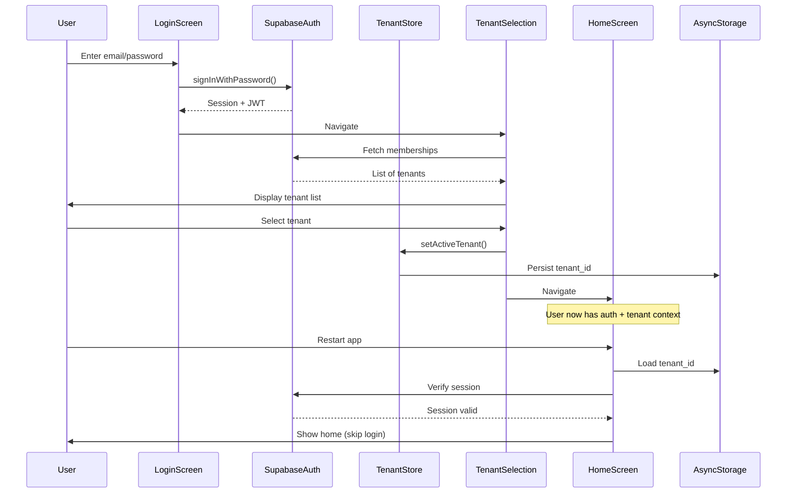

I have created the following plan after thorough exploration and analysis of the codebase. Follow the below plan verbatim. Trust the files and references. Do not re-verify what's written in the plan. Explore only when absolutely necessary. First implement all the proposed file changes and then I'll review all the changes together at the end.

## Observations

The codebase has a solid foundation with complete backend schema, RLS policies, JWT auth hooks, i18n infrastructure, and Tamagui design system already implemented. The auth translation keys exist in both English and Korean. No auth screens or flows exist yet—this is a greenfield implementation. The testing infrastructure (Jest, Detox, integration test helpers) is ready. The project follows strict SDD → TDD → DDD discipline with mandatory MCP usage, particularly the Supabase MCP for all backend operations.

## Approach

This implementation follows the mandatory SDD → TDD → DDD workflow. First, create a comprehensive SDD specification document for auth flows covering login, signup, tenant selection, and session management. Second, write Detox E2E tests that define the expected user journey (TDD-first). Third, implement the UI screens, Supabase client integration, tenant context provider, and session persistence. The Supabase MCP will be used for all auth operations and schema verification. All UI strings will use the existing i18n system with no hardcoded text.

## Implementation Steps

### Step 1: Create SDD Specification for Authentication Flows

**Subagents**: Product_Manager, Backend_Expert, Frontend_Expert, Quality_Assurance_Manager

**Objective**: Write a comprehensive SDD document that defines all auth flows, security requirements, tenant context management, and test expectations.

**Actions**:

1. Create `file:claude_docs/14_authentication_flows.md` with the following sections:
   - **WHAT**: Define the three core auth flows (login, signup, tenant selection)
   - **WHY**: Explain security requirements, multi-tenant isolation, session management rationale
   - **HOW**: Detail each flow with step-by-step user journey, API calls, state transitions, error handling
   - **Figma References**: Link to relevant Figma screens (if available in `file:claude_docs/00_product_spec.md`)
   - **Security Considerations**: JWT claims (user_id, tenant_id, role), token refresh, session expiration
   - **Tenant Context Management**: How tenant_id is stored, accessed, and switched
   - **Session Persistence**: AsyncStorage strategy for maintaining auth state across app restarts
   - **Error Scenarios**: Invalid credentials, email not confirmed, session expired, no tenants found
   - **Test Implications**: E2E scenarios, integration tests for RLS with auth context, unit tests for auth hooks

2. Define the auth state machine:
   ```
   Unauthenticated → Login/Signup → Authenticated (no tenant) → Tenant Selection → Authenticated (with tenant) → App Home
   ```

3. Specify data flows:
   - Login: email/password → Supabase Auth → JWT with claims → Store session → Fetch user memberships → Tenant selection
   - Signup: email/password → Supabase Auth → Create user record → Create membership (if invited) → Tenant selection
   - Tenant Selection: Select tenant → Update local context → Refresh JWT claims (if needed) → Navigate to Home

4. Define Supabase client configuration:
   - Initialize with `SUPABASE_URL` and `SUPABASE_ANON_KEY` from environment variables
   - Configure AsyncStorage for session persistence
   - Set up auth state change listeners

5. Specify tenant context provider requirements:
   - Global Zustand store for active tenant context
   - Methods: `setActiveTenant`, `getActiveTenant`, `clearTenantContext`
   - Persistence: Store tenant_id in AsyncStorage with key `@gagyo:active_tenant_id`
   - Validation: Ensure user has active membership in selected tenant

6. Document navigation guards:
   - Unauthenticated users → redirect to Login
   - Authenticated users without tenant → redirect to Tenant Selection
   - Authenticated users with tenant → allow access to app

**MCPs Used**:
- **supabase MCP**: Verify auth schema, test auth hooks, validate JWT claims structure
- **context7 MCP**: Consult Supabase Auth documentation for best practices

**Exit Criteria**:
- `file:claude_docs/14_authentication_flows.md` exists with all sections complete
- Spec includes tenant isolation requirements and RLS integration
- Test implications section defines E2E scenarios, integration tests, and unit tests
- Spec reviewed by Backend_Expert for security compliance
- Spec reviewed by Frontend_Expert for implementation feasibility

---

### Step 2: Write Detox E2E Tests for Auth Flows (TDD)

**Subagents**: Quality_Assurance_Manager, Frontend_Expert

**Objective**: Write comprehensive E2E tests that define the expected auth user journey before implementation.

**Actions**:

1. Create `file:e2e/auth.test.ts` with the following test suites:

   **Suite 1: Login Flow**
   ```typescript
   describe('Login Flow', () => {
     it('should show login screen on app launch when not authenticated', async () => {
       await expect(element(by.id('login-screen'))).toBeVisible();
       await expect(element(by.id('email-input'))).toBeVisible();
       await expect(element(by.id('password-input'))).toBeVisible();
       await expect(element(by.id('login-button'))).toBeVisible();
     });

     it('should display error for invalid credentials', async () => {
       await element(by.id('email-input')).typeText('invalid@test.com');
       await element(by.id('password-input')).typeText('wrongpassword');
       await element(by.id('login-button')).tap();
       await expect(element(by.text('Invalid email or password'))).toBeVisible();
     });

     it('should navigate to tenant selection after successful login', async () => {
       await element(by.id('email-input')).typeText('admin@test.com');
       await element(by.id('password-input')).typeText('password');
       await element(by.id('login-button')).tap();
       await waitFor(element(by.id('tenant-selection-screen')))
         .toBeVisible()
         .withTimeout(5000);
     });
   });
   ```

   **Suite 2: Signup Flow**
   ```typescript
   describe('Signup Flow', () => {
     it('should navigate to signup screen from login', async () => {
       await element(by.id('signup-link')).tap();
       await expect(element(by.id('signup-screen'))).toBeVisible();
     });

     it('should validate email format', async () => {
       await element(by.id('email-input')).typeText('invalid-email');
       await element(by.id('signup-button')).tap();
       await expect(element(by.text('Please enter a valid email address'))).toBeVisible();
     });

     it('should validate password length', async () => {
       await element(by.id('email-input')).typeText('newuser@test.com');
       await element(by.id('password-input')).typeText('short');
       await element(by.id('signup-button')).tap();
       await expect(element(by.text('Password must be at least 8 characters'))).toBeVisible();
     });

     it('should create account and navigate to tenant selection', async () => {
       await element(by.id('email-input')).typeText('newuser@test.com');
       await element(by.id('password-input')).typeText('password123');
       await element(by.id('confirm-password-input')).typeText('password123');
       await element(by.id('signup-button')).tap();
       await waitFor(element(by.id('tenant-selection-screen')))
         .toBeVisible()
         .withTimeout(5000);
     });
   });
   ```

   **Suite 3: Tenant Selection Flow**
   ```typescript
   describe('Tenant Selection Flow', () => {
     beforeEach(async () => {
       // Login first
       await element(by.id('email-input')).typeText('admin@test.com');
       await element(by.id('password-input')).typeText('password');
       await element(by.id('login-button')).tap();
       await waitFor(element(by.id('tenant-selection-screen')))
         .toBeVisible()
         .withTimeout(5000);
     });

     it('should display list of user tenants', async () => {
       await expect(element(by.id('tenant-list'))).toBeVisible();
       await expect(element(by.text('Test Church 1'))).toBeVisible();
     });

     it('should navigate to home after selecting tenant', async () => {
       await element(by.text('Test Church 1')).tap();
       await waitFor(element(by.id('home-screen')))
         .toBeVisible()
         .withTimeout(5000);
     });

     it('should show error when no tenants found', async () => {
       // Test with user who has no memberships
       await expect(element(by.text('No churches found'))).toBeVisible();
     });
   });
   ```

   **Suite 4: Session Persistence**
   ```typescript
   describe('Session Persistence', () => {
     it('should restore session after app restart', async () => {
       // Login and select tenant
       await element(by.id('email-input')).typeText('admin@test.com');
       await element(by.id('password-input')).typeText('password');
       await element(by.id('login-button')).tap();
       await element(by.text('Test Church 1')).tap();
       await waitFor(element(by.id('home-screen'))).toBeVisible();

       // Restart app
       await device.reloadReactNative();

       // Should go directly to home (session restored)
       await expect(element(by.id('home-screen'))).toBeVisible();
     });

     it('should redirect to login when session expired', async () => {
       // Simulate expired session (manual test or mock)
       await expect(element(by.id('login-screen'))).toBeVisible();
       await expect(element(by.text('Your session has expired'))).toBeVisible();
     });
   });
   ```

   **Suite 5: i18n Support**
   ```typescript
   describe('Auth i18n', () => {
     it('should display Korean text when locale is ko', async () => {
       await device.launchApp({
         languageAndRegion: { language: 'ko-KR' }
       });
       await expect(element(by.text('로그인'))).toBeVisible();
       await expect(element(by.text('이메일'))).toBeVisible();
       await expect(element(by.text('비밀번호'))).toBeVisible();
     });
   });
   ```

2. Add test utilities in `file:e2e/helpers/auth-helpers.ts`:
   ```typescript
   export async function loginAsUser(email: string, password: string) {
     await element(by.id('email-input')).typeText(email);
     await element(by.id('password-input')).typeText(password);
     await element(by.id('login-button')).tap();
   }

   export async function selectTenant(tenantName: string) {
     await waitFor(element(by.id('tenant-selection-screen')))
       .toBeVisible()
       .withTimeout(5000);
     await element(by.text(tenantName)).tap();
   }

   export async function logout() {
     await element(by.id('settings-tab')).tap();
     await element(by.id('logout-button')).tap();
   }
   ```

**MCPs Used**:
- **rn-debugger MCP**: Inspect runtime state during test development, verify element IDs
- **ios-simulator MCP**: Capture screenshots of test failures, verify UI rendering

**Exit Criteria**:
- All E2E tests written and failing (red phase of TDD)
- Test IDs documented for all interactive elements
- Test helpers created for reusable auth actions
- Tests cover happy paths, error scenarios, and i18n variants
- Tests reviewed by Quality_Assurance_Manager for completeness

---

### Step 3: Set Up Supabase Client and Auth Utilities

**Subagents**: Backend_Expert, Frontend_Expert

**Objective**: Create Supabase client configuration, auth hooks, and utility functions.

**Actions**:

1. Create `file:src/lib/supabase.ts`:
   ```typescript
   import { createClient } from '@supabase/supabase-js';
   import AsyncStorage from '@react-native-async-storage/async-storage';

   const supabaseUrl = process.env.EXPO_PUBLIC_SUPABASE_URL!;
   const supabaseAnonKey = process.env.EXPO_PUBLIC_SUPABASE_ANON_KEY!;

   export const supabase = createClient(supabaseUrl, supabaseAnonKey, {
     auth: {
       storage: AsyncStorage,
       autoRefreshToken: true,
       persistSession: true,
       detectSessionInUrl: false,
     },
   });
   ```

2. Create `file:src/hooks/useAuth.ts`:
   ```typescript
   import { useEffect, useState } from 'react';
   import { Session, User } from '@supabase/supabase-js';
   import { supabase } from '@/lib/supabase';

   export function useAuth() {
     const [session, setSession] = useState<Session | null>(null);
     const [user, setUser] = useState<User | null>(null);
     const [loading, setLoading] = useState(true);

     useEffect(() => {
       // Get initial session
       supabase.auth.getSession().then(({ data: { session } }) => {
         setSession(session);
         setUser(session?.user ?? null);
         setLoading(false);
       });

       // Listen for auth changes
       const { data: { subscription } } = supabase.auth.onAuthStateChange(
         (_event, session) => {
           setSession(session);
           setUser(session?.user ?? null);
         }
       );

       return () => subscription.unsubscribe();
     }, []);

     return { session, user, loading };
   }
   ```

3. Create `file:src/lib/auth.ts` with auth utility functions:
   ```typescript
   import { supabase } from './supabase';

   export async function signIn(email: string, password: string) {
     const { data, error } = await supabase.auth.signInWithPassword({
       email,
       password,
     });
     if (error) throw error;
     return data;
   }

   export async function signUp(email: string, password: string) {
     const { data, error } = await supabase.auth.signUp({
       email,
       password,
     });
     if (error) throw error;
     return data;
   }

   export async function signOut() {
     const { error } = await supabase.auth.signOut();
     if (error) throw error;
   }

   export async function resetPassword(email: string) {
     const { error } = await supabase.auth.resetPasswordForEmail(email);
     if (error) throw error;
   }
   ```

4. Create `file:src/hooks/useMemberships.ts`:
   ```typescript
   import { useEffect, useState } from 'react';
   import { supabase } from '@/lib/supabase';
   import type { Membership } from '@/types/database';

   export function useMemberships(userId: string | undefined) {
     const [memberships, setMemberships] = useState<Membership[]>([]);
     const [loading, setLoading] = useState(true);
     const [error, setError] = useState<Error | null>(null);

     useEffect(() => {
       if (!userId) {
         setMemberships([]);
         setLoading(false);
         return;
       }

       async function fetchMemberships() {
         try {
           const { data, error } = await supabase
             .from('memberships')
             .select('*, tenant:tenants(*)')
             .eq('user_id', userId)
             .eq('status', 'active');

           if (error) throw error;
           setMemberships(data || []);
         } catch (err) {
           setError(err as Error);
         } finally {
           setLoading(false);
         }
       }

       fetchMemberships();
     }, [userId]);

     return { memberships, loading, error };
   }
   ```

5. Add environment variable examples to `file:.env.example`:
   ```
   EXPO_PUBLIC_SUPABASE_URL=YOUR_SUPABASE_URL_HERE
   EXPO_PUBLIC_SUPABASE_ANON_KEY=YOUR_ANON_KEY_HERE
   ```

**MCPs Used**:
- **supabase MCP**: Verify connection, test auth operations, validate JWT claims
- **context7 MCP**: Consult Supabase JS client documentation for best practices

**Exit Criteria**:
- Supabase client configured with AsyncStorage persistence
- Auth hooks (`useAuth`, `useMemberships`) implemented and tested
- Auth utility functions (signIn, signUp, signOut) implemented
- Environment variables documented in `.env.example`
- Unit tests written for auth utilities

---

### Step 4: Create Tenant Context Provider

**Subagents**: Frontend_Expert, Backend_Expert

**Objective**: Implement global tenant context management using Zustand with AsyncStorage persistence.

**Actions**:

1. Create `file:src/stores/tenantStore.ts`:
   ```typescript
   import { create } from 'zustand';
   import AsyncStorage from '@react-native-async-storage/async-storage';
   import { supabase } from '@/lib/supabase';

   const TENANT_STORAGE_KEY = '@gagyo:active_tenant_id';

   interface TenantState {
     activeTenantId: string | null;
     activeTenantName: string | null;
     loading: boolean;
     setActiveTenant: (tenantId: string, tenantName: string) => Promise<void>;
     clearTenantContext: () => Promise<void>;
     loadTenantFromStorage: () => Promise<void>;
   }

   export const useTenantStore = create<TenantState>((set) => ({
     activeTenantId: null,
     activeTenantName: null,
     loading: true,

     setActiveTenant: async (tenantId: string, tenantName: string) => {
       await AsyncStorage.setItem(TENANT_STORAGE_KEY, tenantId);
       set({ activeTenantId: tenantId, activeTenantName: tenantName });
     },

     clearTenantContext: async () => {
       await AsyncStorage.removeItem(TENANT_STORAGE_KEY);
       set({ activeTenantId: null, activeTenantName: null });
     },

     loadTenantFromStorage: async () => {
       try {
         const tenantId = await AsyncStorage.getItem(TENANT_STORAGE_KEY);
         if (tenantId) {
           // Verify tenant still valid
           const { data: membership } = await supabase
             .from('memberships')
             .select('tenant:tenants(name)')
             .eq('tenant_id', tenantId)
             .eq('status', 'active')
             .single();

           if (membership) {
             set({
               activeTenantId: tenantId,
               activeTenantName: membership.tenant.name,
               loading: false,
             });
             return;
           }
         }
       } catch (error) {
         console.error('Failed to load tenant from storage:', error);
       }
       set({ loading: false });
     },
   }));
   ```

2. Create `file:src/hooks/useTenantContext.ts`:
   ```typescript
   import { useTenantStore } from '@/stores/tenantStore';

   export function useTenantContext() {
     const activeTenantId = useTenantStore((state) => state.activeTenantId);
     const activeTenantName = useTenantStore((state) => state.activeTenantName);
     const loading = useTenantStore((state) => state.loading);
     const setActiveTenant = useTenantStore((state) => state.setActiveTenant);
     const clearTenantContext = useTenantStore((state) => state.clearTenantContext);

     return {
       activeTenantId,
       activeTenantName,
       loading,
       setActiveTenant,
       clearTenantContext,
       hasTenant: activeTenantId !== null,
     };
   }
   ```

3. Create unit tests in `file:src/stores/__tests__/tenantStore.test.ts`:
   ```typescript
   import { renderHook, act } from '@testing-library/react-native';
   import AsyncStorage from '@react-native-async-storage/async-storage';
   import { useTenantStore } from '../tenantStore';

   jest.mock('@react-native-async-storage/async-storage');

   describe('tenantStore', () => {
     beforeEach(() => {
       jest.clearAllMocks();
     });

     it('should set active tenant and persist to storage', async () => {
       const { result } = renderHook(() => useTenantStore());

       await act(async () => {
         await result.current.setActiveTenant('tenant-123', 'Test Church');
       });

       expect(result.current.activeTenantId).toBe('tenant-123');
       expect(result.current.activeTenantName).toBe('Test Church');
       expect(AsyncStorage.setItem).toHaveBeenCalledWith(
         '@gagyo:active_tenant_id',
         'tenant-123'
       );
     });

     it('should clear tenant context and remove from storage', async () => {
       const { result } = renderHook(() => useTenantStore());

       await act(async () => {
         await result.current.clearTenantContext();
       });

       expect(result.current.activeTenantId).toBeNull();
       expect(AsyncStorage.removeItem).toHaveBeenCalledWith('@gagyo:active_tenant_id');
     });
   });
   ```

**MCPs Used**:
- **supabase MCP**: Verify tenant membership validation queries

**Exit Criteria**:
- Tenant store implemented with Zustand
- AsyncStorage persistence working
- Tenant validation against memberships table
- Unit tests passing for tenant store
- Hook (`useTenantContext`) provides clean API

---

### Step 5: Implement Login Screen

**Subagents**: Frontend_Expert, Designer, Design_System_Manager

**Objective**: Create login screen UI using Tamagui components and i18n.

**Actions**:

1. Create `file:app/(auth)/login.tsx`:
   ```typescript
   import { useState } from 'react';
   import { useRouter } from 'expo-router';
   import { YStack, XStack, Button, Input, Text, Heading } from 'tamagui';
   import { useTranslation } from 'react-i18next';
   import { signIn } from '@/lib/auth';
   import { Alert } from 'react-native';

   export default function LoginScreen() {
     const { t } = useTranslation('auth');
     const router = useRouter();
     const [email, setEmail] = useState('');
     const [password, setPassword] = useState('');
     const [loading, setLoading] = useState(false);

     async function handleLogin() {
       if (!email || !password) return;

       setLoading(true);
       try {
         await signIn(email, password);
         router.replace('/(auth)/tenant-selection');
       } catch (error: any) {
         Alert.alert(t('invalid_credentials'));
       } finally {
         setLoading(false);
       }
     }

     return (
       <YStack
         testID="login-screen"
         flex={1}
         padding="$4"
         justifyContent="center"
         backgroundColor="$background"
       >
         <Heading size="$8" marginBottom="$4">
           {t('sign_in')}
         </Heading>

         <Input
           testID="email-input"
           placeholder={t('email')}
           value={email}
           onChangeText={setEmail}
           autoCapitalize="none"
           keyboardType="email-address"
           marginBottom="$3"
         />

         <Input
           testID="password-input"
           placeholder={t('password')}
           value={password}
           onChangeText={setPassword}
           secureTextEntry
           marginBottom="$4"
         />

         <Button
           testID="login-button"
           onPress={handleLogin}
           disabled={loading || !email || !password}
           marginBottom="$3"
         >
           {loading ? t('common:loading') : t('sign_in')}
         </Button>

         <XStack justifyContent="center" gap="$2">
           <Text>{t('dont_have_account')}</Text>
           <Text
             testID="signup-link"
             color="$blue10"
             onPress={() => router.push('/(auth)/signup')}
           >
             {t('sign_up')}
           </Text>
         </XStack>
       </YStack>
     );
   }
   ```

2. Update `file:app/_layout.tsx` to handle auth routing:
   ```typescript
   import { useEffect } from 'react';
   import { Stack, useRouter, useSegments } from 'expo-router';
   import { useAuth } from '@/hooks/useAuth';
   import { useTenantContext } from '@/hooks/useTenantContext';

   export default function RootLayout() {
     const { user, loading: authLoading } = useAuth();
     const { hasTenant, loading: tenantLoading } = useTenantContext();
     const segments = useSegments();
     const router = useRouter();

     useEffect(() => {
       if (authLoading || tenantLoading) return;

       const inAuthGroup = segments[0] === '(auth)';

       if (!user && !inAuthGroup) {
         router.replace('/(auth)/login');
       } else if (user && !hasTenant && !inAuthGroup) {
         router.replace('/(auth)/tenant-selection');
       } else if (user && hasTenant && inAuthGroup) {
         router.replace('/(tabs)');
       }
     }, [user, hasTenant, segments, authLoading, tenantLoading]);

     return (
       <Stack>
         <Stack.Screen name="(auth)" options={{ headerShown: false }} />
         <Stack.Screen name="(tabs)" options={{ headerShown: false }} />
       </Stack>
     );
   }
   ```

3. Create `file:app/(auth)/_layout.tsx`:
   ```typescript
   import { Stack } from 'expo-router';

   export default function AuthLayout() {
     return (
       <Stack screenOptions={{ headerShown: false }}>
         <Stack.Screen name="login" />
         <Stack.Screen name="signup" />
         <Stack.Screen name="tenant-selection" />
       </Stack>
     );
   }
   ```

**MCPs Used**:
- **figma MCP**: Verify login screen design matches Figma specs
- **expo-docs MCP**: Consult Expo Router documentation for navigation patterns

**Exit Criteria**:
- Login screen renders with Tamagui components
- All UI strings use i18n (no hardcoded text)
- Form validation working (email format, password length)
- Error handling displays translated messages
- Navigation to tenant selection after successful login
- Test IDs match E2E test expectations

---

### Step 6: Implement Signup Screen

**Subagents**: Frontend_Expert, Designer

**Objective**: Create signup screen with validation and error handling.

**Actions**:

1. Create `file:app/(auth)/signup.tsx`:
   ```typescript
   import { useState } from 'react';
   import { useRouter } from 'expo-router';
   import { YStack, XStack, Button, Input, Text, Heading } from 'tamagui';
   import { useTranslation } from 'react-i18next';
   import { signUp } from '@/lib/auth';
   import { Alert } from 'react-native';

   export default function SignupScreen() {
     const { t } = useTranslation('auth');
     const router = useRouter();
     const [email, setEmail] = useState('');
     const [password, setPassword] = useState('');
     const [confirmPassword, setConfirmPassword] = useState('');
     const [loading, setLoading] = useState(false);

     function validateEmail(email: string): boolean {
       return /^[^\s@]+@[^\s@]+\.[^\s@]+$/.test(email);
     }

     async function handleSignup() {
       if (!validateEmail(email)) {
         Alert.alert(t('invalid_email'));
         return;
       }

       if (password.length < 8) {
         Alert.alert(t('password_too_short'));
         return;
       }

       if (password !== confirmPassword) {
         Alert.alert(t('passwords_dont_match'));
         return;
       }

       setLoading(true);
       try {
         await signUp(email, password);
         router.replace('/(auth)/tenant-selection');
       } catch (error: any) {
         Alert.alert(t('errors:signup_failed'), error.message);
       } finally {
         setLoading(false);
       }
     }

     return (
       <YStack
         testID="signup-screen"
         flex={1}
         padding="$4"
         justifyContent="center"
         backgroundColor="$background"
       >
         <Heading size="$8" marginBottom="$4">
           {t('create_account')}
         </Heading>

         <Input
           testID="email-input"
           placeholder={t('email')}
           value={email}
           onChangeText={setEmail}
           autoCapitalize="none"
           keyboardType="email-address"
           marginBottom="$3"
         />

         <Input
           testID="password-input"
           placeholder={t('password')}
           value={password}
           onChangeText={setPassword}
           secureTextEntry
           marginBottom="$3"
         />

         <Input
           testID="confirm-password-input"
           placeholder={t('confirm_password')}
           value={confirmPassword}
           onChangeText={setConfirmPassword}
           secureTextEntry
           marginBottom="$4"
         />

         <Button
           testID="signup-button"
           onPress={handleSignup}
           disabled={loading || !email || !password || !confirmPassword}
           marginBottom="$3"
         >
           {loading ? t('common:loading') : t('create_account')}
         </Button>

         <XStack justifyContent="center" gap="$2">
           <Text>{t('already_have_account')}</Text>
           <Text
             color="$blue10"
             onPress={() => router.back()}
           >
             {t('sign_in')}
           </Text>
         </XStack>
       </YStack>
     );
   }
   ```

2. Add unit tests in `file:app/(auth)/__tests__/signup.test.tsx`:
   ```typescript
   import { render, fireEvent } from '@testing-library/react-native';
   import SignupScreen from '../signup';

   jest.mock('@/lib/auth');

   describe('SignupScreen', () => {
     it('should validate email format', () => {
       const { getByTestId, getByText } = render(<SignupScreen />);
       
       fireEvent.changeText(getByTestId('email-input'), 'invalid-email');
       fireEvent.press(getByTestId('signup-button'));
       
       expect(getByText('Please enter a valid email address')).toBeTruthy();
     });

     it('should validate password length', () => {
       const { getByTestId, getByText } = render(<SignupScreen />);
       
       fireEvent.changeText(getByTestId('email-input'), 'test@test.com');
       fireEvent.changeText(getByTestId('password-input'), 'short');
       fireEvent.press(getByTestId('signup-button'));
       
       expect(getByText('Password must be at least 8 characters')).toBeTruthy();
     });
   });
   ```

**MCPs Used**:
- **figma MCP**: Verify signup screen design
- **expo-docs MCP**: Consult form validation best practices

**Exit Criteria**:
- Signup screen renders correctly
- Email validation working
- Password validation (length, match) working
- Error messages translated
- Navigation to tenant selection after signup
- Unit tests passing

---

### Step 7: Implement Tenant Selection Screen

**Subagents**: Frontend_Expert, Backend_Expert

**Objective**: Create tenant selection screen that displays user's memberships and sets active tenant.

**Actions**:

1. Create `file:app/(auth)/tenant-selection.tsx`:
   ```typescript
   import { useEffect } from 'react';
   import { useRouter } from 'expo-router';
   import { YStack, Button, Text, Heading, Spinner } from 'tamagui';
   import { useTranslation } from 'react-i18next';
   import { useAuth } from '@/hooks/useAuth';
   import { useMemberships } from '@/hooks/useMemberships';
   import { useTenantContext } from '@/hooks/useTenantContext';

   export default function TenantSelectionScreen() {
     const { t } = useTranslation('auth');
     const router = useRouter();
     const { user } = useAuth();
     const { memberships, loading } = useMemberships(user?.id);
     const { setActiveTenant } = useTenantContext();

     async function handleSelectTenant(tenantId: string, tenantName: string) {
       await setActiveTenant(tenantId, tenantName);
       router.replace('/(tabs)');
     }

     if (loading) {
       return (
         <YStack flex={1} justifyContent="center" alignItems="center">
           <Spinner size="large" />
         </YStack>
       );
     }

     if (memberships.length === 0) {
       return (
         <YStack
           flex={1}
           padding="$4"
           justifyContent="center"
           alignItems="center"
         >
           <Text testID="no-tenants-message">{t('no_churches_found')}</Text>
         </YStack>
       );
     }

     return (
       <YStack
         testID="tenant-selection-screen"
         flex={1}
         padding="$4"
         justifyContent="center"
         backgroundColor="$background"
       >
         <Heading size="$8" marginBottom="$4" textAlign="center">
           {t('select_church')}
         </Heading>

         <YStack testID="tenant-list" gap="$3">
           {memberships.map((membership) => (
             <Button
               key={membership.id}
               size="$5"
               onPress={() =>
                 handleSelectTenant(
                   membership.tenant_id,
                   membership.tenant.name
                 )
               }
             >
               {membership.tenant.name}
             </Button>
           ))}
         </YStack>
       </YStack>
     );
   }
   ```

2. Create integration test in `file:__tests__/integration/tenant-selection.test.ts`:
   ```typescript
   import { supabase } from '@/lib/supabase';
   import { useMemberships } from '@/hooks/useMemberships';
   import { renderHook, waitFor } from '@testing-library/react-native';

   describe('Tenant Selection Integration', () => {
     it('should fetch user memberships from Supabase', async () => {
       const { result } = renderHook(() => useMemberships('test-user-id'));

       await waitFor(() => expect(result.current.loading).toBe(false));

       expect(result.current.memberships).toBeDefined();
       expect(Array.isArray(result.current.memberships)).toBe(true);
     });

     it('should only return active memberships', async () => {
       const { result } = renderHook(() => useMemberships('test-user-id'));

       await waitFor(() => expect(result.current.loading).toBe(false));

       result.current.memberships.forEach((membership) => {
         expect(membership.status).toBe('active');
       });
     });
   });
   ```

**MCPs Used**:
- **supabase MCP**: Test membership queries, verify RLS policies allow user to see own memberships
- **figma MCP**: Verify tenant selection UI design

**Exit Criteria**:
- Tenant selection screen displays user's memberships
- Selecting tenant updates Zustand store and AsyncStorage
- Navigation to home after tenant selection
- Empty state shown when no memberships
- Integration tests verify Supabase queries
- Loading states handled properly

---

### Step 8: Implement Session Persistence and Auth State Management

**Subagents**: Frontend_Expert, Backend_Expert

**Objective**: Ensure auth session persists across app restarts and handle session expiration.

**Actions**:

1. Update `file:app/_layout.tsx` to load tenant context on app start:
   ```typescript
   import { useEffect } from 'react';
   import { useTenantStore } from '@/stores/tenantStore';

   export default function RootLayout() {
     const loadTenantFromStorage = useTenantStore(
       (state) => state.loadTenantFromStorage
     );

     useEffect(() => {
       loadTenantFromStorage();
     }, []);

     // ... rest of layout
   }
   ```

2. Create `file:src/hooks/useAuthGuard.ts`:
   ```typescript
   import { useEffect } from 'react';
   import { useRouter } from 'expo-router';
   import { useAuth } from './useAuth';
   import { useTenantContext } from './useTenantContext';

   export function useAuthGuard() {
     const { user, loading: authLoading } = useAuth();
     const { hasTenant, loading: tenantLoading } = useTenantContext();
     const router = useRouter();

     useEffect(() => {
       if (authLoading || tenantLoading) return;

       if (!user) {
         router.replace('/(auth)/login');
       } else if (!hasTenant) {
         router.replace('/(auth)/tenant-selection');
       }
     }, [user, hasTenant, authLoading, tenantLoading]);

     return { user, hasTenant, loading: authLoading || tenantLoading };
   }
   ```

3. Add session expiration handling in `file:src/hooks/useAuth.ts`:
   ```typescript
   useEffect(() => {
     const { data: { subscription } } = supabase.auth.onAuthStateChange(
       (event, session) => {
         if (event === 'SIGNED_OUT' || event === 'TOKEN_REFRESHED') {
           setSession(session);
           setUser(session?.user ?? null);
         }

         if (event === 'SIGNED_OUT') {
           // Clear tenant context on logout
           useTenantStore.getState().clearTenantContext();
         }
       }
     );

     return () => subscription.unsubscribe();
   }, []);
   ```

4. Create logout functionality in `file:src/lib/auth.ts`:
   ```typescript
   export async function signOut() {
     const { error } = await supabase.auth.signOut();
     if (error) throw error;
     
     // Clear tenant context
     await useTenantStore.getState().clearTenantContext();
   }
   ```

**MCPs Used**:
- **supabase MCP**: Test session persistence, verify token refresh behavior
- **rn-debugger MCP**: Inspect AsyncStorage state, verify session data

**Exit Criteria**:
- Session persists across app restarts
- Tenant context restored from AsyncStorage
- Session expiration handled gracefully
- Logout clears both auth session and tenant context
- Auth guards prevent unauthorized access

---

### Step 9: Write Integration Tests for RLS with Auth Context

**Subagents**: Quality_Assurance_Manager, Backend_Expert

**Objective**: Verify RLS policies work correctly with authenticated users and tenant context.

**Actions**:

1. Create `file:__tests__/integration/auth-rls.test.ts`:
   ```typescript
   import { executeAsUser, TEST_DATA } from '../helpers/supabase-test';

   const connectionString = process.env.SUPABASE_DB_URL!;

   describe('Auth RLS Integration', () => {
     describe('Memberships Table', () => {
       it('should allow user to view own memberships', async () => {
         const sql = `
           SELECT * FROM memberships
           WHERE user_id = '${TEST_DATA.user1Id}'
         `;
         const result = await executeAsUser(TEST_DATA.user1Id, sql, connectionString);
         
         expect(result.rowCount).toBeGreaterThan(0);
         expect(result.rows[0].user_id).toBe(TEST_DATA.user1Id);
       });

       it('should not allow user to view other users memberships', async () => {
         const sql = `
           SELECT * FROM memberships
           WHERE user_id = '${TEST_DATA.user2Id}'
         `;
         const result = await executeAsUser(TEST_DATA.user1Id, sql, connectionString);
         
         expect(result.rowCount).toBe(0);
       });
     });

     describe('Tenant Isolation', () => {
       it('should only return data from user tenant', async () => {
         const sql = `
           SELECT * FROM conversations
           WHERE tenant_id = '${TEST_DATA.tenant1Id}'
         `;
         const result = await executeAsUser(TEST_DATA.user1Id, sql, connectionString);
         
         expect(result.rowCount).toBeGreaterThan(0);
         result.rows.forEach((row) => {
           expect(row.tenant_id).toBe(TEST_DATA.tenant1Id);
         });
       });

       it('should not return data from other tenants', async () => {
         const sql = `
           SELECT * FROM conversations
           WHERE tenant_id = '${TEST_DATA.tenant2Id}'
         `;
         const result = await executeAsUser(TEST_DATA.user1Id, sql, connectionString);
         
         expect(result.rowCount).toBe(0);
       });
     });
   });
   ```

2. Add test script to `file:package.json`:
   ```json
   {
     "scripts": {
       "test:integration": "bun jest --testPathPattern=integration"
     }
   }
   ```

**MCPs Used**:
- **supabase MCP**: Execute RLS test queries, verify policy enforcement

**Exit Criteria**:
- Integration tests verify RLS policies enforce tenant isolation
- Tests cover positive cases (user can access own data)
- Tests cover negative cases (user cannot access other tenant data)
- All integration tests passing

---

### Step 10: Run E2E Tests and Iterate (Green Phase)

**Subagents**: Quality_Assurance_Manager, Frontend_Expert

**Objective**: Run E2E tests, fix failures, and achieve green test suite.

**Actions**:

1. Build and run Detox tests:
   ```bash
   bun run e2e:build:ios
   bun run e2e:test:ios
   ```

2. Debug test failures using MCPs:
   - Use **rn-debugger MCP** to inspect runtime state
   - Use **ios-simulator MCP** to capture screenshots of failures
   - Verify element IDs match between tests and implementation

3. Fix implementation issues:
   - Adjust test IDs if needed
   - Fix timing issues with proper `waitFor` usage
   - Handle async state updates correctly

4. Iterate until all tests pass:
   - Login flow tests ✅
   - Signup flow tests ✅
   - Tenant selection tests ✅
   - Session persistence tests ✅
   - i18n tests ✅

**MCPs Used**:
- **rn-debugger MCP**: Debug test failures, inspect element tree
- **ios-simulator MCP**: Capture screenshots, verify UI rendering
- **expo-docs MCP**: Consult Detox best practices

**Exit Criteria**:
- All E2E tests passing (green phase)
- No flaky tests
- Test coverage meets requirements (90%+ for auth flows)
- Screenshots captured for documentation

---

### Step 11: Update Documentation and SKILL.md

**Subagents**: Product_Manager, Quality_Assurance_Manager

**Objective**: Document auth implementation, update SKILL.md with lessons learned.

**Actions**:

1. Update `file:claude_docs/14_authentication_flows.md` with implementation notes:
   - Add "Implementation Notes" section
   - Document any deviations from original spec
   - Add troubleshooting guide for common issues

2. Update `file:skills/SKILL.md`:
   ```markdown
   ## Auth Implementation (Phase 5)

   ### Key Learnings
   - Supabase Auth with AsyncStorage persistence works seamlessly
   - Tenant context must be loaded on app start before navigation guards
   - JWT claims (tenant_id, role) are set via auth hooks and available in RLS
   - Session expiration handled automatically by Supabase client

   ### Gotchas
   - Auth state change listener must clear tenant context on logout
   - Navigation guards need to check both auth and tenant loading states
   - E2E tests require proper `waitFor` for async navigation

   ### Testing Strategy
   - E2E tests cover full user journey (login → tenant selection → home)
   - Integration tests verify RLS policies with auth context
   - Unit tests cover auth utilities and tenant store

   ### Next Steps
   - Home screen navigation (Phase 6)
   - Chat implementation will use tenant context from auth
   ```

3. Create `file:docs/auth-troubleshooting.md`:
   - Common issues and solutions
   - How to debug auth state
   - How to test RLS policies locally

**Exit Criteria**:
- Documentation updated with implementation details
- SKILL.md reflects lessons learned
- Troubleshooting guide created

---

## Mermaid Diagram: Auth Flow Sequence



## Summary Table: Files to Create/Modify

| File Path | Action | Purpose |
|-----------|--------|---------|
| `file:claude_docs/14_authentication_flows.md` | Create | SDD specification for auth flows |
| `file:e2e/auth.test.ts` | Create | E2E tests for auth (TDD) |
| `file:e2e/helpers/auth-helpers.ts` | Create | Reusable auth test utilities |
| `file:src/lib/supabase.ts` | Create | Supabase client configuration |
| `file:src/lib/auth.ts` | Create | Auth utility functions |
| `file:src/hooks/useAuth.ts` | Create | Auth state hook |
| `file:src/hooks/useMemberships.ts` | Create | Fetch user memberships |
| `file:src/stores/tenantStore.ts` | Create | Tenant context Zustand store |
| `file:src/hooks/useTenantContext.ts` | Create | Tenant context hook |
| `file:src/hooks/useAuthGuard.ts` | Create | Navigation guard hook |
| `file:app/(auth)/_layout.tsx` | Create | Auth group layout |
| `file:app/(auth)/login.tsx` | Create | Login screen |
| `file:app/(auth)/signup.tsx` | Create | Signup screen |
| `file:app/(auth)/tenant-selection.tsx` | Create | Tenant selection screen |
| `file:app/_layout.tsx` | Modify | Add auth routing and guards |
| `file:.env.example` | Modify | Add Supabase env vars |
| `file:__tests__/integration/auth-rls.test.ts` | Create | RLS integration tests |
| `file:__tests__/integration/tenant-selection.test.ts` | Create | Tenant selection integration tests |
| `file:skills/SKILL.md` | Modify | Document lessons learned |