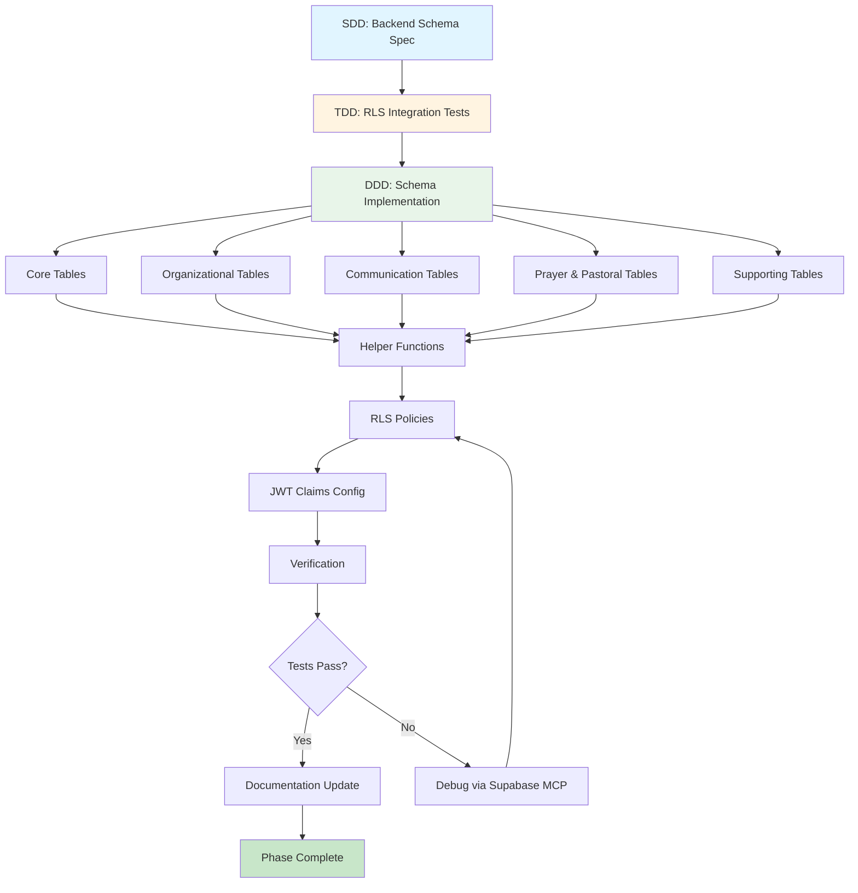
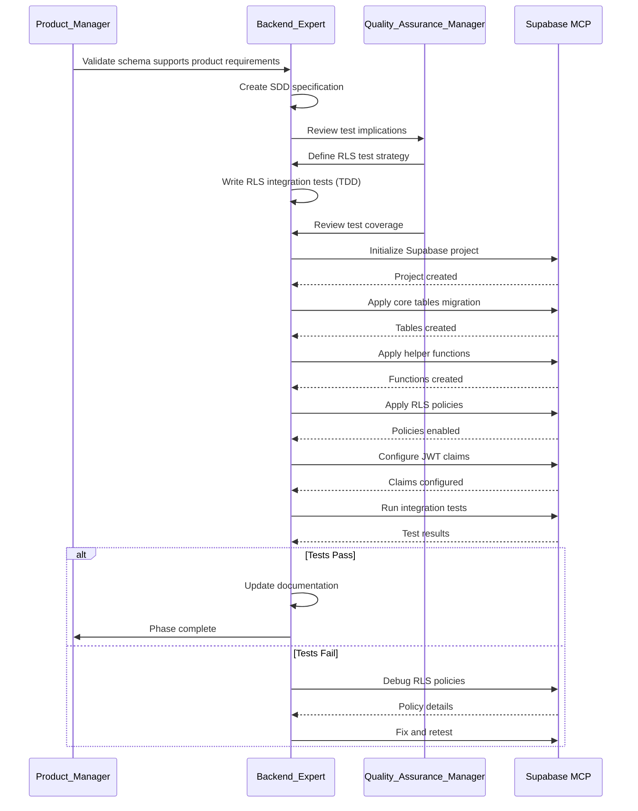

I have created the following plan after thorough exploration and analysis of the codebase. Follow the below plan verbatim. Trust the files and references. Do not re-verify what's written in the plan. Explore only when absolutely necessary. First implement all the proposed file changes and then I'll review all the changes together at the end.

## Observations

The codebase has a well-defined domain ontology with all entities documented in `file:claude_docs/01_domain_glossary.md` and complete schema/RLS specifications in `file:claude_docs/04_multi_tenant_model.md`. However, no actual Supabase schema files exist yet—this is a greenfield backend implementation. The project already has Supabase client dependencies installed and test infrastructure configured. The multi-tenant model requires strict tenant isolation with `tenant_id` on all relevant tables and comprehensive RLS policies. JWT claims must include `tenant_id` and `role` for proper authorization.

## Approach

This implementation follows the mandatory SDD→TDD→DDD workflow. First, create an SDD specification document for the backend schema implementation that references the existing domain ontology and multi-tenant model. Then, write integration tests for RLS policies (both positive and negative cases) before implementing the schema. Finally, implement the complete Supabase schema with migrations, RLS policies, helper functions, and JWT claims configuration using the Supabase MCP exclusively. The approach ensures tenant isolation is enforced at the database level and thoroughly tested before any application code depends on it.

## Implementation Steps

### Phase 1: SDD Specification (Backend Schema)

Create a new specification document `file:claude_docs/12_backend_schema_implementation.md` that defines:

**Content Structure:**
- **WHAT**: Complete Supabase schema implementation covering all entities from the domain glossary
- **WHY**: Establish tenant-isolated data foundation with RLS enforcement before any application features
- **HOW**: Migration strategy, table creation order (respecting foreign key dependencies), RLS policy implementation, JWT claims setup
- **Test Implications**: Integration test requirements for RLS policies (positive: same-tenant access, negative: cross-tenant denial)
- **Figma References**: Link to `file:claude_docs/00_product_spec.md` for context on features that depend on this schema

**Key Sections:**
1. Migration file structure and naming convention
2. Table creation order (dependency graph):
   - Core: `tenants` → `users` → `memberships`
   - Organizational: `zones` → `small_groups`, `ministries` → `ministry_memberships`
   - Communication: `conversations` → `conversation_participants` → `messages` → `event_chat_exclusions`
   - Prayer: `prayer_cards` → `prayer_card_recipients`
   - Pastoral: `pastoral_journals` → `pastoral_journal_comments`
   - Supporting: `notifications`, `device_tokens`, `attachments`
3. Helper functions: `update_updated_at_column()`, `get_user_membership()`, `get_user_role()`, `has_role()`
4. RLS policy patterns for each table type
5. JWT claims configuration (auth hooks or custom claims)
6. Seed data requirements for development/testing

**Deliverable:** Complete SDD document following the format in `file:claude_docs/00a_sdd_rules.md`

---

### Phase 2: TDD - Integration Test Suite for RLS Policies

Create test file `__tests__/integration/rls-policies.test.ts` with comprehensive RLS validation:

**Test Structure:**

```
describe('RLS Policies - Tenant Isolation')
  - Setup: Create test tenants, users, memberships using Supabase MCP
  - Teardown: Clean up test data

  describe('Tenants Table')
    ✓ Users can view tenants they are members of
    ✗ Users cannot view tenants they are not members of
    ✓ Admins can update their tenant settings
    ✗ Non-admins cannot update tenant settings

  describe('Memberships Table')
    ✓ Users can view memberships in their tenants
    ✗ Users cannot view memberships in other tenants
    ✓ Admins can create/update/delete memberships
    ✗ Non-admins cannot manage memberships

  describe('Messages Table')
    ✓ Users can view messages in accessible conversations
    ✗ Users cannot view messages in other tenant conversations
    ✓ Event Chat: excluded users cannot see excluded messages
    ✗ Event Chat: non-excluded users can see messages
    ✓ Users can send messages to accessible conversations
    ✗ Users cannot send messages to inaccessible conversations

  describe('Prayer Cards Table')
    ✓ Authors can view their own prayer cards
    ✓ Church-wide: all tenant members can view
    ✓ Individual: only recipients can view
    ✗ Individual: non-recipients cannot view
    ✓ Small group: group members can view
    ✗ Small group: non-group members cannot view

  describe('Pastoral Journals Table')
    ✓ Pastors can view all journals in tenant
    ✓ Zone leaders can view journals in their zone
    ✗ Zone leaders cannot view journals outside their zone
    ✓ Small group leaders can view their group's journals
    ✗ Small group leaders cannot view other groups' journals
    ✓ Members cannot view any journals

  describe('Device Tokens Table')
    ✓ Users can manage their own device tokens
    ✗ Users cannot view other users' device tokens
```

**Test Implementation Requirements:**
- Use Supabase MCP to create test database connections with different user contexts
- Test both SELECT and INSERT/UPDATE/DELETE operations
- Verify RLS policies block unauthorized access (expect empty results or errors)
- Test role-based access (member, small_group_leader, zone_leader, pastor, admin)
- Test JWT claims are properly extracted and used in policies

**Deliverable:** Complete test suite that initially fails (no schema exists yet)

---

### Phase 3: DDD - Supabase Schema Implementation

#### Step 3.1: Project Structure Setup

Create Supabase project directory structure:
```
supabase/
├── migrations/
│   ├── 00000000000000_initial_schema.sql
│   ├── 00000000000001_rls_policies.sql
│   └── 00000000000002_seed_data.sql
├── functions/
│   └── (Edge Functions - future phases)
└── config.toml
```

Use Supabase MCP to initialize project configuration.

---

#### Step 3.2: Core Tables Migration (`00000000000000_initial_schema.sql`)

Implement tables in dependency order using Supabase MCP:

**1. Tenants Table**
```sql
CREATE TABLE tenants (
  id UUID PRIMARY KEY DEFAULT gen_random_uuid(),
  name TEXT NOT NULL,
  slug TEXT NOT NULL UNIQUE,
  settings JSONB DEFAULT '{}'::jsonb,
  created_at TIMESTAMPTZ DEFAULT now(),
  updated_at TIMESTAMPTZ DEFAULT now()
);

CREATE INDEX idx_tenants_slug ON tenants(slug);
CREATE TRIGGER update_tenants_updated_at BEFORE UPDATE ON tenants
  FOR EACH ROW EXECUTE FUNCTION update_updated_at_column();
```

**2. Users Table** (extends auth.users)
```sql
CREATE TABLE users (
  id UUID PRIMARY KEY REFERENCES auth.users(id) ON DELETE CASCADE,
  display_name TEXT,
  photo_url TEXT,
  locale TEXT DEFAULT 'en' CHECK (locale IN ('en', 'ko')),
  created_at TIMESTAMPTZ DEFAULT now(),
  updated_at TIMESTAMPTZ DEFAULT now()
);

CREATE TRIGGER update_users_updated_at BEFORE UPDATE ON users
  FOR EACH ROW EXECUTE FUNCTION update_updated_at_column();
```

**3. Memberships Table**
```sql
CREATE TABLE memberships (
  id UUID PRIMARY KEY DEFAULT gen_random_uuid(),
  user_id UUID NOT NULL REFERENCES users(id) ON DELETE CASCADE,
  tenant_id UUID NOT NULL REFERENCES tenants(id) ON DELETE CASCADE,
  role TEXT NOT NULL CHECK (role IN ('member', 'small_group_leader', 'zone_leader', 'pastor', 'admin')),
  small_group_id UUID REFERENCES small_groups(id) ON DELETE SET NULL,
  status TEXT DEFAULT 'active' CHECK (status IN ('invited', 'active', 'suspended', 'removed')),
  created_at TIMESTAMPTZ DEFAULT now(),
  updated_at TIMESTAMPTZ DEFAULT now(),
  UNIQUE(user_id, tenant_id)
);

CREATE INDEX idx_memberships_user_tenant ON memberships(user_id, tenant_id);
CREATE INDEX idx_memberships_tenant ON memberships(tenant_id);
CREATE TRIGGER update_memberships_updated_at BEFORE UPDATE ON memberships
  FOR EACH ROW EXECUTE FUNCTION update_updated_at_column();
```

**4-11. Remaining Tables** (following the complete schema from `file:claude_docs/04_multi_tenant_model.md`):
- Zones
- Small Groups
- Ministries
- Ministry Memberships
- Conversations
- Conversation Participants
- Messages
- Event Chat Exclusions
- Prayer Cards
- Prayer Card Recipients
- Pastoral Journals
- Pastoral Journal Comments
- Notifications
- Device Tokens
- Attachments

Each table must include:
- `tenant_id UUID NOT NULL REFERENCES tenants(id)` (except global tables: users, device_tokens)
- Appropriate indexes on `tenant_id` and foreign keys
- `updated_at` trigger where applicable
- CHECK constraints for enums

---

#### Step 3.3: Helper Functions Migration

Implement SQL helper functions referenced in RLS policies:

**1. Update Timestamp Trigger**
```sql
CREATE OR REPLACE FUNCTION update_updated_at_column()
RETURNS TRIGGER AS $
BEGIN
  NEW.updated_at = now();
  RETURN NEW;
END;
$ LANGUAGE plpgsql;
```

**2. Get User Membership**
```sql
CREATE OR REPLACE FUNCTION get_user_membership(p_tenant_id UUID)
RETURNS UUID AS $
  SELECT id FROM memberships
  WHERE user_id = auth.uid()
    AND tenant_id = p_tenant_id
    AND status = 'active'
  LIMIT 1;
$ LANGUAGE sql SECURITY DEFINER STABLE;
```

**3. Get User Role**
```sql
CREATE OR REPLACE FUNCTION get_user_role(p_tenant_id UUID)
RETURNS TEXT AS $
  SELECT role FROM memberships
  WHERE user_id = auth.uid()
    AND tenant_id = p_tenant_id
    AND status = 'active'
  LIMIT 1;
$ LANGUAGE sql SECURITY DEFINER STABLE;
```

**4. Has Role Check**
```sql
CREATE OR REPLACE FUNCTION has_role(p_tenant_id UUID, p_min_role TEXT)
RETURNS BOOLEAN AS $
DECLARE
  v_user_role TEXT;
  v_role_hierarchy TEXT[] := ARRAY['member', 'small_group_leader', 'zone_leader', 'pastor', 'admin'];
BEGIN
  v_user_role := get_user_role(p_tenant_id);
  IF v_user_role IS NULL THEN RETURN FALSE; END IF;
  RETURN array_position(v_role_hierarchy, v_user_role) >= array_position(v_role_hierarchy, p_min_role);
END;
$ LANGUAGE plpgsql SECURITY DEFINER STABLE;
```

---

#### Step 3.4: RLS Policies Migration (`00000000000001_rls_policies.sql`)

Enable RLS on all tables and implement policies from `file:claude_docs/04_multi_tenant_model.md`:

**Enable RLS:**
```sql
ALTER TABLE tenants ENABLE ROW LEVEL SECURITY;
ALTER TABLE users ENABLE ROW LEVEL SECURITY;
-- ... (all tables)
```

**Implement Policies for Each Table:**

Example for Messages table:
```sql
-- View messages (with Event Chat exclusion logic)
CREATE POLICY "Users can view messages"
  ON messages FOR SELECT
  USING (
    deleted_at IS NULL AND
    EXISTS (
      SELECT 1 FROM conversations c
      JOIN memberships m ON m.tenant_id = c.tenant_id AND m.user_id = auth.uid() AND m.status = 'active'
      WHERE c.id = messages.conversation_id
        AND (
          c.type = 'church_wide'
          OR (c.type = 'small_group' AND m.small_group_id = c.small_group_id)
          OR (c.type = 'ministry' AND EXISTS (
            SELECT 1 FROM ministry_memberships mm WHERE mm.membership_id = m.id AND mm.ministry_id = c.ministry_id
          ))
          OR (c.type = 'direct' AND EXISTS (
            SELECT 1 FROM conversation_participants cp WHERE cp.conversation_id = c.id AND cp.membership_id = m.id
          ))
        )
        AND NOT (
          messages.is_event_chat = TRUE AND EXISTS (
            SELECT 1 FROM event_chat_exclusions ece
            WHERE ece.message_id = messages.id AND ece.excluded_membership_id = m.id
          )
        )
    )
  );

-- Insert messages
CREATE POLICY "Users can insert messages"
  ON messages FOR INSERT
  WITH CHECK (
    sender_id = get_user_membership(tenant_id) AND
    EXISTS (
      SELECT 1 FROM conversations c
      JOIN memberships m ON m.tenant_id = c.tenant_id AND m.user_id = auth.uid() AND m.status = 'active'
      WHERE c.id = messages.conversation_id
        AND (/* same conversation access logic */)
    )
  );
```

Implement all policies from the specification for:
- Tenants (view by membership, update by admin)
- Users (view own + shared tenants, update own)
- Memberships (view in tenant, manage by admin)
- Zones, Small Groups, Ministries (view in tenant, manage by admin)
- Conversations (view by type rules, create direct)
- Messages (view with Event Chat logic, insert to accessible conversations)
- Prayer Cards (view by recipient scope, create/update own)
- Pastoral Journals (role-based view/update)
- Notifications (view/update own)
- Device Tokens (manage own)
- Attachments (follow parent entity access)

---

#### Step 3.5: JWT Claims Configuration

Configure Supabase Auth to include custom JWT claims using Supabase MCP:

**Option A: Auth Hook (Recommended)**

Create auth hook function to add claims on token generation:
```sql
CREATE OR REPLACE FUNCTION auth.custom_access_token_hook(event jsonb)
RETURNS jsonb AS $
DECLARE
  claims jsonb;
  user_membership record;
BEGIN
  claims := event->'claims';
  
  -- Get user's active membership (if any)
  SELECT tenant_id, role INTO user_membership
  FROM memberships
  WHERE user_id = (event->>'user_id')::uuid
    AND status = 'active'
  LIMIT 1;
  
  IF user_membership IS NOT NULL THEN
    claims := jsonb_set(claims, '{tenant_id}', to_jsonb(user_membership.tenant_id::text));
    claims := jsonb_set(claims, '{role}', to_jsonb(user_membership.role));
  END IF;
  
  event := jsonb_set(event, '{claims}', claims);
  RETURN event;
END;
$ LANGUAGE plpgsql SECURITY DEFINER;
```

Configure hook in Supabase dashboard or via MCP.

**Option B: Client-Side Tenant Context**

If auth hooks are not available, implement tenant context management in application:
- Store active `tenant_id` in local storage after tenant selection
- Pass `tenant_id` as query parameter or header in API requests
- Validate tenant access on each request using `get_user_membership()` function

---

#### Step 3.6: Seed Data Migration (`00000000000002_seed_data.sql`)

Create minimal seed data for development and testing:

```sql
-- Test tenant
INSERT INTO tenants (id, name, slug) VALUES
  ('00000000-0000-0000-0000-000000000001', 'Test Church', 'test-church');

-- Test users (requires auth.users entries - coordinate with Supabase Auth)
-- Test memberships with various roles
-- Test small groups, zones
-- Test conversations
```

**Note:** Coordinate with Supabase Auth for user creation (may require separate auth flow or manual setup).

---

### Phase 4: Verification and Testing

#### Step 4.1: Run Integration Tests

Execute the RLS test suite created in Phase 2:
```bash
bun test __tests__/integration/rls-policies.test.ts
```

**Expected Outcome:** All tests pass, confirming:
- Tenant isolation is enforced
- Role-based access works correctly
- Event Chat exclusions function properly
- Cross-tenant access is blocked

---

#### Step 4.2: Manual Verification via Supabase MCP

Use Supabase MCP to:
1. Inspect schema structure (verify all tables, indexes, triggers exist)
2. Test RLS policies manually with different user contexts
3. Verify JWT claims are included in auth tokens
4. Check helper functions return expected results

---

#### Step 4.3: Documentation Update

Update `file:claude_docs/04_multi_tenant_model.md` with:
- Migration file references
- Actual implementation notes (any deviations from spec)
- Known limitations or future improvements
- Testing results summary

Update `file:skills/SKILL.md` with:
- Backend schema implementation context
- RLS policy patterns learned
- Supabase MCP usage patterns
- Testing strategies for tenant isolation

---

## Subagents Involved

- **Backend_Expert**: Primary agent for schema design, RLS policies, JWT claims, and integration tests
- **Quality_Assurance_Manager**: Test strategy, RLS test coverage, verification criteria
- **Product_Manager**: Validate schema supports all product requirements from domain glossary

---

## MCPs Used

### Supabase MCP (Required - Hard Stop)
**Why:** All database operations, schema creation, RLS policy implementation, and testing must use Supabase MCP exclusively per `file:CLAUDE.md` non-negotiables.

**Usage:**
- Create and manage Supabase project
- Execute migration SQL files
- Inspect schema and RLS policies
- Test database access with different user contexts
- Configure auth hooks for JWT claims
- Seed test data

**Evidence Provided:**
- Schema structure confirmation
- RLS policy enforcement verification
- JWT claims validation
- Query execution results for test scenarios

### Context7 MCP (Documentation Lookup)
**Why:** Consult latest Supabase documentation before implementing RLS policies, auth hooks, and migration patterns.

**Usage:**
- Verify current Supabase RLS syntax and best practices
- Check auth hook implementation patterns
- Validate JWT claims configuration methods

---

## Exit Criteria

**Phase 1 (SDD) Complete When:**
- ✅ `file:claude_docs/12_backend_schema_implementation.md` exists with complete specification
- ✅ Specification includes WHAT/WHY/HOW, test implications, and Figma references
- ✅ Migration strategy and table dependency graph documented
- ✅ RLS policy patterns defined for each table type

**Phase 2 (TDD) Complete When:**
- ✅ `__tests__/integration/rls-policies.test.ts` exists with comprehensive test coverage
- ✅ Tests cover positive cases (same-tenant access)
- ✅ Tests cover negative cases (cross-tenant denial)
- ✅ Tests cover role-based access for all roles
- ✅ Tests cover Event Chat exclusion logic
- ✅ All tests initially fail (no schema exists yet)

**Phase 3 (DDD) Complete When:**
- ✅ Supabase project structure created (`supabase/` directory)
- ✅ All migration files created and applied via Supabase MCP
- ✅ All tables exist with correct schema (tenant_id, indexes, triggers)
- ✅ All helper functions implemented and tested
- ✅ All RLS policies implemented and enabled
- ✅ JWT claims configuration completed (auth hooks or client-side context)
- ✅ Seed data loaded for development/testing

**Phase 4 (Verification) Complete When:**
- ✅ All integration tests pass (100% success rate)
- ✅ Manual verification via Supabase MCP confirms schema correctness
- ✅ JWT claims verified in auth tokens
- ✅ Documentation updated with implementation notes
- ✅ `file:skills/SKILL.md` updated with context for future work

**Overall Success Criteria:**
- ✅ Complete Supabase schema implemented matching domain ontology
- ✅ Tenant isolation enforced at database level via RLS
- ✅ JWT claims include `tenant_id` and `role`
- ✅ Integration tests prove RLS policies work correctly
- ✅ No cross-tenant data access possible
- ✅ All operations performed via Supabase MCP (no workarounds)
- ✅ SDD→TDD→DDD workflow followed strictly

---

## Architecture Diagram



---

## Implementation Sequence

