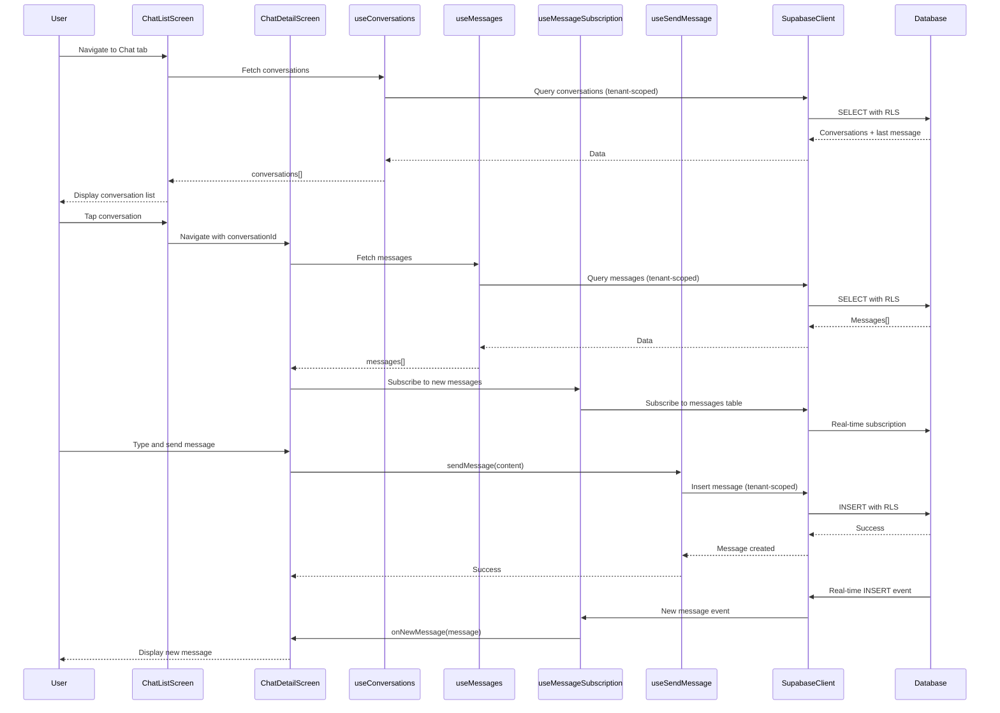

I have created the following plan after thorough exploration and analysis of the codebase. Follow the below plan verbatim. Trust the files and references. Do not re-verify what's written in the plan. Explore only when absolutely necessary. First implement all the proposed file changes and then I'll review all the changes together at the end.

## Observations

The codebase has a solid foundation with complete database schema, RLS policies, and UI component library. The `conversations` and `messages` tables are fully defined with support for conversation types (direct, small_group, ministry, church_wide), message content types, threads (via `parent_id`), and Event Chat exclusions. Translation keys for chat are already defined in both English and Korean. However, no chat-specific implementation exists yet—only a placeholder screen. The existing UI components (Button, Text, Input) enforce i18n and follow Tamagui-first principles, providing a strong foundation for building chat features.

## Approach

This implementation follows the strict SDD → TDD → DDD workflow mandated by CLAUDE.md. First, we'll extend the existing chat architecture spec (`file:claude_docs/05_chat_architecture.md`) with detailed implementation guidance for the chat list and detail screens, including real-time subscription patterns and room type visual differentiation. Second, we'll write Detox E2E tests for critical chat flows (viewing conversations, sending messages, real-time updates) before any functional code. Third, we'll implement the chat features following domain boundaries: conversation queries, message operations, and real-time subscriptions as separate concerns. All backend operations will use the Supabase MCP, and runtime debugging will leverage the rn-debugger MCP. The implementation will be organized in a feature-first structure (`src/features/chat/`) with clear separation between data access, business logic, and UI components.

---

## Implementation Steps

### 1. Extend SDD Spec for Chat Implementation

**Subagents:** Product_Manager, Backend_Expert, Frontend_Expert

**Objective:** Update `file:claude_docs/05_chat_architecture.md` with detailed implementation guidance for chat list and detail screens.

**Tasks:**
- Document chat list screen requirements:
  - Query pattern for fetching conversations with last message and unread count
  - Sorting logic (most recent activity first)
  - Conversation type filtering
  - Empty state handling
- Document chat detail screen requirements:
  - Message pagination strategy (load recent 50, infinite scroll for older)
  - Real-time subscription setup for new messages
  - Message rendering by content type (text, image, system, prayer_card)
  - Thread indicator UI and navigation
  - Message input component with send button
- Document room type background color mapping:
  - Direct: neutral/default background
  - Small Group: warm tone (e.g., `$backgroundWarm`)
  - Ministry: cool tone (e.g., `$backgroundCool`)
  - Church Wide: distinct accent (e.g., `$backgroundAccent`)
- Document real-time subscription patterns:
  - Subscribe to `messages` table filtered by `conversation_id`
  - Handle INSERT events for new messages
  - Handle UPDATE events for message edits
  - Handle DELETE events for soft deletes
  - Cleanup subscriptions on unmount
- Document test implications:
  - Unit tests: message component rendering, date formatting, unread count calculation
  - Integration tests: real-time subscription behavior, message query with RLS
  - E2E tests: send message flow, receive message flow, conversation navigation

**MCPs Used:**
- `supabase` MCP: Verify schema and RLS policies align with implementation plan

**Exit Criteria:**
- `file:claude_docs/05_chat_architecture.md` contains complete implementation guidance
- All flows reference tenant isolation and RLS enforcement
- Test implications section is comprehensive

---

### 2. Extend Database Types for Chat Entities

**Subagents:** Backend_Expert

**Objective:** Add TypeScript type definitions for messages, conversations, and related entities to `file:src/types/database.ts`.

**Tasks:**
- Add `messages` table types:
  - Row type with all columns (id, tenant_id, conversation_id, sender_id, parent_id, content, content_type, is_event_chat, created_at, updated_at, deleted_at)
  - Insert type with optional fields
  - Update type with optional fields
- Add `conversations` table types (extend existing partial definition):
  - Complete Row type with all columns
  - Insert and Update types
- Add `conversation_participants` table types:
  - Row type with conversation_id, membership_id, last_read_at, created_at
  - Insert and Update types
- Add `event_chat_exclusions` table types:
  - Row type with message_id, excluded_membership_id, created_at
- Add helper types:
  - `MessageWithSender` (message joined with sender membership and user)
  - `ConversationWithLastMessage` (conversation with last message preview)
  - `ConversationType` enum type
  - `MessageContentType` enum type

**MCPs Used:**
- `supabase` MCP: Introspect schema to ensure type definitions match database

**Exit Criteria:**
- All chat-related tables have complete TypeScript types
- Types are exported from `file:src/types/database.ts`
- No `any` types used

---

### 3. Write Detox E2E Tests for Chat Flows (TDD)

**Subagents:** Quality_Assurance_Manager, Frontend_Expert

**Objective:** Write E2E tests for chat list, chat detail, and message sending flows before implementation.

**Tasks:**
- Create `file:e2e/chat.test.ts` with test scenarios:
  - **Test: View conversation list**
    - Login and select tenant
    - Navigate to chat tab
    - Assert conversation list is visible
    - Assert conversations show last message preview
    - Assert unread count badge is visible for unread conversations
  - **Test: Open conversation and view messages**
    - Navigate to chat tab
    - Tap on a conversation
    - Assert chat detail screen opens
    - Assert messages are displayed in chronological order
    - Assert sender names are visible
  - **Test: Send text message**
    - Open a conversation
    - Type message in input field
    - Tap send button
    - Assert message appears in conversation
    - Assert input field is cleared
  - **Test: Receive real-time message**
    - Open a conversation
    - Simulate another user sending a message (via test helper)
    - Assert new message appears without refresh
  - **Test: Room type background colors**
    - Open small group conversation
    - Assert background color matches small group theme
    - Navigate back and open ministry conversation
    - Assert background color matches ministry theme
- Create `file:e2e/helpers/chat-helpers.ts`:
  - `createTestConversation(tenantId, type, participants)`
  - `sendTestMessage(conversationId, senderId, content)`
  - `getConversationById(conversationId)`
  - `waitForMessage(messageContent, timeout)`

**MCPs Used:**
- `supabase` MCP: Create test data (conversations, messages) for E2E tests
- `rn-debugger` MCP: Inspect app state during test execution if tests fail

**Exit Criteria:**
- All E2E tests are written and initially failing (red state)
- Test helpers are implemented
- Tests cover happy paths and basic error scenarios

---

### 4. Implement Conversation and Message Hooks

**Subagents:** Frontend_Expert, Backend_Expert

**Objective:** Create React hooks for querying conversations and messages with tenant isolation.

**Tasks:**
- Create `file:src/features/chat/hooks/useConversations.ts`:
  - Hook signature: `useConversations(tenantId: string)`
  - Query conversations with last message and unread count
  - Sort by `updated_at DESC`
  - Return `{ conversations, loading, error, refetch }`
  - Use Supabase client from `file:src/lib/supabase.ts`
- Create `file:src/features/chat/hooks/useMessages.ts`:
  - Hook signature: `useMessages(conversationId: string, tenantId: string)`
  - Query messages for conversation, ordered by `created_at ASC`
  - Paginate with limit of 50 messages
  - Filter out soft-deleted messages (`deleted_at IS NULL`)
  - Return `{ messages, loading, error, loadMore, hasMore }`
- Create `file:src/features/chat/hooks/useSendMessage.ts`:
  - Hook signature: `useSendMessage(conversationId: string, tenantId: string)`
  - Mutation function: `sendMessage(content: string, contentType: MessageContentType)`
  - Get sender membership ID from tenant context
  - Insert message with tenant_id, conversation_id, sender_id, content, content_type
  - Return `{ sendMessage, sending, error }`
- Write unit tests for each hook in `file:src/features/chat/hooks/__tests__/`:
  - Mock Supabase client responses
  - Test loading states
  - Test error handling
  - Test tenant isolation (verify tenant_id is included in queries)

**MCPs Used:**
- `supabase` MCP: Execute queries to verify RLS policies work correctly with hooks

**Exit Criteria:**
- All hooks are implemented with TypeScript types
- Unit tests pass for all hooks
- Hooks enforce tenant isolation

---

### 5. Implement Real-Time Subscription Hook

**Subagents:** Frontend_Expert, Backend_Expert

**Objective:** Create a hook for subscribing to real-time message updates using Supabase subscriptions.

**Tasks:**
- Create `file:src/features/chat/hooks/useMessageSubscription.ts`:
  - Hook signature: `useMessageSubscription(conversationId: string, onNewMessage: (message: Message) => void)`
  - Subscribe to `messages` table with filter: `conversation_id=eq.${conversationId}`
  - Listen for INSERT events
  - Call `onNewMessage` callback when new message arrives
  - Cleanup subscription on unmount
  - Handle subscription errors gracefully
- Add integration test in `file:src/features/chat/hooks/__tests__/useMessageSubscription.test.ts`:
  - Mock Supabase real-time channel
  - Test subscription setup
  - Test callback invocation on INSERT event
  - Test cleanup on unmount
- Document subscription pattern in `file:claude_docs/05_chat_architecture.md`:
  - Connection lifecycle
  - Error handling strategy
  - Reconnection behavior

**MCPs Used:**
- `supabase` MCP: Test real-time subscriptions with actual database
- `rn-debugger` MCP: Monitor subscription events during development

**Exit Criteria:**
- Real-time subscription hook is implemented
- Integration test passes
- Subscription cleanup prevents memory leaks

---

### 6. Implement Chat List Screen

**Subagents:** Frontend_Expert, Designer

**Objective:** Build the chat list screen showing all conversations with last message preview and unread counts.

**Tasks:**
- Create `file:src/features/chat/components/ConversationListItem.tsx`:
  - Display conversation name (or participant names for direct messages)
  - Show last message preview (truncated to 60 characters)
  - Display timestamp (formatted as "Today", "Yesterday", or date)
  - Show unread count badge if unread messages exist
  - Apply conversation type icon (optional)
  - Use i18n for all text via `useTranslation` hook
  - Props: `conversation: ConversationWithLastMessage`, `onPress: () => void`
- Create `file:src/features/chat/components/ConversationList.tsx`:
  - Use `useConversations` hook to fetch data
  - Render FlatList with `ConversationListItem` components
  - Show loading spinner while fetching
  - Show empty state if no conversations (use `chat.no_conversations` translation key)
  - Pull-to-refresh functionality
  - Navigate to chat detail on item press
- Update `file:app/(tabs)/chat.tsx`:
  - Replace placeholder with `<ConversationList />`
  - Ensure tenant context is available via `useRequireAuth`
- Create Storybook stories:
  - `file:src/features/chat/components/ConversationListItem.stories.tsx`
  - `file:src/features/chat/components/ConversationList.stories.tsx`
  - Include both `en` and `ko` locale variants
- Write unit tests:
  - `file:src/features/chat/components/__tests__/ConversationListItem.test.tsx`
  - `file:src/features/chat/components/__tests__/ConversationList.test.tsx`
  - Test rendering with mock data
  - Test empty state
  - Test loading state
  - Test navigation on press

**MCPs Used:**
- `figma` MCP: Reference Figma designs for chat list layout (https://www.figma.com/design/6gW1h8DfD1WYH29AmJqaeW/Gagyo?node-id=2-780)
- `rn-debugger` MCP: Inspect component rendering and data flow

**Exit Criteria:**
- Chat list screen displays conversations correctly
- Unread counts are accurate
- Empty state is shown when no conversations exist
- All text uses i18n translation keys
- Unit tests pass

---

### 7. Implement Chat Detail Screen with Message Rendering

**Subagents:** Frontend_Expert, Designer

**Objective:** Build the chat detail screen with message list, real-time updates, and message input.

**Tasks:**
- Create `file:src/features/chat/components/MessageBubble.tsx`:
  - Display message content based on content_type (text, image, system)
  - Show sender name and timestamp
  - Apply different styling for own messages vs others (alignment, background color)
  - Support thread indicator (show reply count if message has replies)
  - Use i18n for timestamps via `formatRelativeTime` utility
  - Props: `message: MessageWithSender`, `isOwnMessage: boolean`, `onThreadPress?: () => void`
- Create `file:src/features/chat/components/MessageList.tsx`:
  - Use `useMessages` hook to fetch messages
  - Use `useMessageSubscription` hook for real-time updates
  - Render FlatList with `MessageBubble` components (inverted for chat UX)
  - Group messages by date with date separators
  - Implement infinite scroll for loading older messages
  - Auto-scroll to bottom on new message
  - Show loading indicator while fetching
- Create `file:src/features/chat/components/MessageInput.tsx`:
  - Text input field with placeholder (use `chat.type_message` translation key)
  - Send button (use `chat.send` translation key)
  - Disable send button when input is empty or sending
  - Clear input after successful send
  - Use `useSendMessage` hook for sending
  - Props: `conversationId: string`, `tenantId: string`
- Create `file:src/features/chat/screens/ChatDetailScreen.tsx`:
  - Combine `MessageList` and `MessageInput` components
  - Apply room type background color based on conversation type:
    - Use Tamagui theme tokens: `$backgroundWarm`, `$backgroundCool`, `$backgroundAccent`
    - Map conversation type to background color
  - Show conversation name in header
  - Handle navigation back to chat list
- Update Expo Router to add chat detail route:
  - Create `file:app/(tabs)/chat/[conversationId].tsx`
  - Use dynamic route parameter for conversation ID
  - Render `ChatDetailScreen` component
- Create Storybook stories:
  - `file:src/features/chat/components/MessageBubble.stories.tsx`
  - `file:src/features/chat/components/MessageList.stories.tsx`
  - `file:src/features/chat/components/MessageInput.stories.tsx`
- Write unit tests:
  - `file:src/features/chat/components/__tests__/MessageBubble.test.tsx`
  - `file:src/features/chat/components/__tests__/MessageList.test.tsx`
  - `file:src/features/chat/components/__tests__/MessageInput.test.tsx`
  - Test message rendering for different content types
  - Test own message vs other message styling
  - Test send button disabled state
  - Test real-time message insertion

**MCPs Used:**
- `figma` MCP: Reference Figma designs for chat detail layout (https://www.figma.com/design/6gW1h8DfD1WYH29AmJqaeW/Gagyo?node-id=2-776)
- `rn-debugger` MCP: Debug real-time subscription behavior and message rendering
- `supabase` MCP: Test message insertion and real-time events

**Exit Criteria:**
- Chat detail screen displays messages correctly
- Real-time updates work without manual refresh
- Message input sends messages successfully
- Room type background colors differentiate conversation types
- All text uses i18n translation keys
- Unit tests pass

---

### 8. Implement Room Type Background Color Differentiation

**Subagents:** Design_System_Manager, Frontend_Expert

**Objective:** Add theme tokens for room type background colors and apply them in chat detail screen.

**Tasks:**
- Update `file:src/constants/theme.ts`:
  - Add theme tokens for room type backgrounds:
    - `backgroundWarm`: warm tone for small group (e.g., `#FFF8F0`)
    - `backgroundCool`: cool tone for ministry (e.g., `#F0F8FF`)
    - `backgroundAccent`: distinct accent for church wide (e.g., `#FFF0F8`)
  - Ensure tokens work in both light and dark themes
- Create `file:src/features/chat/utils/getRoomBackgroundColor.ts`:
  - Function signature: `getRoomBackgroundColor(conversationType: ConversationType): string`
  - Map conversation type to theme token:
    - `direct` → default background
    - `small_group` → `$backgroundWarm`
    - `ministry` → `$backgroundCool`
    - `church_wide` → `$backgroundAccent`
  - Return theme token string
- Update `file:src/features/chat/screens/ChatDetailScreen.tsx`:
  - Use `getRoomBackgroundColor` to determine background
  - Apply background color to screen container
- Write unit test:
  - `file:src/features/chat/utils/__tests__/getRoomBackgroundColor.test.ts`
  - Test each conversation type returns correct color

**MCPs Used:**
- `figma` MCP: Verify color choices match Figma design system

**Exit Criteria:**
- Theme tokens are defined for all room types
- Background colors are applied correctly in chat detail screen
- Colors are visually distinct and accessible
- Unit test passes

---

### 9. Write Integration Tests for Real-Time Sync

**Subagents:** Quality_Assurance_Manager, Backend_Expert

**Objective:** Write integration tests to verify real-time message synchronization works with RLS policies.

**Tasks:**
- Create `file:__tests__/integration/chat-realtime.test.ts`:
  - **Test: Real-time message delivery within same tenant**
    - Create two authenticated clients for same tenant
    - Client A subscribes to conversation
    - Client B sends message
    - Assert Client A receives message via subscription
  - **Test: Real-time message blocked across tenants**
    - Create two authenticated clients for different tenants
    - Client A subscribes to conversation in Tenant A
    - Client B sends message in Tenant B
    - Assert Client A does NOT receive message
  - **Test: Event Chat exclusion in real-time**
    - Create conversation with Event Chat message excluding User A
    - User A subscribes to conversation
    - Assert User A does NOT receive excluded message
  - **Test: Subscription cleanup on disconnect**
    - Subscribe to conversation
    - Disconnect subscription
    - Send message
    - Assert no callback is invoked
- Use `file:__tests__/helpers/supabase-test.ts` for test client setup

**MCPs Used:**
- `supabase` MCP: Execute integration tests against local Supabase instance
- `rn-debugger` MCP: Monitor subscription events during test execution

**Exit Criteria:**
- All integration tests pass
- RLS policies are verified to work with real-time subscriptions
- Tenant isolation is enforced in real-time events

---

### 10. Run E2E Tests and Verify Implementation

**Subagents:** Quality_Assurance_Manager

**Objective:** Run Detox E2E tests written in Step 3 and verify all tests pass.

**Tasks:**
- Run E2E tests: `bun run test:e2e`
- Verify all chat flow tests pass:
  - View conversation list
  - Open conversation and view messages
  - Send text message
  - Receive real-time message
  - Room type background colors
- If tests fail:
  - Use `rn-debugger` MCP to inspect app state
  - Use `ios-simulator` MCP to capture screenshots/video
  - Fix implementation issues
  - Re-run tests until all pass
- Document any flaky tests and mitigation strategies in `file:claude_docs/09_running_tests.md`

**MCPs Used:**
- `rn-debugger` MCP: Debug test failures
- `ios-simulator` MCP: Capture evidence of test execution

**Exit Criteria:**
- All E2E tests pass consistently
- No flaky tests remain
- Test execution is documented

---

### 11. Update SKILL.md with Implementation Context

**Subagents:** Product_Manager

**Objective:** Document lessons learned and implementation context in `file:skills/SKILL.md`.

**Tasks:**
- Add section: "Chat Implementation"
  - Document real-time subscription pattern used
  - Note any challenges with RLS policies and real-time
  - Document room type background color approach
  - List key hooks and their responsibilities
  - Note any performance optimizations applied (e.g., message pagination)
- Add section: "Testing Strategy for Chat"
  - Document E2E test coverage
  - Note integration test approach for real-time
  - List any test helpers created

**Exit Criteria:**
- `file:skills/SKILL.md` is updated with chat implementation context
- Future developers can understand the chat architecture from SKILL.md

---

## Architecture Diagram

---

## Summary Table

| Step | Subagents | Key Deliverables | MCPs Used |
|------|-----------|------------------|-----------|
| 1. Extend SDD Spec | Product_Manager, Backend_Expert, Frontend_Expert | Updated `file:claude_docs/05_chat_architecture.md` | supabase |
| 2. Extend Database Types | Backend_Expert | Updated `file:src/types/database.ts` with message/conversation types | supabase |
| 3. Write E2E Tests (TDD) | Quality_Assurance_Manager, Frontend_Expert | `file:e2e/chat.test.ts`, `file:e2e/helpers/chat-helpers.ts` | supabase, rn-debugger |
| 4. Implement Hooks | Frontend_Expert, Backend_Expert | `useConversations`, `useMessages`, `useSendMessage` hooks | supabase |
| 5. Implement Real-Time Hook | Frontend_Expert, Backend_Expert | `useMessageSubscription` hook | supabase, rn-debugger |
| 6. Implement Chat List | Frontend_Expert, Designer | `ConversationList`, `ConversationListItem` components | figma, rn-debugger |
| 7. Implement Chat Detail | Frontend_Expert, Designer | `MessageBubble`, `MessageList`, `MessageInput`, `ChatDetailScreen` | figma, rn-debugger, supabase |
| 8. Room Type Colors | Design_System_Manager, Frontend_Expert | Theme tokens, `getRoomBackgroundColor` utility | figma |
| 9. Integration Tests | Quality_Assurance_Manager, Backend_Expert | `file:__tests__/integration/chat-realtime.test.ts` | supabase, rn-debugger |
| 10. Run E2E Tests | Quality_Assurance_Manager | All E2E tests passing | rn-debugger, ios-simulator |
| 11. Update SKILL.md | Product_Manager | Updated `file:skills/SKILL.md` | - |