I have created the following plan after thorough exploration and analysis of the codebase. Follow the below plan verbatim. Trust the files and references. Do not re-verify what's written in the plan. Explore only when absolutely necessary. First implement all the proposed file changes and then I'll review all the changes together at the end.

## Observations

The thread functionality foundation is **already in place** at the database level: the `messages` table has a `parent_id` column (referencing `messages.id`), an index on `parent_id`, and RLS policies that automatically apply to thread messages. The UI components (`MessageBubble`) already display a thread reply count indicator (💬 badge), and a `useSendReply` hook exists for sending replies. However, the **reply_count calculation, thread message fetching, thread view screen, navigation logic, and comprehensive tests are missing**.

## Approach

This implementation follows the **TDD → DDD → Implementation** sequence mandated by `CLAUDE.md`. We will:

1. **Write the SDD specification** defining thread behavior, constraints (single-level only, no nested threads), and UI flows
2. **Write Detox E2E tests** for thread creation, navigation, and reply flows (TDD-first)
3. **Extend the `useMessages` hook** to calculate `reply_count` via a Supabase aggregate query
4. **Create a `useThreadMessages` hook** to fetch messages where `parent_id = parentMessageId`
5. **Build the thread view screen** (`app/chat/thread/[id].tsx`) reusing the existing chat detail screen structure
6. **Implement navigation** from message press to thread view, passing `parentMessageId` as a route param
7. **Add validation** to prevent nested threads (check `parent_id` is null before allowing reply)
8. **Write unit tests** for hooks and validation logic
9. **Add i18n keys** for thread-related UI strings (en/ko)

All phases use the **Supabase MCP** for backend operations and **rn-debugger MCP** for runtime inspection during testing.

---

## Implementation Steps

### 1. Write SDD Specification for Thread Functionality

**Subagent:** Product_Manager, Backend_Expert

**Deliverable:** `file:claude_docs/16_thread_architecture.md`

Create a comprehensive SDD document covering:

- **Thread Model:** Messages with `parent_id` form single-level threads (no nesting)
- **Constraints:** 
  - Threads cannot have threads (validate `parent_id IS NULL` before allowing reply)
  - Thread messages inherit conversation visibility and Event Chat exclusions
- **UI Behavior:**
  - Tapping a message with `reply_count > 0` opens thread view
  - Thread view looks identical to chat detail (reuse components)
  - Thread view shows only messages where `parent_id = parentMessageId`
  - Thread input sends replies with `parent_id` set
- **Reply Count Calculation:**
  - Aggregate query: `COUNT(messages WHERE parent_id = message.id)`
  - Updated in real-time via subscription
- **Navigation Flow:**
  - Chat detail → tap message → thread view
  - Thread view → back button → chat detail
- **RLS Enforcement:** Thread messages follow same RLS as parent message
- **Test Scenarios:** Positive (create thread, view replies) and negative (attempt nested thread)

**Reference:** Follow structure of `file:claude_docs/05_chat_architecture.md`

---

### 2. Add i18n Keys for Thread UI

**Subagent:** Design_System_Manager

**Deliverable:** Update `file:locales/en/chat.json` and `file:locales/ko/chat.json`

Add translation keys:

```json
{
  "thread_title": "Thread",
  "thread_replies": "{{count}} replies",
  "thread_reply_placeholder": "Reply to thread...",
  "thread_no_replies": "No replies yet",
  "thread_start_conversation": "Be the first to reply",
  "thread_cannot_nest": "Cannot reply to a reply"
}
```

Korean equivalents in `ko/chat.json`.

---

### 3. Extend useMessages Hook to Calculate reply_count

**Subagent:** Backend_Expert, Frontend_Expert

**Deliverable:** Update `file:src/features/chat/hooks/useMessages.ts`

Modify the Supabase query to include a subquery counting replies:

```typescript
.select(`
  id,
  tenant_id,
  conversation_id,
  sender_id,
  parent_id,
  content,
  content_type,
  is_event_chat,
  created_at,
  updated_at,
  deleted_at,
  sender:memberships!messages_sender_id_fkey (
    id,
    user:users!memberships_user_id_fkey (
      id,
      display_name,
      photo_url
    )
  ),
  replies:messages!parent_id(count)
`)
```

Transform the response to include `reply_count`:

```typescript
reply_count: msg.replies?.[0]?.count ?? 0
```

**Test:** Write unit test in `file:src/features/chat/hooks/__tests__/useMessages.test.ts` verifying `reply_count` is correctly calculated.

**MCP:** Use `supabase` MCP to verify query syntax and RLS enforcement.

---

### 4. Create useThreadMessages Hook

**Subagent:** Frontend_Expert, Backend_Expert

**Deliverable:** `file:src/features/chat/hooks/useThreadMessages.ts`

Create a new hook similar to `useMessages` but filtering by `parent_id`:

```typescript
export function useThreadMessages(
  parentMessageId: string | null,
  tenantId: string | null
): MessagesState {
  // Query messages WHERE parent_id = parentMessageId
  // Order by created_at ASC (chronological)
  // Include sender info
  // Support pagination (50 messages per page)
}
```

**Key differences from useMessages:**
- Filter: `.eq('parent_id', parentMessageId)` instead of `.eq('conversation_id', conversationId)`
- No need for `reply_count` (threads cannot have threads)

**Test:** Write unit test in `file:src/features/chat/hooks/__tests__/useThreadMessages.test.ts` verifying:
- Fetches only messages with matching `parent_id`
- Returns empty array if `parentMessageId` is null
- Handles pagination correctly

**Export:** Add to `file:src/features/chat/hooks/index.ts`

---

### 5. Add Nested Thread Validation to useSendReply

**Subagent:** Backend_Expert, Frontend_Expert

**Deliverable:** Update `file:src/features/chat/hooks/useSendReply.ts`

Before sending a reply, fetch the parent message and check if it has a `parent_id`:

```typescript
// Fetch parent message to check if it's already a reply
const { data: parentMessage } = await supabase
  .from('messages')
  .select('parent_id')
  .eq('id', parentMessageId)
  .single();

if (parentMessage?.parent_id) {
  setError(new Error(t('chat.thread_cannot_nest')));
  return null;
}
```

**Test:** Write unit test verifying:
- Allows reply to top-level message (parent_id = null)
- Rejects reply to reply (parent_id != null)
- Returns appropriate error message

---

### 6. Create Thread View Screen

**Subagent:** Frontend_Expert, Designer

**Deliverable:** `file:app/chat/thread/[id].tsx`

Create a new screen that mirrors `file:app/chat/[id].tsx` but:

- **Route param:** `id` is the `parentMessageId`
- **Fetch parent message:** Display parent message at top (sticky header or first item)
- **Fetch thread messages:** Use `useThreadMessages(parentMessageId, tenantId)`
- **Send replies:** Use `useSendReply(conversationId, tenantId, membershipId, parentMessageId)`
- **Header title:** "Thread" (i18n: `chat.thread_title`)
- **Back button:** Navigate back to chat detail

**Layout:**
```
┌─────────────────────────────┐
│ Header: "Thread"      [X]   │
├─────────────────────────────┤
│ [Parent Message - Sticky]   │
├─────────────────────────────┤
│ Reply 1                     │
│ Reply 2                     │
│ Reply 3                     │
│ ...                         │
├─────────────────────────────┤
│ [Reply Input]               │
└─────────────────────────────┘
```

**Reuse components:**
- `MessageList` from `file:src/features/chat/components/MessageList.tsx`
- `MessageInput` from `file:src/features/chat/components/MessageInput.tsx`
- `MessageBubble` from `file:src/features/chat/components/MessageBubble.tsx`

**Real-time subscription:** Subscribe to messages where `parent_id = parentMessageId` using `useMessageSubscription` with a filter.

**Test:** Write unit test in `file:app/chat/thread/__tests__/[id].test.tsx` verifying:
- Renders parent message
- Fetches and displays thread messages
- Sends replies with correct `parent_id`

---

### 7. Implement Thread Navigation from Chat Detail

**Subagent:** Frontend_Expert

**Deliverable:** Update `file:app/chat/[id].tsx`

Replace the placeholder `handleMessagePress` (line 147-150) with navigation logic:

```typescript
const handleMessagePress = useCallback((message: MessageWithSender) => {
  if (message.reply_count && message.reply_count > 0) {
    // Navigate to thread view
    router.push(`/chat/thread/${message.id}`);
  } else if (message.content_type === 'image') {
    // Future: Open image viewer
  }
}, [router]);
```

**Test:** Verify navigation works by tapping a message with `reply_count > 0`.

---

### 8. Update MessageBubble to Make Thread Indicator Tappable

**Subagent:** Frontend_Expert, Designer

**Deliverable:** Update `file:src/features/chat/components/MessageBubble.tsx`

Ensure the thread reply count badge (lines 261-276) is part of the pressable area. The entire message bubble is already wrapped in `<Pressable onPress={handlePress}>` (line 229), so tapping anywhere on the message (including the badge) will trigger `onPress`.

**Optional enhancement:** Add visual feedback (e.g., highlight) when tapping a message with replies.

---

### 9. Write Unit Tests for Thread Logic

**Subagent:** Quality_Assurance_Manager, Frontend_Expert

**Deliverables:**

1. **`file:src/features/chat/hooks/__tests__/useThreadMessages.test.ts`**
   - Test fetching thread messages by `parent_id`
   - Test empty state when no replies exist
   - Test pagination

2. **`file:src/features/chat/hooks/__tests__/useSendReply.test.ts`** (update existing)
   - Test nested thread validation (reject reply to reply)
   - Test successful reply to top-level message

3. **`file:app/chat/thread/__tests__/[id].test.tsx`**
   - Test thread view renders parent message
   - Test thread view fetches replies
   - Test sending a reply updates the list

**Test patterns:** Follow existing test structure in `file:src/features/chat/hooks/__tests__/useMessages.test.ts`

---

### 10. Write Detox E2E Tests for Thread Flows

**Subagent:** Quality_Assurance_Manager

**Deliverable:** `file:e2e/threads.test.ts`

Create E2E tests covering:

1. **View thread indicator on message with replies**
   - Navigate to chat detail
   - Verify message with replies shows 💬 badge with count

2. **Open thread view by tapping message**
   - Tap message with replies
   - Verify thread view opens
   - Verify parent message is visible at top
   - Verify replies are listed below

3. **Send reply in thread**
   - Open thread view
   - Type reply text
   - Tap send
   - Verify reply appears in thread

4. **Navigate back from thread to chat detail**
   - Open thread view
   - Tap back button
   - Verify chat detail screen is visible

5. **Prevent nested threads**
   - Open thread view
   - Tap a reply message
   - Verify no thread indicator appears (reply_count = 0)
   - Verify tapping reply does not open another thread

**Test helpers:** Create `file:e2e/helpers/thread-helpers.ts` with:
- `openThread(messageText: string)`
- `sendReply(replyText: string)`
- `expectThreadViewVisible()`
- `expectParentMessage(messageText: string)`

**Reference:** Follow patterns in `file:e2e/chat.test.ts`

**MCP:** Use `rn-debugger` MCP for runtime inspection and `ios-simulator` MCP for UI verification during test development.

---

### 11. Update Real-Time Subscription to Handle Thread Updates

**Subagent:** Frontend_Expert, Backend_Expert

**Deliverable:** Update `file:src/features/chat/hooks/useMessageSubscription.ts`

Ensure the subscription handles:
- **New replies:** When a reply is added to a thread, update the parent message's `reply_count`
- **Thread view subscription:** In thread view, subscribe to messages where `parent_id = parentMessageId`

**Implementation:**
- In chat detail: When a new message arrives with `parent_id`, increment the parent message's `reply_count` in local state
- In thread view: Subscribe with filter `.eq('parent_id', parentMessageId)`

**Test:** Write integration test verifying real-time updates work for threads.

---

### 12. Add Thread Support to Chat Helpers

**Subagent:** Quality_Assurance_Manager

**Deliverable:** Update `file:e2e/helpers/chat-helpers.ts`

Add helper functions:

```typescript
export async function expectThreadIndicator(messageText: string, replyCount: number) {
  const message = element(by.text(messageText));
  await expect(message).toBeVisible();
  const badge = element(by.text(`💬 ${replyCount}`));
  await expect(badge).toBeVisible();
}

export async function openThread(messageText: string) {
  const message = element(by.text(messageText));
  await message.tap();
  await waitFor(element(by.id('thread-view-screen')))
    .toBeVisible()
    .withTimeout(5000);
}

export async function sendReply(replyText: string) {
  await element(by.id('message-text-input')).typeText(replyText);
  await element(by.id('send-message-button')).tap();
  await waitFor(element(by.text(replyText)))
    .toBeVisible()
    .withTimeout(5000);
}
```

---

### 13. Update Domain Glossary

**Subagent:** Product_Manager

**Deliverable:** Update `file:claude_docs/01_domain_glossary.md`

Add entry for **Thread**:

```markdown
### Thread

A single-level conversation branching from a parent message. Threads allow focused discussions on specific topics without cluttering the main conversation.

**Properties:**
- `parent_id`: UUID reference to the parent message
- Single-level only (threads cannot have threads)
- Inherits visibility rules from parent message (including Event Chat exclusions)
- Reply count displayed on parent message

**Constraints:**
- Cannot reply to a reply (nested threads not allowed)
- Thread messages follow same RLS policies as parent
- Thread view shows only messages with matching `parent_id`
```

---

### 14. Final Integration Testing and Validation

**Subagent:** Quality_Assurance_Manager, Frontend_Expert, Backend_Expert

**Tasks:**

1. **Run all unit tests:** `bun test`
2. **Run all E2E tests:** `bun test:e2e`
3. **Manual testing:**
   - Create a thread by replying to a message
   - Verify reply count updates in real-time
   - Open thread view and verify replies are visible
   - Attempt to reply to a reply (should show error)
   - Navigate back and forth between chat detail and thread view
   - Test with Event Chat messages (threads should respect exclusions)
4. **RLS validation:** Use `supabase` MCP to verify thread messages respect tenant isolation
5. **i18n validation:** Switch locale to Korean and verify all thread UI strings are translated

**Exit Criteria:**
- All unit tests pass
- All E2E tests pass
- Manual testing confirms expected behavior
- No RLS leaks (cross-tenant or cross-conversation)
- i18n complete for en/ko

---

## Summary Table

| Step | Deliverable | Subagents | MCPs | Tests |
|------|-------------|-----------|------|-------|
| 1 | SDD spec (`16_thread_architecture.md`) | Product_Manager, Backend_Expert | - | - |
| 2 | i18n keys (en/ko) | Design_System_Manager | - | - |
| 3 | Update `useMessages` (reply_count) | Backend_Expert, Frontend_Expert | supabase | Unit |
| 4 | Create `useThreadMessages` hook | Frontend_Expert, Backend_Expert | supabase | Unit |
| 5 | Add nested thread validation | Backend_Expert, Frontend_Expert | supabase | Unit |
| 6 | Create thread view screen | Frontend_Expert, Designer | - | Unit |
| 7 | Implement navigation | Frontend_Expert | - | - |
| 8 | Update MessageBubble | Frontend_Expert, Designer | - | - |
| 9 | Write unit tests | Quality_Assurance_Manager, Frontend_Expert | - | Unit |
| 10 | Write E2E tests | Quality_Assurance_Manager | rn-debugger, ios-simulator | E2E |
| 11 | Update real-time subscription | Frontend_Expert, Backend_Expert | supabase | Integration |
| 12 | Add thread helpers | Quality_Assurance_Manager | - | - |
| 13 | Update domain glossary | Product_Manager | - | - |
| 14 | Final validation | All | supabase, rn-debugger | All |

---

## Architecture Diagram

```mermaid
sequenceDiagram
    participant User
    participant ChatDetail as Chat Detail Screen
    participant MessageBubble
    participant ThreadView as Thread View Screen
    participant useMessages
    participant useThreadMessages
    participant useSendReply
    participant Supabase

    User->>ChatDetail: View conversation
    ChatDetail->>useMessages: Fetch messages
    useMessages->>Supabase: SELECT messages with reply_count
    Supabase-->>useMessages: Messages + reply_count
    useMessages-->>ChatDetail: Display messages
    ChatDetail->>MessageBubble: Render message with reply_count
    MessageBubble-->>User: Show 💬 badge (e.g., "💬 3")

    User->>MessageBubble: Tap message with replies
    MessageBubble->>ChatDetail: onPress(message)
    ChatDetail->>ThreadView: Navigate to /chat/thread/[id]

    ThreadView->>useThreadMessages: Fetch thread messages
    useThreadMessages->>Supabase: SELECT messages WHERE parent_id = [id]
    Supabase-->>useThreadMessages: Thread messages
    useThreadMessages-->>ThreadView: Display replies

    User->>ThreadView: Type reply
    User->>ThreadView: Tap send
    ThreadView->>useSendReply: sendReply(content)
    useSendReply->>Supabase: Check parent_id (prevent nesting)
    Supabase-->>useSendReply: parent_id = null (OK)
    useSendReply->>Supabase: INSERT message with parent_id
    Supabase-->>useSendReply: New reply
    useSendReply-->>ThreadView: Update UI
    ThreadView->>Supabase: Real-time subscription
    Supabase-->>ThreadView: New reply event
    ThreadView-->>User: Display new reply
```



---

## Exit Criteria

✅ SDD specification complete (`16_thread_architecture.md`)  
✅ i18n keys added for en/ko  
✅ `useMessages` calculates `reply_count`  
✅ `useThreadMessages` hook created and tested  
✅ Nested thread validation implemented  
✅ Thread view screen created (`app/chat/thread/[id].tsx`)  
✅ Navigation from chat detail to thread view works  
✅ MessageBubble thread indicator is tappable  
✅ Unit tests pass for all thread logic  
✅ E2E tests pass for thread flows  
✅ Real-time subscription updates thread messages  
✅ Domain glossary updated  
✅ Manual testing confirms expected behavior  
✅ RLS policies enforce tenant isolation for threads  
✅ No nested threads possible (validation works)