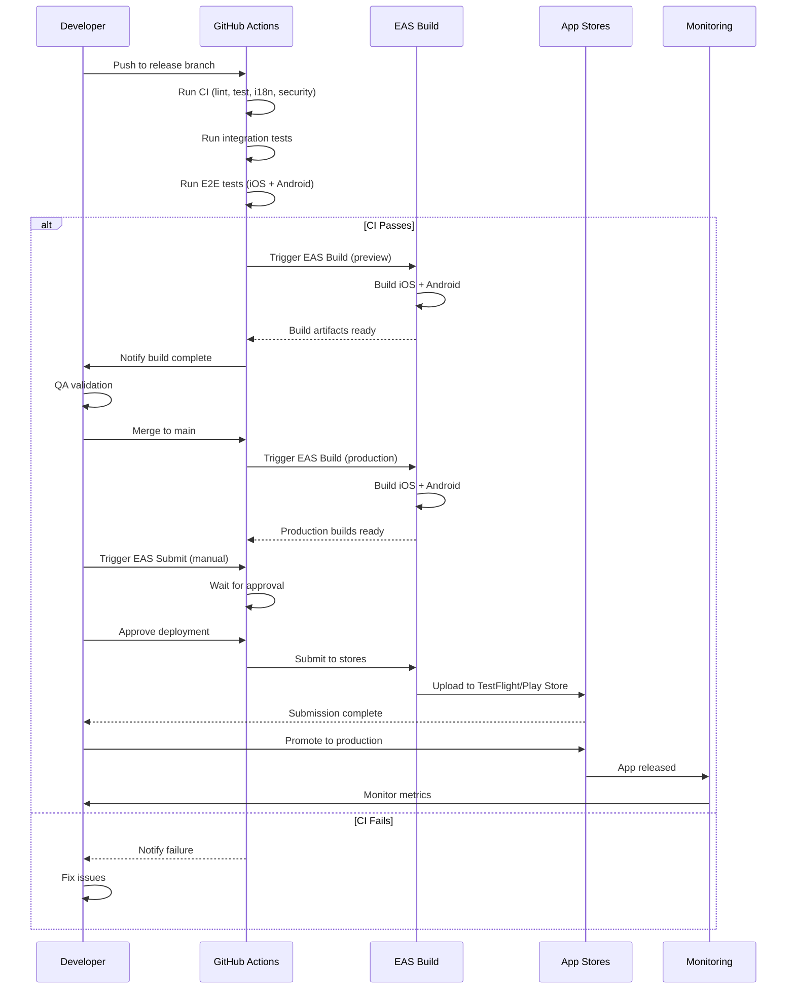
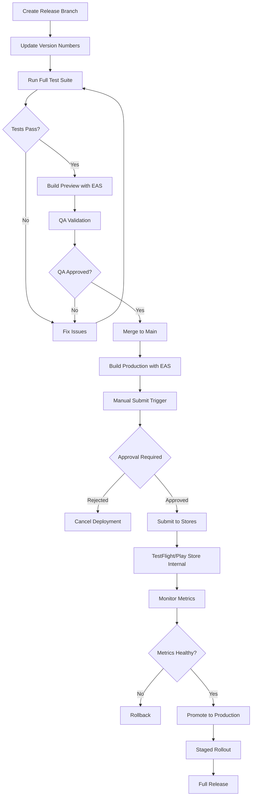

I have created the following plan after thorough exploration and analysis of the codebase. Follow the below plan verbatim. Trust the files and references. Do not re-verify what's written in the plan. Explore only when absolutely necessary. First implement all the proposed file changes and then I'll review all the changes together at the end.

## Observations

The project has a solid CI/CD foundation with comprehensive workflows for linting, testing, i18n validation, and E2E testing. However, production readiness requires completing the EAS Build/Submit configuration, enhancing app metadata, establishing GitHub Secrets, and creating a comprehensive release runbook. The existing CI uses TruffleHog for secret scanning while documentation mentions Gitleaks—this needs alignment. Asset files exist but `app.json` and `eas.json` lack production-ready configuration (bundle IDs, version codes, resource classes, submit settings). Integration tests are implemented but not separated in CI from unit tests.

## Approach

This phase completes production readiness by enhancing EAS configuration with platform-specific settings and submit profiles, enriching app metadata with bundle identifiers and version management, creating automated EAS Build/Submit workflows triggered by release branches, configuring all required GitHub Secrets, aligning secret scanning tooling, separating integration tests in CI, and documenting a comprehensive release checklist. The approach leverages **expo-docs MCP** for EAS configuration verification, **supabase MCP** for backend secrets validation, and involves **Backend_Expert** for infrastructure and **Quality_Assurance_Manager** for release validation criteria.

## Implementation Steps

### 1. Enhance EAS Configuration (`eas.json`)

**Objective:** Configure production-ready EAS build profiles with platform-specific settings, resource classes, and submit configuration.

**Actions:**

1. **Add iOS-specific configuration:**
   - Set `bundleIdentifier` (e.g., `com.gagyo.app`)
   - Configure `resourceClass: "m-medium"` for production builds
   - Add simulator support for development profile
   - Configure automatic code signing with `autoCodeSigning: "automatic"`

2. **Add Android-specific configuration:**
   - Set `package` (e.g., `com.gagyo.app`)
   - Configure `buildType: "apk"` for development/preview
   - Configure `buildType: "app-bundle"` for production (already set)
   - Add `versionCode` auto-increment

3. **Configure submit profiles:**
   - iOS: Add `appleId`, `ascAppId`, `appleTeamId`
   - Android: Add `serviceAccountKeyPath` or use GitHub Secrets
   - Set initial track to `internal` for both platforms

4. **Add environment-specific secrets:**
   - Reference EAS Secrets for `SUPABASE_URL`, `SUPABASE_ANON_KEY`, `SENTRY_DSN`, `POSTHOG_API_KEY`
   - Configure `env` blocks for each profile

5. **Verify configuration with expo-docs MCP:**
   - Consult latest EAS Build documentation
   - Validate submit configuration format
   - Confirm resource class options

**Files to modify:**
- `file:eas.json`

**Expected structure:**
```json
{
  "cli": { "version": ">= 16.28.0", "appVersionSource": "remote" },
  "build": {
    "development": {
      "developmentClient": true,
      "distribution": "internal",
      "ios": { "simulator": true, "bundleIdentifier": "com.gagyo.app.dev" },
      "android": { "buildType": "apk", "package": "com.gagyo.app.dev" },
      "env": { "EXPO_PUBLIC_ENV": "development" }
    },
    "preview": {
      "distribution": "internal",
      "ios": { "bundleIdentifier": "com.gagyo.app.preview", "resourceClass": "m-medium" },
      "android": { "buildType": "apk", "package": "com.gagyo.app.preview" },
      "env": { "EXPO_PUBLIC_ENV": "preview" }
    },
    "production": {
      "autoIncrement": true,
      "ios": { "bundleIdentifier": "com.gagyo.app", "resourceClass": "m-medium" },
      "android": { "buildType": "app-bundle", "package": "com.gagyo.app" },
      "env": { "EXPO_PUBLIC_ENV": "production" }
    }
  },
  "submit": {
    "production": {
      "ios": {
        "appleId": "PLACEHOLDER_APPLE_ID",
        "ascAppId": "PLACEHOLDER_ASC_APP_ID",
        "appleTeamId": "PLACEHOLDER_TEAM_ID"
      },
      "android": {
        "serviceAccountKeyPath": "./google-services-key.json",
        "track": "internal"
      }
    }
  }
}
```

---

### 2. Complete App Metadata (`app.json`)

**Objective:** Add production-ready app metadata including bundle identifiers, version codes, build numbers, and platform-specific configuration.

**Actions:**

1. **Add iOS configuration:**
   - `bundleIdentifier: "com.gagyo.app"`
   - `buildNumber: "1"`
   - `infoPlist` with required permissions (camera, photo library, notifications)
   - `config.googleMapsApiKey` (if using maps)

2. **Add Android configuration:**
   - `package: "com.gagyo.app"`
   - `versionCode: 1`
   - `permissions` array (CAMERA, READ_EXTERNAL_STORAGE, NOTIFICATIONS)
   - `googleServicesFile` path (if using Firebase)

3. **Add app metadata:**
   - `description` (English and Korean)
   - `primaryColor`
   - `backgroundColor`
   - `privacy: "unlisted"` (for initial release)

4. **Configure splash screen:**
   - Verify `splash.image` path matches existing assets
   - Set `splash.resizeMode: "contain"`
   - Set `splash.backgroundColor: "#ffffff"`

5. **Configure notifications:**
   - Add `notification.icon` for Android
   - Add `notification.color` for Android
   - Configure `ios.infoPlist.UIBackgroundModes: ["remote-notification"]`

6. **Add EAS project configuration:**
   - `extra.eas.projectId: "PLACEHOLDER_PROJECT_ID"`
   - Reference from environment variable

**Files to modify:**
- `file:app.json`

**Expected additions:**
```json
{
  "expo": {
    "name": "Gagyo",
    "slug": "Gagyo",
    "version": "1.0.0",
    "description": "Church Messenger for community connection",
    "primaryColor": "#007AFF",
    "ios": {
      "bundleIdentifier": "com.gagyo.app",
      "buildNumber": "1",
      "supportsTablet": true,
      "infoPlist": {
        "NSCameraUsageDescription": "Take photos to share with your community",
        "NSPhotoLibraryUsageDescription": "Share photos with your community",
        "UIBackgroundModes": ["remote-notification"]
      }
    },
    "android": {
      "package": "com.gagyo.app",
      "versionCode": 1,
      "permissions": ["CAMERA", "READ_EXTERNAL_STORAGE", "POST_NOTIFICATIONS"],
      "adaptiveIcon": { ... },
      "notification": {
        "icon": "./assets/notification-icon.png",
        "color": "#007AFF"
      }
    },
    "extra": {
      "eas": {
        "projectId": "PLACEHOLDER_PROJECT_ID"
      }
    }
  }
}
```

---

### 3. Create EAS Build Workflow (`.github/workflows/eas-build.yml`)

**Objective:** Automate EAS builds on release branches and main branch.

**Actions:**

1. **Create workflow file:**
   - Trigger on push to `main` and `release/*` branches
   - Trigger on workflow_dispatch for manual builds

2. **Add build matrix:**
   - Separate jobs for iOS and Android
   - Use `preview` profile for release branches
   - Use `production` profile for main branch

3. **Configure EAS authentication:**
   - Use `EXPO_TOKEN` from GitHub Secrets
   - Set up Expo GitHub Action

4. **Add build steps:**
   - Checkout code
   - Setup Bun
   - Install dependencies
   - Run EAS build with appropriate profile
   - Upload build artifacts

5. **Add build notifications:**
   - Comment on PR with build status and download links
   - Post to Slack/Discord (optional)

**Files to create:**
- `file:.github/workflows/eas-build.yml`

**Workflow structure:**
```yaml
name: EAS Build

on:
  push:
    branches: [main, 'release/**']
  workflow_dispatch:
    inputs:
      profile:
        description: 'Build profile'
        required: true
        default: 'preview'
        type: choice
        options: [development, preview, production]
      platform:
        description: 'Platform'
        required: true
        default: 'all'
        type: choice
        options: [ios, android, all]

jobs:
  build:
    name: EAS Build
    runs-on: ubuntu-latest
    steps:
      - uses: actions/checkout@v4
      - uses: oven-sh/setup-bun@v1
      - uses: expo/expo-github-action@v8
        with:
          expo-version: latest
          eas-version: latest
          token: ${{ secrets.EXPO_TOKEN }}
      - run: bun install --frozen-lockfile
      - name: Build on EAS
        run: |
          PROFILE=${{ github.ref == 'refs/heads/main' && 'production' || 'preview' }}
          eas build --profile $PROFILE --platform all --non-interactive
```

---

### 4. Create EAS Submit Workflow (`.github/workflows/eas-submit.yml`)

**Objective:** Automate submission to App Store and Play Store after successful builds.

**Actions:**

1. **Create workflow file:**
   - Trigger on workflow_dispatch (manual only for safety)
   - Require approval before submission

2. **Add submit jobs:**
   - Separate jobs for iOS (TestFlight) and Android (Play Store Internal)
   - Use `production` profile only

3. **Configure store credentials:**
   - iOS: Use `APPLE_ID`, `ASC_APP_ID`, `APPLE_TEAM_ID` from GitHub Secrets
   - Android: Use `GOOGLE_SERVICE_ACCOUNT_KEY` from GitHub Secrets

4. **Add submission steps:**
   - Checkout code
   - Setup Bun and Expo
   - Run EAS submit with latest build
   - Post submission status

5. **Add safety checks:**
   - Require manual approval via GitHub Environments
   - Verify version number matches expected release
   - Check that all tests passed

**Files to create:**
- `file:.github/workflows/eas-submit.yml`

**Workflow structure:**
```yaml
name: EAS Submit

on:
  workflow_dispatch:
    inputs:
      platform:
        description: 'Platform to submit'
        required: true
        type: choice
        options: [ios, android, all]

jobs:
  submit-ios:
    name: Submit to TestFlight
    runs-on: ubuntu-latest
    environment: production
    if: ${{ github.event.inputs.platform == 'ios' || github.event.inputs.platform == 'all' }}
    steps:
      - uses: actions/checkout@v4
      - uses: expo/expo-github-action@v8
        with:
          token: ${{ secrets.EXPO_TOKEN }}
      - run: eas submit --platform ios --latest --non-interactive

  submit-android:
    name: Submit to Play Store
    runs-on: ubuntu-latest
    environment: production
    if: ${{ github.event.inputs.platform == 'android' || github.event.inputs.platform == 'all' }}
    steps:
      - uses: actions/checkout@v4
      - uses: expo/expo-github-action@v8
        with:
          token: ${{ secrets.EXPO_TOKEN }}
      - run: eas submit --platform android --latest --non-interactive
```

---

### 5. Add Integration Test Job to CI

**Objective:** Separate integration tests from unit tests in CI pipeline for better visibility and parallelization.

**Actions:**

1. **Add new job to `ci.yml`:**
   - Name: `integration-tests`
   - Run after `test` job completes
   - Use Supabase test instance

2. **Configure test environment:**
   - Set up test database with Supabase MCP
   - Seed test data
   - Run integration tests from `__tests__/integration/`

3. **Add test reporting:**
   - Upload integration test results
   - Generate coverage report separately
   - Fail CI if integration tests fail

4. **Add test cleanup:**
   - Tear down test database
   - Clean up test data

**Files to modify:**
- `file:.github/workflows/ci.yml`

**Job addition:**
```yaml
integration-tests:
  name: Integration Tests
  runs-on: ubuntu-latest
  needs: test
  steps:
    - uses: actions/checkout@v4
    - uses: oven-sh/setup-bun@v1
    - run: bun install --frozen-lockfile
    - name: Run integration tests
      run: bun jest __tests__/integration --coverage
      env:
        SUPABASE_URL: ${{ secrets.SUPABASE_TEST_URL }}
        SUPABASE_ANON_KEY: ${{ secrets.SUPABASE_TEST_ANON_KEY }}
    - name: Upload integration test coverage
      uses: codecov/codecov-action@v4
      with:
        file: ./coverage/lcov.info
        flags: integration
```

---

### 6. Configure GitHub Secrets

**Objective:** Document and configure all required GitHub Secrets for CI/CD and EAS.

**Actions:**

1. **Create secrets documentation section in `agent_docs/04_release_and_ci.md`:**
   - List all required secrets
   - Provide instructions for obtaining each secret
   - Document secret rotation policy

2. **Required GitHub Secrets:**
   - `EXPO_TOKEN` - Expo access token for CI/CD
   - `CODECOV_TOKEN` - Codecov upload token
   - `SENTRY_AUTH_TOKEN` - Sentry release auth token
   - `SUPABASE_TEST_URL` - Test instance URL
   - `SUPABASE_TEST_ANON_KEY` - Test instance anon key
   - `APPLE_ID` - Apple Developer account email
   - `ASC_APP_ID` - App Store Connect app ID
   - `APPLE_TEAM_ID` - Apple Developer Team ID
   - `GOOGLE_SERVICE_ACCOUNT_KEY` - Google Play service account JSON (base64 encoded)

3. **EAS Secrets (via EAS CLI):**
   - `SUPABASE_URL` - Production Supabase URL
   - `SUPABASE_ANON_KEY` - Production Supabase anon key
   - `SENTRY_DSN` - Sentry DSN for error tracking
   - `POSTHOG_API_KEY` - PostHog API key for analytics

4. **Create setup script:**
   - Add `scripts/setup-eas-secrets.sh` with commands to set EAS secrets
   - Use placeholders, not actual values
   - Document in release runbook

**Files to modify:**
- `file:agent_docs/04_release_and_ci.md`

**Files to create:**
- `file:scripts/setup-eas-secrets.sh`

**Documentation section:**
```markdown
## GitHub Secrets Configuration

### Required Secrets

| Secret | Description | How to Obtain |
|--------|-------------|---------------|
| `EXPO_TOKEN` | Expo access token | Run `eas login` then `eas whoami --json` |
| `CODECOV_TOKEN` | Codecov upload token | From Codecov project settings |
| `SENTRY_AUTH_TOKEN` | Sentry auth token | From Sentry account settings |
| `SUPABASE_TEST_URL` | Test database URL | From Supabase test project |
| `SUPABASE_TEST_ANON_KEY` | Test anon key | From Supabase test project |
| `APPLE_ID` | Apple Developer email | Your Apple ID |
| `ASC_APP_ID` | App Store Connect ID | From App Store Connect |
| `APPLE_TEAM_ID` | Apple Team ID | From Apple Developer account |
| `GOOGLE_SERVICE_ACCOUNT_KEY` | Play Store service account | From Google Cloud Console (base64 encoded) |

### Setting GitHub Secrets

```bash
# Navigate to repository settings
# Settings > Secrets and variables > Actions > New repository secret

# Add each secret with its value
```

### Setting EAS Secrets

```bash
# Use EAS CLI to set secrets
eas secret:create --scope project --name SUPABASE_URL --value "https://..."
eas secret:create --scope project --name SUPABASE_ANON_KEY --value "..."
eas secret:create --scope project --name SENTRY_DSN --value "..."
eas secret:create --scope project --name POSTHOG_API_KEY --value "..."
```
```

---

### 7. Align Secret Scanning (Gitleaks Implementation)

**Objective:** Implement Gitleaks for secret scanning to align with documentation, or update documentation to reflect TruffleHog usage.

**Decision:** Keep TruffleHog (already working) and update documentation to reflect actual implementation.

**Actions:**

1. **Update `claude_docs/07_security_and_secrets.md`:**
   - Replace Gitleaks references with TruffleHog
   - Document TruffleHog configuration in CI
   - Explain why TruffleHog was chosen (better GitHub integration, verified secrets only)

2. **Enhance TruffleHog configuration in CI:**
   - Add custom regex patterns for project-specific secrets
   - Configure to fail CI on verified secrets
   - Add exclusion patterns for false positives

3. **Add pre-commit hook for TruffleHog (optional):**
   - Install TruffleHog locally
   - Configure in `.husky/pre-commit`
   - Document in developer setup guide

**Alternative:** If Gitleaks is preferred, replace TruffleHog in `ci.yml` with Gitleaks action.

**Files to modify:**
- `file:claude_docs/07_security_and_secrets.md`
- `file:.github/workflows/ci.yml` (enhance existing TruffleHog step)

**Documentation update:**
```markdown
### Secret Scanning

#### TruffleHog in CI
We use TruffleHog for secret scanning in CI/CD pipelines:

```yaml
- name: Check for secrets in code
  uses: trufflesecurity/trufflehog@main
  with:
    path: ./
    base: ${{ github.event.repository.default_branch }}
    head: HEAD
    extra_args: --only-verified --fail
```

TruffleHog advantages:
- Native GitHub integration
- Verified secrets only (reduces false positives)
- Comprehensive secret detection database
```

---

### 8. Create Comprehensive Release Checklist

**Objective:** Document a complete release runbook in `agent_docs/04_release_and_ci.md` with step-by-step instructions, validation criteria, and rollback procedures.

**Actions:**

1. **Expand release process section:**
   - Pre-release checklist (feature completeness, test coverage, i18n validation)
   - Version bump instructions (semantic versioning)
   - Release branch creation and management
   - QA validation criteria
   - Production deployment steps
   - Post-release monitoring
   - Rollback procedures

2. **Add release validation checklist:**
   - All Figma designs implemented
   - All user-facing strings use i18n
   - Test coverage ≥90% for critical paths
   - E2E tests passing on both platforms
   - Integration tests passing
   - No hardcoded secrets
   - Sentry and PostHog configured
   - Push notifications tested

3. **Add deployment runbook:**
   - Step-by-step EAS build commands
   - Step-by-step EAS submit commands
   - App Store Connect submission steps
   - Play Console submission steps
   - Staged rollout configuration (10% → 50% → 100%)

4. **Add monitoring checklist:**
   - Sentry error rate thresholds
   - PostHog engagement metrics
   - Crash-free session rate targets
   - Response time benchmarks

5. **Add rollback procedures:**
   - iOS rollback (remove from sale)
   - Android rollback (halt rollout, promote previous version)
   - Database migration rollback (if applicable)
   - Post-mortem template

**Files to modify:**
- `file:agent_docs/04_release_and_ci.md`

**Checklist structure:**
```markdown
## Pre-Release Checklist

### Feature Completeness
- [ ] All features from Figma implemented
- [ ] All screens match Figma designs
- [ ] All user flows tested end-to-end
- [ ] All edge cases handled

### Code Quality
- [ ] Test coverage ≥90% for critical paths
- [ ] All E2E tests passing (iOS + Android)
- [ ] All integration tests passing
- [ ] All unit tests passing
- [ ] No TypeScript errors
- [ ] No ESLint errors
- [ ] Code reviewed and approved

### Internationalization
- [ ] All UI strings use i18n system
- [ ] English translations complete
- [ ] Korean translations complete
- [ ] i18n validation passing
- [ ] E2E tests run in both locales

### Security
- [ ] No hardcoded secrets in code
- [ ] All secrets in GitHub Secrets / EAS Secrets
- [ ] Secret scanning passing
- [ ] Dependency audit passing
- [ ] RLS policies tested

### Monitoring
- [ ] Sentry configured and tested
- [ ] PostHog configured and tested
- [ ] Error tracking verified
- [ ] Analytics events verified

### Release Preparation
- [ ] Version bumped in `app.json` and `package.json`
- [ ] iOS build number incremented
- [ ] Android version code incremented
- [ ] Release notes written (English + Korean)
- [ ] Changelog updated

## Deployment Steps

### 1. Create Release Branch
```bash
git checkout develop
git pull origin develop
git checkout -b release/1.0.0
```

### 2. Update Version Numbers
- Update `version` in `app.json`: `"1.0.0"`
- Update `version` in `package.json`: `"1.0.0"`
- Update `buildNumber` in `app.json` (iOS): `"1"`
- Update `versionCode` in `app.json` (Android): `1`

### 3. Run Full Test Suite
```bash
bun run ci:coverage
bun run e2e:build:ios && bun run e2e:test:ios
bun run e2e:build:android && bun run e2e:test:android
```

### 4. Build with EAS
```bash
# Preview build for QA
eas build --profile preview --platform all

# Production build (after QA approval)
eas build --profile production --platform all
```

### 5. Submit to Stores
```bash
# iOS (TestFlight Internal)
eas submit --platform ios --latest

# Android (Play Store Internal)
eas submit --platform android --latest
```

### 6. Monitor Release
- Check Sentry for error spikes
- Check PostHog for engagement metrics
- Monitor crash-free session rate
- Review user feedback

## Rollback Procedures

### iOS Rollback
1. Log into App Store Connect
2. Navigate to app version
3. Remove from sale
4. Users will no longer receive updates

### Android Rollback
1. Log into Play Console
2. Navigate to release
3. Halt staged rollout
4. Promote previous version if needed

### Post-Mortem
- Document issue and root cause
- Create fix branch
- Fast-track new release
```

---

### 9. Verify Asset Configuration

**Objective:** Ensure all app icons and splash screens are properly configured and referenced in `app.json`.

**Actions:**

1. **Verify asset paths in `app.json`:**
   - `icon: "./assets/icon.png"` ✓
   - `splash.image: "./assets/splash-icon.png"` ✓
   - `ios.icon: "./assets/icon.png"` (add if missing)
   - `android.adaptiveIcon.foregroundImage: "./assets/adaptive-icon.png"` ✓
   - `android.notification.icon: "./assets/notification-icon.png"` (add if missing)
   - `web.favicon: "./assets/favicon.png"` ✓

2. **Verify asset files exist:**
   - Check that all referenced files exist in `assets/` directory
   - Verify image dimensions meet platform requirements:
     - iOS icon: 1024x1024px
     - Android adaptive icon: 1024x1024px
     - Splash screen: 1284x2778px (iPhone 13 Pro Max)
     - Notification icon: 96x96px (Android)

3. **Add missing assets if needed:**
   - Create notification icon for Android (monochrome, transparent background)
   - Verify splash screen works on all device sizes

4. **Test asset rendering:**
   - Build development app and verify icons display correctly
   - Test splash screen on iOS and Android
   - Test notification icon on Android

**Files to verify:**
- `file:app.json`
- `file:assets/icon.png`
- `file:assets/adaptive-icon.png`
- `file:assets/splash-icon.png`
- `file:assets/favicon.png`
- `file:assets/notification-icon.png` (create if missing)

---

### 10. Create GitHub Environments for Deployment Protection

**Objective:** Set up GitHub Environments with approval requirements for production deployments.

**Actions:**

1. **Create `production` environment in GitHub:**
   - Navigate to repository Settings > Environments
   - Create new environment named `production`
   - Add required reviewers (at least 1)
   - Add deployment branch rule: only `main` branch

2. **Configure environment secrets:**
   - Add production-specific secrets to `production` environment
   - These override repository secrets when deploying to production

3. **Update EAS Submit workflow:**
   - Reference `production` environment in submit jobs
   - This enforces manual approval before submission

4. **Document environment setup:**
   - Add instructions to `agent_docs/04_release_and_ci.md`
   - Explain approval workflow

**Files to modify:**
- `file:agent_docs/04_release_and_ci.md`

**Documentation addition:**
```markdown
## GitHub Environments

### Production Environment Setup

1. Navigate to repository Settings > Environments
2. Create new environment: `production`
3. Configure protection rules:
   - Required reviewers: 1 (add team members)
   - Deployment branches: `main` only
4. Add environment-specific secrets (if needed)

### Approval Workflow

When triggering EAS Submit workflow:
1. Workflow starts and waits for approval
2. Designated reviewer receives notification
3. Reviewer approves or rejects deployment
4. If approved, submission proceeds
5. If rejected, workflow is cancelled
```

---

## Subagents Involved

- **Backend_Expert**: Configure Supabase secrets, validate backend infrastructure readiness, review RLS policies for production
- **Quality_Assurance_Manager**: Define release validation criteria, create test coverage requirements, establish monitoring thresholds
- **Frontend_Expert**: Verify app metadata configuration, validate asset rendering, ensure UI readiness
- **Product_Manager**: Review release checklist, approve deployment criteria, validate feature completeness

---

## MCPs Used

- **expo-docs MCP**: Verify EAS Build configuration format, validate submit profile settings, confirm latest best practices for resource classes and auto-increment
- **supabase MCP**: Validate production database readiness, verify RLS policies are production-ready, confirm backup and recovery procedures
- **github MCP**: Configure GitHub Secrets, set up GitHub Environments, validate workflow syntax

---

## Exit Criteria

- ✅ `eas.json` contains complete iOS/Android configuration with resource classes and submit profiles
- ✅ `app.json` includes bundle identifiers, version codes, build numbers, and all required metadata
- ✅ EAS Build workflow (`.github/workflows/eas-build.yml`) created and tested
- ✅ EAS Submit workflow (`.github/workflows/eas-submit.yml`) created with approval gates
- ✅ Integration test job added to CI workflow and passing
- ✅ All required GitHub Secrets documented and configured
- ✅ All required EAS Secrets documented with setup script
- ✅ Secret scanning aligned (TruffleHog documented or Gitleaks implemented)
- ✅ Comprehensive release checklist added to `agent_docs/04_release_and_ci.md`
- ✅ All app assets verified and properly referenced
- ✅ GitHub `production` environment created with approval requirements
- ✅ Test build successfully created with EAS (preview profile)
- ✅ All workflows pass in CI without errors

---

## Visual Overview



---

## Release Workflow Diagram



---

## GitHub Secrets Configuration Table

| Secret Name | Type | Used By | Description |
|-------------|------|---------|-------------|
| `EXPO_TOKEN` | Repository | CI, EAS Build, EAS Submit | Expo authentication token |
| `CODECOV_TOKEN` | Repository | CI | Codecov upload token |
| `SENTRY_AUTH_TOKEN` | Repository | CI, EAS Build | Sentry release auth token |
| `SUPABASE_TEST_URL` | Repository | CI (integration tests) | Test database URL |
| `SUPABASE_TEST_ANON_KEY` | Repository | CI (integration tests) | Test database anon key |
| `APPLE_ID` | Repository | EAS Submit | Apple Developer account email |
| `ASC_APP_ID` | Repository | EAS Submit | App Store Connect app ID |
| `APPLE_TEAM_ID` | Repository | EAS Submit | Apple Developer Team ID |
| `GOOGLE_SERVICE_ACCOUNT_KEY` | Repository | EAS Submit | Play Store service account (base64) |
| `SUPABASE_URL` | EAS Secret | App Runtime | Production database URL |
| `SUPABASE_ANON_KEY` | EAS Secret | App Runtime | Production database anon key |
| `SENTRY_DSN` | EAS Secret | App Runtime | Sentry error tracking DSN |
| `POSTHOG_API_KEY` | EAS Secret | App Runtime | PostHog analytics key |