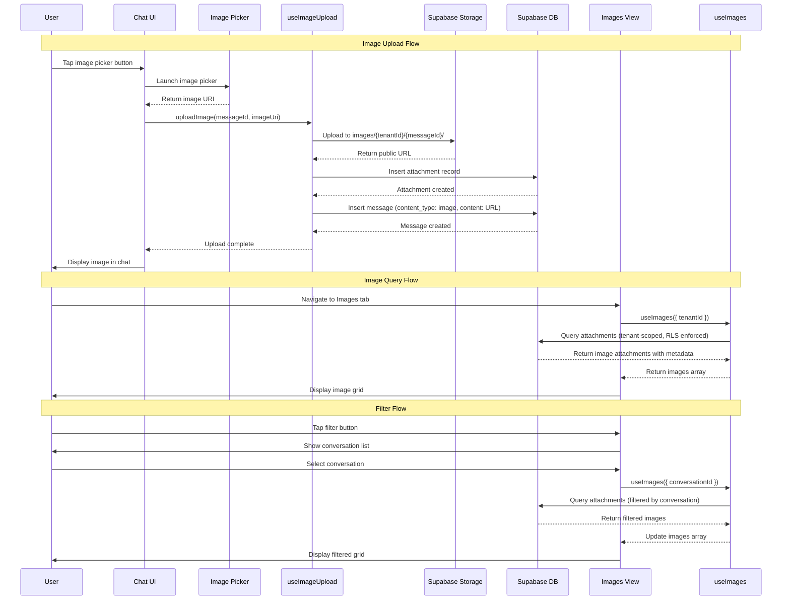

I have created the following plan after thorough exploration and analysis of the codebase. Follow the below plan verbatim. Trust the files and references. Do not re-verify what's written in the plan. Explore only when absolutely necessary. First implement all the proposed file changes and then I'll review all the changes together at the end.

# Implementation Plan: Unified Images View

## Observations

The codebase already has foundational infrastructure for image handling:
- The `attachments` table stores image metadata with tenant isolation and RLS policies
- Messages support `content_type: 'image'` with URLs stored in the `content` field
- `MessageBubble` component renders images from message content
- Supabase Storage is enabled with a 5MiB file size limit
- RLS policies enforce tenant-scoped access to attachments

However, critical gaps exist:
- No Supabase Storage bucket configuration or RLS policies for storage
- No image upload utilities or hooks
- No cross-conversation image query logic
- The `images.tsx` screen is a placeholder with no implementation
- No gallery UI components (thumbnail grid, full-screen viewer)

## Approach

This implementation follows a **storage-first, query-second, UI-last** strategy to ensure data integrity before building the interface. The approach aligns with the project's SDD → TDD → DDD workflow and leverages the existing `attachments` table schema rather than duplicating image storage in message content.

**Key decisions:**
1. **Dual storage model**: Store image URLs in both `messages.content` (for chat display) and `attachments` table (for gallery queries and metadata)
2. **Bucket strategy**: Single `images` bucket with tenant-scoped folders (`{tenant_id}/{message_id}/{filename}`)
3. **RLS enforcement**: Storage RLS policies mirror database RLS (conversation access = image access)
4. **Query optimization**: Index-backed query on `attachments` table filtered by `tenant_id` and `file_type LIKE 'image/%'`
5. **Progressive enhancement**: Start with basic grid + viewer, add filtering in iteration 2

This approach avoids over-engineering while maintaining security and performance standards.

---

## Implementation Steps

### 1. Write SDD Specification Document

**Subagents**: Product_Manager, Backend_Expert, Frontend_Expert

**Deliverable**: `file:claude_docs/17_images_view.md`

Create comprehensive SDD spec following the pattern in `file:claude_docs/15_home_screen.md`:

**Structure**:
- **WHAT**: Unified Images view showing all images from accessible conversations, with thumbnail grid, full-screen viewer, and filtering
- **WHY**: Centralized image access, quick photo sharing review, compliance with content moderation requirements
- **HOW**: 
  - Data model: Query `attachments` table filtered by `tenant_id`, `file_type LIKE 'image/%'`, joined with `messages` and `conversations`
  - Storage: Supabase Storage bucket `images` with folder structure `{tenant_id}/{message_id}/{filename}`
  - UI components: `ImageGrid`, `ImageViewer`, `ImageFilterSheet`
  - API boundaries: Storage upload/download, attachment metadata queries
  - Navigation: Tab navigation to Images screen, deep link support for image viewer

**Test implications**:
- Unit tests: Image query hook, upload utility, filter logic
- Integration tests: Storage RLS policies, attachment RLS enforcement
- E2E tests: Upload image in chat → appears in Images view, filter by conversation, full-screen viewer navigation

**Figma reference**: https://www.figma.com/design/6gW1h8DfD1WYH29AmJqaeW/Gagyo?node-id=38-982

**i18n keys required**:
```json
// en/common.json
{
  "images": {
    "title": "Images",
    "empty_state": "No images yet",
    "filter_by_conversation": "Filter by conversation",
    "all_conversations": "All conversations",
    "loading": "Loading images...",
    "upload_failed": "Failed to upload image",
    "delete_confirm": "Delete this image?"
  }
}

// ko/common.json
{
  "images": {
    "title": "이미지",
    "empty_state": "아직 이미지가 없습니다",
    "filter_by_conversation": "대화별 필터",
    "all_conversations": "모든 대화",
    "loading": "이미지 로딩 중...",
    "upload_failed": "이미지 업로드 실패",
    "delete_confirm": "이 이미지를 삭제하시겠습니까?"
  }
}
```

---

### 2. Set Up Supabase Storage Bucket and RLS Policies

**Subagents**: Backend_Expert

**MCPs**: `supabase` MCP for bucket creation and policy configuration

**Deliverable**: `file:supabase/migrations/20250106000000_create_images_storage.sql`

Create migration to set up storage infrastructure:

```sql
-- Create images storage bucket
INSERT INTO storage.buckets (id, name, public, file_size_limit, allowed_mime_types)
VALUES (
  'images',
  'images',
  false,  -- Private bucket, access controlled by RLS
  5242880,  -- 5 MiB limit
  ARRAY['image/jpeg', 'image/png', 'image/gif', 'image/webp']
);

-- Storage RLS: Users can view images from conversations they can access
CREATE POLICY "Users can view images from accessible conversations"
ON storage.objects FOR SELECT
USING (
  bucket_id = 'images'
  AND (storage.foldername(name))[1]::uuid IN (
    SELECT m.tenant_id FROM memberships m
    WHERE m.user_id = auth.uid() AND m.status = 'active'
  )
);

-- Storage RLS: Users can upload images to their tenant folder
CREATE POLICY "Users can upload images to their tenant"
ON storage.objects FOR INSERT
WITH CHECK (
  bucket_id = 'images'
  AND (storage.foldername(name))[1]::uuid IN (
    SELECT m.tenant_id FROM memberships m
    WHERE m.user_id = auth.uid() AND m.status = 'active'
  )
);

-- Storage RLS: Users can delete their own uploaded images
CREATE POLICY "Users can delete own images"
ON storage.objects FOR DELETE
USING (
  bucket_id = 'images'
  AND (storage.foldername(name))[1]::uuid IN (
    SELECT m.tenant_id FROM memberships m
    WHERE m.user_id = auth.uid() AND m.status = 'active'
  )
  AND owner = auth.uid()
);
```

**Validation**:
- Use `supabase` MCP to verify bucket creation
- Test RLS policies with positive/negative cases (same tenant access allowed, cross-tenant denied)

---

### 3. Create Image Upload Utility and Hook

**Subagents**: Frontend_Expert, Backend_Expert

**Deliverables**: 
- `file:src/lib/imageUpload.ts` (upload utility)
- `file:src/features/chat/hooks/useImageUpload.ts` (React hook)

**Image upload utility** (`imageUpload.ts`):
```typescript
/**
 * Upload image to Supabase Storage and create attachment record.
 * 
 * @param tenantId - Tenant context
 * @param messageId - Parent message ID
 * @param imageUri - Local image URI (from ImagePicker)
 * @param fileName - Original file name
 * @returns Public URL of uploaded image
 */
export async function uploadImage(
  tenantId: string,
  messageId: string,
  imageUri: string,
  fileName: string
): Promise<string>
```

**Implementation details**:
1. Generate unique file path: `{tenantId}/{messageId}/{timestamp}-{fileName}`
2. Upload to `images` bucket using `supabase.storage.from('images').upload()`
3. Get public URL using `supabase.storage.from('images').getPublicUrl()`
4. Insert record into `attachments` table with metadata
5. Return public URL for message content field

**React hook** (`useImageUpload.ts`):
```typescript
export function useImageUpload() {
  return {
    uploadImage: async (messageId: string, imageUri: string) => {...},
    uploading: boolean,
    error: Error | null
  }
}
```

**Error handling**:
- Network failures: Retry with exponential backoff
- File size exceeded: Show user-friendly error with i18n key `images.upload_failed`
- Invalid file type: Validate before upload, show error

**Unit tests** (`file:src/lib/__tests__/imageUpload.test.ts`):
- Successful upload creates attachment record
- File size validation rejects oversized images
- Invalid MIME type rejected
- Network error triggers retry logic
- Tenant isolation enforced (cannot upload to other tenant's folder)

---

### 4. Implement Image Query Hook

**Subagents**: Frontend_Expert, Backend_Expert

**Deliverable**: `file:src/features/images/hooks/useImages.ts`

**Hook interface**:
```typescript
export function useImages(options?: {
  conversationId?: string;  // Filter by conversation
  limit?: number;           // Pagination limit (default: 50)
  offset?: number;          // Pagination offset
}) {
  return {
    images: ImageAttachment[],
    loading: boolean,
    error: Error | null,
    hasMore: boolean,
    loadMore: () => void
  }
}

type ImageAttachment = {
  id: string;
  url: string;
  fileName: string;
  fileSize: number;
  createdAt: string;
  message: {
    id: string;
    conversationId: string;
    conversation: {
      id: string;
      name: string | null;
      type: ConversationType;
    };
    sender: {
      displayName: string | null;
      photoUrl: string | null;
    };
  };
};
```

**Query implementation**:
```typescript
const { data, error } = await supabase
  .from('attachments')
  .select(`
    id,
    url,
    file_name,
    file_size,
    created_at,
    message:messages!inner (
      id,
      conversation_id,
      conversation:conversations!inner (
        id,
        name,
        type
      ),
      sender:memberships!inner (
        user:users (
          display_name,
          photo_url
        )
      )
    )
  `)
  .eq('tenant_id', tenantId)
  .like('file_type', 'image/%')
  .order('created_at', { ascending: false })
  .range(offset, offset + limit - 1);
```

**Filtering logic**:
- If `conversationId` provided: Add `.eq('message.conversation_id', conversationId)`
- Pagination: Use `.range()` with offset/limit
- Tenant isolation: Automatic via RLS policies

**Unit tests** (`file:src/features/images/hooks/__tests__/useImages.test.ts`):
- Returns all images for tenant
- Filters by conversation correctly
- Pagination loads next batch
- RLS enforces tenant isolation (mock Supabase client)
- Empty state handled gracefully

---

### 5. Build Gallery UI Components

**Subagents**: Frontend_Expert, Designer, Design_System_Manager

**Deliverables**:
- `file:src/features/images/components/ImageGrid.tsx`
- `file:src/features/images/components/ImageViewer.tsx`
- `file:src/features/images/components/ImageFilterSheet.tsx`
- Storybook stories for each component

#### ImageGrid Component

**Purpose**: Display thumbnail grid of images with infinite scroll

**Props**:
```typescript
interface ImageGridProps {
  images: ImageAttachment[];
  onImagePress: (image: ImageAttachment, index: number) => void;
  onLoadMore: () => void;
  loading?: boolean;
  hasMore?: boolean;
}
```

**Implementation**:
- Use `FlashList` for virtualized rendering (performance optimization)
- 3-column grid layout with equal spacing
- Thumbnail size: 120x120 with `cover` resize mode
- Loading indicator at bottom when `hasMore` is true
- Empty state with i18n key `images.empty_state`

**Storybook story** (`ImageGrid.stories.tsx`):
- Default state with images
- Loading state
- Empty state
- Single image
- Many images (test virtualization)

#### ImageViewer Component

**Purpose**: Full-screen image viewer with swipe navigation

**Props**:
```typescript
interface ImageViewerProps {
  images: ImageAttachment[];
  initialIndex: number;
  visible: boolean;
  onClose: () => void;
}
```

**Implementation**:
- Use `react-native-image-viewing` library (or build custom with `Modal` + `PanResponder`)
- Swipe left/right to navigate between images
- Pinch-to-zoom support
- Close button (X icon) in top-right
- Image metadata overlay: sender name, conversation name, date
- Share button (native share sheet)

**Storybook story** (`ImageViewer.stories.tsx`):
- Single image
- Multiple images with navigation
- With metadata overlay
- Dark mode variant

#### ImageFilterSheet Component

**Purpose**: Bottom sheet for filtering images by conversation

**Props**:
```typescript
interface ImageFilterSheetProps {
  visible: boolean;
  onClose: () => void;
  conversations: Conversation[];
  selectedConversationId: string | null;
  onSelectConversation: (conversationId: string | null) => void;
}
```

**Implementation**:
- Use Tamagui `Sheet` component
- List of conversations with radio buttons
- "All conversations" option at top (clears filter)
- Search input to filter conversation list
- Apply button to confirm selection

**Storybook story** (`ImageFilterSheet.stories.tsx`):
- With conversations list
- With selected conversation
- Empty conversations list
- Search functionality

---

### 6. Implement Images Screen

**Subagents**: Frontend_Expert

**Deliverable**: `file:app/(tabs)/images.tsx` (replace placeholder)

**Screen structure**:
```typescript
export default function ImagesScreen() {
  const { tenantId } = useRequireAuth();
  const [selectedConversationId, setSelectedConversationId] = useState<string | null>(null);
  const [viewerVisible, setViewerVisible] = useState(false);
  const [viewerIndex, setViewerIndex] = useState(0);
  
  const { images, loading, hasMore, loadMore } = useImages({
    conversationId: selectedConversationId
  });
  
  const { conversations } = useConversations({ tenantId });
  
  // ... handlers
  
  return (
    <Container>
      <Stack flexDirection="row" justifyContent="space-between" padding="$4">
        <Heading level="h1" i18nKey="images.title" />
        <Button onPress={() => setFilterSheetVisible(true)}>
          <Text i18nKey="images.filter_by_conversation" />
        </Button>
      </Stack>
      
      <ImageGrid
        images={images}
        onImagePress={handleImagePress}
        onLoadMore={loadMore}
        loading={loading}
        hasMore={hasMore}
      />
      
      <ImageViewer
        images={images}
        initialIndex={viewerIndex}
        visible={viewerVisible}
        onClose={() => setViewerVisible(false)}
      />
      
      <ImageFilterSheet
        visible={filterSheetVisible}
        onClose={() => setFilterSheetVisible(false)}
        conversations={conversations}
        selectedConversationId={selectedConversationId}
        onSelectConversation={setSelectedConversationId}
      />
    </Container>
  );
}
```

**Navigation**:
- Accessible via bottom tab navigation (already configured)
- Deep link support: `gagyo://images?conversation={id}`

---

### 7. Integrate Image Upload into Chat

**Subagents**: Frontend_Expert

**Deliverable**: Update `file:src/features/chat/components/MessageInput.tsx`

**Changes**:
1. Add image picker button (📷 icon) next to text input
2. On press: Open native image picker using `expo-image-picker`
3. On image selected:
   - Show upload progress indicator
   - Call `useImageUpload().uploadImage()`
   - Create message with `content_type: 'image'` and `content: imageUrl`
   - Create attachment record
4. Handle errors with toast notification

**Image picker configuration**:
```typescript
import * as ImagePicker from 'expo-image-picker';

const result = await ImagePicker.launchImageLibraryAsync({
  mediaTypes: ImagePicker.MediaTypeOptions.Images,
  allowsEditing: true,
  aspect: [4, 3],
  quality: 0.8,  // Compress to reduce file size
});
```

**Validation**:
- Check file size before upload (max 5 MiB)
- Validate MIME type (jpeg, png, gif, webp only)
- Show error toast with i18n key `images.upload_failed` if validation fails

---

### 8. Write Integration Tests for Storage RLS

**Subagents**: Quality_Assurance_Manager, Backend_Expert

**Deliverable**: `file:__tests__/integration/image-storage-rls.test.ts`

**Test scenarios**:

| Test Case | Setup | Action | Expected Result |
|-----------|-------|--------|-----------------|
| **Positive: Same tenant upload** | User A in Tenant 1 | Upload image to Tenant 1 folder | Success, attachment created |
| **Negative: Cross-tenant upload** | User A in Tenant 1 | Attempt upload to Tenant 2 folder | RLS blocks, error returned |
| **Positive: View own tenant images** | User A in Tenant 1, images exist | Query images for Tenant 1 | All Tenant 1 images returned |
| **Negative: View other tenant images** | User A in Tenant 1 | Query images for Tenant 2 | Empty result (RLS filters) |
| **Positive: Delete own image** | User A uploaded image | Delete own image | Success, image removed |
| **Negative: Delete other user's image** | User B uploaded image | User A attempts delete | RLS blocks, error returned |

**Implementation**:
- Use `supabase` MCP to execute test queries
- Create test users in different tenants
- Verify RLS policies block unauthorized access
- Clean up test data after each test

---

### 9. Write E2E Tests for Images View

**Subagents**: Quality_Assurance_Manager, Frontend_Expert

**MCPs**: `rn-debugger` MCP for runtime inspection, `ios-simulator` MCP for UI verification

**Deliverable**: `file:e2e/images.test.ts`

**Test scenarios**:

```typescript
describe('Images View', () => {
  beforeAll(async () => {
    await device.launchApp();
    await loginAsTestUser();
    await selectTenant('Test Church');
  });

  it('should display images from all conversations', async () => {
    await element(by.id('tab-images')).tap();
    await expect(element(by.id('images-screen'))).toBeVisible();
    await expect(element(by.id('image-grid'))).toBeVisible();
  });

  it('should open full-screen viewer on image tap', async () => {
    await element(by.id('tab-images')).tap();
    await element(by.id('image-thumbnail-0')).tap();
    await expect(element(by.id('image-viewer'))).toBeVisible();
  });

  it('should filter images by conversation', async () => {
    await element(by.id('tab-images')).tap();
    await element(by.id('filter-button')).tap();
    await element(by.text('Small Group Chat')).tap();
    await element(by.id('apply-filter-button')).tap();
    // Verify only images from selected conversation shown
  });

  it('should upload image from chat and see it in Images view', async () => {
    // Navigate to chat
    await element(by.id('tab-chat')).tap();
    await element(by.id('conversation-0')).tap();
    
    // Upload image
    await element(by.id('image-picker-button')).tap();
    // Mock image picker result
    
    // Verify image appears in chat
    await expect(element(by.id('message-image'))).toBeVisible();
    
    // Navigate to Images view
    await element(by.id('tab-images')).tap();
    
    // Verify image appears in grid
    await expect(element(by.id('image-thumbnail-0'))).toBeVisible();
  });

  it('should handle empty state', async () => {
    // Setup: User with no images
    await element(by.id('tab-images')).tap();
    await expect(element(by.text('No images yet'))).toBeVisible();
  });

  it('should load more images on scroll', async () => {
    await element(by.id('tab-images')).tap();
    await element(by.id('image-grid')).scroll(500, 'down');
    // Verify more images loaded
  });
});
```

**Evidence capture**:
- Use `ios-simulator` MCP to capture screenshots of:
  - Image grid with thumbnails
  - Full-screen viewer
  - Filter sheet
  - Empty state
- Use `rn-debugger` MCP to verify:
  - Network requests to Supabase Storage
  - Attachment records created
  - RLS policies enforced

---

### 10. Update Documentation and Translation Keys

**Subagents**: Product_Manager, Design_System_Manager

**Deliverables**:
- Update `file:claude_docs/01_domain_glossary.md` with "Image Attachment" entity definition
- Add translation keys to `file:locales/en/common.json` and `file:locales/ko/common.json`
- Update `file:skills/SKILL.md` with lessons learned about image storage and RLS

**Domain glossary entry**:
```markdown
### Image Attachment

**Definition**: A reference to an image file stored in Supabase Storage, linked to a message in a conversation.

**Attributes**:
- `id`: Unique identifier
- `tenant_id`: Tenant scope (for isolation)
- `message_id`: Parent message reference
- `url`: Public URL of image in storage
- `file_name`: Original file name
- `file_type`: MIME type (e.g., image/jpeg)
- `file_size`: Size in bytes

**Relationships**:
- Belongs to one Message
- Belongs to one Tenant

**Access Rules**:
- Users can view images from conversations they have access to
- Users can upload images to their tenant's storage folder
- Users can delete their own uploaded images
```

---

## Exit Criteria

- [ ] SDD specification document created and reviewed
- [ ] Supabase Storage bucket `images` created with RLS policies
- [ ] Image upload utility and hook implemented with error handling
- [ ] Image query hook implemented with pagination and filtering
- [ ] Gallery UI components built (ImageGrid, ImageViewer, ImageFilterSheet)
- [ ] Images screen implemented with all features
- [ ] Image upload integrated into chat MessageInput
- [ ] Integration tests for storage RLS passing (6 test cases)
- [ ] E2E tests for Images view passing (6 test scenarios)
- [ ] Translation keys added for en and ko locales
- [ ] Documentation updated (domain glossary, SKILL.md)
- [ ] All tests passing in CI pipeline
- [ ] Code review completed by Backend_Expert and Frontend_Expert
- [ ] Feature verified against Figma design (node-id=38-982)

---

## Mermaid Diagram: Image Upload and Query Flow



---

## Risk Mitigation

| Risk | Impact | Mitigation |
|------|--------|------------|
| **Storage RLS misconfiguration** | High - Cross-tenant data leak | Comprehensive integration tests, manual RLS verification with `supabase` MCP |
| **Large image uploads** | Medium - Poor UX, storage costs | Client-side compression (quality: 0.8), 5 MiB hard limit, progress indicator |
| **Slow image loading** | Medium - Poor UX | Thumbnail caching, virtualized list (FlashList), lazy loading |
| **Attachment/message sync failure** | Medium - Orphaned records | Transactional approach: upload → attachment → message, rollback on failure |
| **Missing translation keys** | Low - Hardcoded strings | ESLint rule enforcement, i18n audit script |