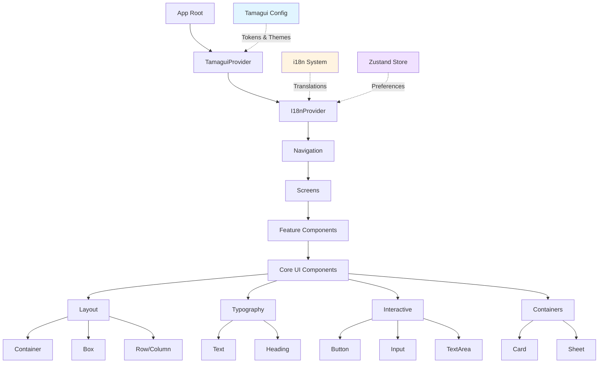

I have created the following plan after thorough exploration and analysis of the codebase. Follow the below plan verbatim. Trust the files and references. Do not re-verify what's written in the plan. Explore only when absolutely necessary. First implement all the proposed file changes and then I'll review all the changes together at the end.

## Observations

The project has Tamagui and Storybook packages installed but lacks configuration files. Current components (`ThemedText`, `ThemedView`) use basic React Native primitives with a simple theme system. The i18n infrastructure exists with translation files, but the initialization code and integration with components are missing. The codebase follows strict TypeScript mode and has path aliases configured for a `src/` directory structure that doesn't exist yet. The project requires MCP-first execution, particularly using `context7` and `expo-docs` MCPs for documentation lookup before implementation.

## Approach

This phase establishes the Tamagui design system foundation by creating configuration files, migrating to a proper `src/` directory structure, and building core UI components using Tamagui primitives. The approach prioritizes reusability and extensibility over custom implementations, following the "reuse first, extend on top" principle. Storybook will be configured for on-device development with stories demonstrating both English and Korean variants. All components will integrate with the existing i18n system, ensuring no hardcoded strings. The implementation follows the existing architecture documents and agent guidelines, with documentation updates to capture component usage patterns.

## Implementation Steps

### 1. Project Structure Reorganization

Restructure the project to match the path aliases defined in `tsconfig.json`:

- Create `src/` directory structure: `components/`, `hooks/`, `i18n/`, `stores/`, `features/`, `utils/`, `types/`
- Move existing files from root directories into `src/`:
  - `/components/*` → `src/components/`
  - `/hooks/*` → `src/hooks/`
  - `/constants/*` → `src/constants/`
- Update all import paths in existing files to use the new structure
- Verify TypeScript compilation succeeds after restructuring

**Rationale:** Aligns with the configured path aliases and prepares for scalable feature-first organization.

### 2. Tamagui Configuration Setup

Create Tamagui configuration with theme tokens, media queries, and type safety:

**File: `tamagui.config.ts`** (project root)

Define configuration structure:
- **Tokens**: Size, space, radius, zIndex, color (base palette)
- **Themes**: Light and dark themes with semantic color tokens (background, text, primary, secondary, border, etc.)
- **Media queries**: Responsive breakpoints (xs, sm, md, lg, xl)
- **Shorthands**: Common property aliases (px, py, bg, etc.)
- **Fonts**: Typography configuration with size, weight, and line height tokens
- **Settings**: Configure for React Native (disable SSR, set allowed style values)

Add TypeScript module augmentation for type safety:
```typescript
type AppConfig = typeof config
declare module 'tamagui' {
  interface TamaguiCustomConfig extends AppConfig {}
}
```

**Rationale:** Provides centralized design tokens and ensures type-safe theme usage across all components.

### 3. Babel and Metro Configuration

Configure build tools to support Tamagui compilation:

**File: `babel.config.js`** (create)

Add Tamagui babel plugin with configuration:
- Enable tree-shaking for production builds
- Configure component extraction
- Set up platform-specific optimizations

**File: `metro.config.js`** (create)

Configure Metro bundler:
- Add Tamagui to transformer configuration
- Set up resolver for Tamagui packages
- Configure source extensions for TypeScript

**Rationale:** Enables Tamagui's compile-time optimizations and ensures proper bundling.

### 4. Tamagui Provider Integration

Integrate Tamagui into the app root:

**File: `app/_layout.tsx`** (update)

Wrap the app with `TamaguiProvider`:
- Import Tamagui config
- Replace React Navigation `ThemeProvider` with Tamagui's theme system
- Pass theme based on color scheme (light/dark)
- Maintain `StatusBar` and `Stack` navigation structure

**Rationale:** Activates Tamagui's theme system and makes tokens available throughout the component tree.

### 5. Core UI Components - Layout Primitives

Create foundational layout components using Tamagui primitives:

**File: `src/components/ui/Container.tsx`**

Build on `Stack` primitive:
- Variants: `default`, `centered`, `padded`
- Props: `maxWidth`, `padding`, `gap`
- Support for safe area insets

**File: `src/components/ui/Box.tsx`**

Build on `Stack` primitive:
- Flexible container with all Tamagui style props
- Variants for common patterns (card, section, inline)

**File: `src/components/ui/Row.tsx` and `src/components/ui/Column.tsx`**

Build on `XStack` and `YStack`:
- Alignment and spacing props
- Responsive gap and padding
- Wrap support for Row

**Rationale:** Establishes consistent layout patterns using Tamagui's optimized primitives.

### 6. Core UI Components - Typography

Create text components with i18n integration:

**File: `src/components/ui/Text.tsx`**

Build on Tamagui `Text`:
- Variants: `body`, `caption`, `label`
- Size variants: `sm`, `md`, `lg`
- Weight variants: `regular`, `medium`, `semibold`, `bold`
- Color variants using theme tokens
- **No children prop** - requires `i18nKey` prop for translation lookup
- Optional `i18nParams` for interpolation

**File: `src/components/ui/Heading.tsx`**

Build on Tamagui `Heading`:
- Level variants: `h1`, `h2`, `h3`, `h4`
- Responsive sizing
- **No children prop** - requires `i18nKey` prop
- Optional `i18nParams` for interpolation

**Rationale:** Enforces i18n usage at the component level, preventing hardcoded strings.

### 7. Core UI Components - Interactive Elements

Create button and input components:

**File: `src/components/ui/Button.tsx`**

Build on Tamagui `Button`:
- Variants: `primary`, `secondary`, `outline`, `ghost`, `danger`
- Size variants: `sm`, `md`, `lg`
- States: `disabled`, `loading`
- Icon support (leading/trailing)
- **Label via `labelKey` prop** for i18n
- Optional `onPress` handler

**File: `src/components/ui/Input.tsx`**

Build on Tamagui `Input`:
- Variants: `default`, `filled`, `outline`
- Size variants: `sm`, `md`, `lg`
- States: `disabled`, `error`, `success`
- **Placeholder via `placeholderKey` prop** for i18n
- Label and helper text support (via i18n keys)
- Icon support

**File: `src/components/ui/TextArea.tsx`**

Build on Tamagui `TextArea`:
- Similar pattern to Input
- Auto-resize support
- Character count display

**Rationale:** Provides consistent interactive components with built-in i18n and accessibility.

### 8. Core UI Components - Containers

Create card and sheet components:

**File: `src/components/ui/Card.tsx`**

Build on Tamagui `Card`:
- Variants: `elevated`, `outlined`, `filled`
- Padding variants
- Pressable variant for interactive cards
- Header, body, footer composition

**File: `src/components/ui/Sheet.tsx`**

Build on Tamagui `Sheet`:
- Bottom sheet for mobile
- Variants: `default`, `fullscreen`
- Snap points configuration
- Backdrop support

**Rationale:** Provides common container patterns for content organization.

### 9. Storybook Configuration

Set up Storybook for on-device development:

**Directory: `.storybook/`** (create)

**File: `.storybook/main.ts`**

Configure Storybook:
- Story file patterns: `../src/components/**/*.stories.tsx`
- Addons: `@storybook/addon-ondevice-controls`, `@storybook/addon-ondevice-actions`, `@storybook/addon-ondevice-notes`

**File: `.storybook/preview.tsx`**

Set up global decorators:
- Wrap stories with `TamaguiProvider`
- Add i18n provider decorator
- Configure default theme

**File: `.storybook/index.tsx`**

Export Storybook UI for app integration

**File: `metro.config.js`** (update)

Wrap Metro config with `withStorybook`:
- Enable via environment variable `STORYBOOK_ENABLED`
- Set config path to `.storybook`

**File: `app/storybook.tsx`** (create)

Create Expo Router route for Storybook:
- Export Storybook UI
- Disable header

**Rationale:** Enables on-device component development and testing with live reloading.

### 10. Component Stories - Layout Components

Create Storybook stories for layout components:

**File: `src/components/ui/Container.stories.tsx`**

Stories:
- `Default`: Basic container
- `Centered`: Centered content
- `Padded`: With padding variants
- `WithMaxWidth`: Responsive max width

**File: `src/components/ui/Box.stories.tsx`**

Stories:
- `Default`: Basic box
- `Card`: Card variant
- `Section`: Section variant
- `AllVariants`: Showcase all variants

**File: `src/components/ui/Row.stories.tsx` and `src/components/ui/Column.stories.tsx`**

Stories:
- `Default`: Basic layout
- `WithGap`: Different gap sizes
- `Alignment`: Different alignment options
- `Responsive`: Responsive behavior

**Rationale:** Documents component usage and enables visual regression testing.

### 11. Component Stories - Typography Components

Create stories with i18n variants:

**File: `src/components/ui/Text.stories.tsx`**

Stories:
- `Default`: Body text in English
- `Korean`: Body text in Korean
- `AllVariants`: All size and weight combinations
- `LongText`: Text wrapping behavior
- `WithInterpolation`: Dynamic content example

**File: `src/components/ui/Heading.stories.tsx`**

Stories:
- `AllLevels`: h1 through h4
- `Korean`: Korean text rendering
- `Responsive`: Size changes across breakpoints

**Rationale:** Demonstrates i18n integration and text rendering across locales.

### 12. Component Stories - Interactive Components

Create stories with controls and actions:

**File: `src/components/ui/Button.stories.tsx`**

Stories:
- `Primary`: Primary button in both locales
- `AllVariants`: All button variants
- `AllSizes`: Size comparison
- `WithIcons`: Leading and trailing icons
- `Loading`: Loading state
- `Disabled`: Disabled state
- `Korean`: Korean text rendering

**File: `src/components/ui/Input.stories.tsx`**

Stories:
- `Default`: Basic input
- `WithLabel`: Label and helper text
- `Error`: Error state
- `Success`: Success state
- `WithIcon`: Icon variants
- `Korean`: Korean placeholder and labels

**File: `src/components/ui/TextArea.stories.tsx`**

Stories:
- `Default`: Basic textarea
- `AutoResize`: Auto-resize behavior
- `CharacterCount`: With character limit
- `Korean`: Korean text input

**Rationale:** Enables interactive testing of component behavior and states.

### 13. Component Stories - Container Components

Create stories for cards and sheets:

**File: `src/components/ui/Card.stories.tsx`**

Stories:
- `Elevated`: Elevated card
- `Outlined`: Outlined card
- `Filled`: Filled card
- `Pressable`: Interactive card
- `WithComposition`: Header, body, footer example

**File: `src/components/ui/Sheet.stories.tsx`**

Stories:
- `Default`: Basic bottom sheet
- `WithSnapPoints`: Multiple snap points
- `Fullscreen`: Fullscreen variant
- `WithBackdrop`: Backdrop behavior

**Rationale:** Documents container patterns and interaction behaviors.

### 14. i18n System Implementation

Create i18n initialization and utilities:

**File: `src/i18n/index.ts`**

Implement i18next configuration:
- Import all translation resources from `/locales/`
- Configure language detection (user preference → device locale → fallback)
- Set up interpolation and formatting
- Enable debug mode in development
- Add missing key handler
- Export `i18n` instance and types

**File: `src/i18n/types.ts`**

Define TypeScript types:
- Module augmentation for `i18next`
- `TranslationNamespace` type
- `TranslationKey` helper type

**File: `src/i18n/utils.ts`**

Create formatting utilities:
- `formatDate`: Locale-aware date formatting
- `formatNumber`: Locale-aware number formatting
- `formatRelativeTime`: Relative time strings

**File: `src/hooks/useLocale.ts`**

Create locale management hook:
- `locale`: Current locale
- `changeLocale`: Function to change locale
- `isKorean`, `isEnglish`: Convenience flags

**File: `app/_layout.tsx`** (update)

Wrap app with i18n provider:
- Import i18n instance
- Initialize before app renders
- Ensure i18n is ready before mounting

**Rationale:** Completes i18n infrastructure and makes translations available throughout the app.

### 15. Zustand Store for Preferences

Create preferences store for locale persistence:

**File: `src/stores/preferences.ts`**

Implement Zustand store:
- State: `locale`, `theme`
- Actions: `setLocale`, `setTheme`
- Persistence: Use `@react-native-async-storage/async-storage`
- Hydration: Load persisted state on app start

**Rationale:** Persists user preferences across sessions.

### 16. Migration of Existing Components

Migrate existing themed components to Tamagui:

**File: `src/components/themed-text.tsx`** (update)

Refactor to use Tamagui `Text`:
- Replace React Native `Text` with Tamagui `Text`
- Use theme tokens instead of `useThemeColor` hook
- Maintain existing type variants
- Add deprecation notice (prefer new `Text` component)

**File: `src/components/themed-view.tsx`** (update)

Refactor to use Tamagui `Stack`:
- Replace React Native `View` with Tamagui `Stack`
- Use theme tokens for background color
- Add deprecation notice (prefer new `Box` component)

**File: `app/(tabs)/index.tsx`** (update)

Update Home screen:
- Replace `ThemedText` with new `Text` component using `i18nKey`
- Replace `ThemedView` with new `Box` component
- Remove hardcoded "Home" string, use `common.home` translation key

**Rationale:** Demonstrates migration path and validates new component system.

### 17. Translation File Updates

Update translation files to nested structure:

**Files: `/locales/en/*.json` and `/locales/ko/*.json`** (update)

Restructure to match i18n architecture document:
- Convert flat structure to nested objects
- Add missing keys for new components
- Add `common.home` key for Home screen
- Ensure key parity between en and ko

**Rationale:** Aligns with i18n architecture and supports component i18n keys.

### 18. Documentation Updates

Document component usage patterns:

**File: `claude_docs/02_code_conventions.md`** (update)

Add sections:
- **Tamagui Component Usage**: Guidelines for using core components
- **Component Composition**: Patterns for building complex UIs
- **Theme Token Reference**: Quick reference for available tokens
- **Storybook Workflow**: How to develop components with Storybook

**File: `claude_docs/13_design_system.md`** (create)

Document design system:
- Component inventory with descriptions
- Token reference (colors, spacing, typography, etc.)
- Theme customization guide
- Accessibility guidelines
- Responsive design patterns

**Rationale:** Provides reference documentation for future development.

### 19. ESLint Configuration Update

Add ESLint rules for hardcoded strings:

**File: `eslint.config.js`** (update)

Add rule:
- `no-restricted-syntax`: Warn on JSX text with alphabetic characters
- Exception: Allow in test files and Storybook stories

**Rationale:** Enforces i18n usage and catches hardcoded strings during development.

### 20. Testing Setup

Add unit tests for core components:

**File: `src/components/ui/__tests__/Button.test.tsx`** (create)

Test cases:
- Renders with correct label from i18n
- Handles press events
- Shows loading state
- Respects disabled state
- Applies correct variant styles

**File: `src/components/ui/__tests__/Text.test.tsx`** (create)

Test cases:
- Renders translated text
- Handles interpolation
- Falls back to English when Korean missing
- Shows missing key warning in development

**File: `src/i18n/__tests__/i18n.test.ts`** (create)

Test cases:
- Initializes with correct locale
- Changes locale dynamically
- Falls back to English
- Handles missing keys
- Interpolates variables

**Rationale:** Ensures component behavior and i18n system work correctly.

### 21. CI Pipeline Update

Update CI to validate design system:

**File: `.github/workflows/ci.yml`** (update)

Add steps:
- Run i18n validation script (`bun run i18n:validate`)
- Run Storybook build test
- Run component unit tests
- Check for hardcoded strings (ESLint)

**Rationale:** Catches i18n and design system issues before merge.

### 22. Package Scripts Update

Add convenience scripts:

**File: `package.json`** (update)

Add scripts:
- `storybook:generate`: Generate Storybook story list
- `storybook:ios`: Launch Storybook on iOS
- `storybook:android`: Launch Storybook on Android
- `components:test`: Run component tests only

**Rationale:** Simplifies development workflow.

---

## Component Architecture Diagram



## Component Hierarchy Table

| Category | Component | Base Primitive | Key Features |
|----------|-----------|----------------|--------------|
| **Layout** | Container | Stack | Max width, padding, safe area |
| | Box | Stack | Flexible container, variants |
| | Row | XStack | Horizontal layout, gap, wrap |
| | Column | YStack | Vertical layout, gap |
| **Typography** | Text | Text | i18n integration, variants |
| | Heading | Heading | Levels (h1-h4), responsive |
| **Interactive** | Button | Button | Variants, sizes, loading |
| | Input | Input | i18n placeholder, validation |
| | TextArea | TextArea | Auto-resize, char count |
| **Containers** | Card | Card | Elevation, composition |
| | Sheet | Sheet | Bottom sheet, snap points |

## Storybook Story Coverage

| Component | Stories | i18n Variants | Interactive Controls |
|-----------|---------|---------------|---------------------|
| Container | 4 | N/A | ✓ |
| Box | 4 | N/A | ✓ |
| Row/Column | 4 each | N/A | ✓ |
| Text | 5 | ✓ | ✓ |
| Heading | 3 | ✓ | ✓ |
| Button | 7 | ✓ | ✓ |
| Input | 6 | ✓ | ✓ |
| TextArea | 4 | ✓ | ✓ |
| Card | 5 | N/A | ✓ |
| Sheet | 4 | N/A | ✓ |

## Subagents Involved

- **Design_System_Manager**: Owns Tamagui configuration, token definitions, component guidelines, and Storybook organization
- **Designer**: Validates component visual alignment with Figma, ensures accessibility standards, and reviews cross-platform consistency
- **Frontend_Expert**: Implements components, integrates i18n system, and ensures React Native best practices
- **Quality_Assurance_Manager**: Writes component tests, validates i18n fallback behavior, and ensures test coverage

## MCPs Used

- **context7 MCP**: Consult Tamagui documentation for component patterns, theme configuration, and optimization techniques before implementation
- **expo-docs MCP**: Verify Expo Router integration patterns, Metro configuration, and React Native compatibility

## Exit Criteria

- [ ] Tamagui configuration file created with tokens, themes, and type safety
- [ ] Babel and Metro configured to support Tamagui compilation
- [ ] TamaguiProvider integrated into app root with theme switching
- [ ] All core UI components implemented using Tamagui primitives
- [ ] All components enforce i18n via props (no hardcoded strings)
- [ ] Storybook configured for on-device development
- [ ] All components have Storybook stories with en/ko variants
- [ ] i18n system implemented with initialization and utilities
- [ ] Zustand preferences store created for locale persistence
- [ ] Existing components migrated to Tamagui
- [ ] Translation files updated to nested structure with key parity
- [ ] Component usage documented in `claude_docs/02_code_conventions.md`
- [ ] Design system documented in `claude_docs/13_design_system.md`
- [ ] ESLint rule added to catch hardcoded strings
- [ ] Unit tests written for core components and i18n system
- [ ] CI pipeline validates i18n parity and runs component tests
- [ ] All tests pass (unit, integration, type checking, linting)
- [ ] Storybook builds successfully and displays all stories
- [ ] Home screen updated to use new components with i18n