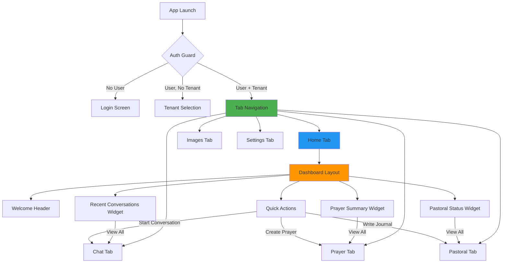
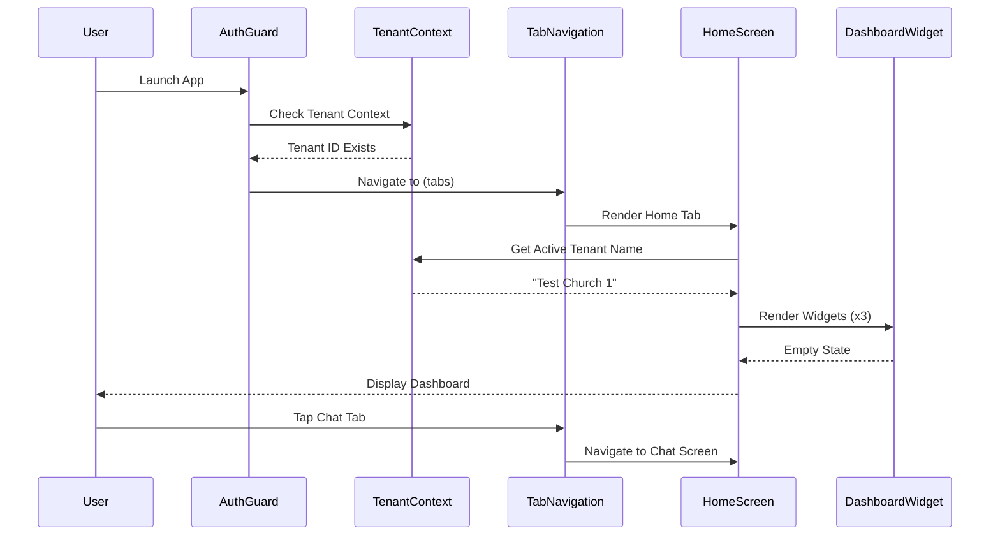

I have created the following plan after thorough exploration and analysis of the codebase. Follow the below plan verbatim. Trust the files and references. Do not re-verify what's written in the plan. Explore only when absolutely necessary. First implement all the proposed file changes and then I'll review all the changes together at the end.

# Home Screen & Tab Navigation Implementation Plan

## Observations

The codebase has a solid foundation with authentication, tenant context, i18n infrastructure, and Tamagui design system already in place. The current `(tabs)` layout contains only a single "Home" tab with a placeholder screen. Navigation guards in `app/_layout.tsx` already handle auth and tenant context redirection. The i18n system is fully operational with translation namespaces for chat, prayer, and pastoral features. All UI components enforce i18n via props (`i18nKey`, `labelKey`), and the project follows strict SDD → TDD → DDD workflow with Detox E2E tests and Jest unit tests.

## Approach

This implementation follows the **SDD → TDD → DDD** workflow mandated by CLAUDE.md. First, create a comprehensive SDD specification (`claude_docs/15_home_screen.md`) defining the Home screen's dashboard layout, tab navigation structure, and navigation guards. Second, write Detox E2E tests for tab navigation flows and unit tests for dashboard components (TDD). Third, implement the Home screen dashboard with quick-access cards, expand tab navigation to include Chat, Prayer, Pastoral Journal, Images, and Settings tabs, and verify tenant context guards. The approach leverages existing Tamagui components (Card, Button, Heading), follows the established i18n pattern with new translation keys in `locales/en/common.json` and `locales/ko/common.json`, and uses the Figma MCP to verify design alignment with node-id=38-643.

## Implementation Steps

### Phase 1: SDD Specification Creation

**Objective**: Create comprehensive specification document before any code or tests

**Subagents**: Product_Manager (primary), Designer (supporting)

**MCPs Used**:
- **Figma MCP**: Fetch design details from `https://www.figma.com/design/6gW1h8DfD1WYH29AmJqaeW/Gagyo?node-id=38-643` to understand dashboard layout, tab icons, and visual hierarchy
- **Context7 MCP**: Consult Expo Router documentation for tab navigation best practices

**Tasks**:

1. **Create `file:claude_docs/15_home_screen.md`** following the SDD format from `file:claude_docs/00a_sdd_rules.md`:
   - **WHAT Section**: Define Home screen as the primary navigation hub with dashboard widgets and bottom tab navigation (Home, Chat, Prayer, Pastoral, Images, Settings)
   - **WHY Section**: Explain rationale for dashboard layout (quick access to key features), tenant-scoped navigation guards (prevent access without tenant context), and tab-based navigation (mobile-first UX pattern)
   - **HOW Section**: Detail implementation approach:
     - Dashboard widgets: Recent conversations card, prayer cards summary, pastoral journal status
     - Tab navigation structure using Expo Router file-based routing
     - Navigation guards leveraging existing `useAuthGuard()` and `useTenantContext()` hooks
     - Tenant context validation on tab access
   - **Figma References**: Link to node-id=38-643 (Home screen) and node-id=128-1255 (dashboard flow)
   - **Test Implications**: Define E2E test scenarios (tab navigation, dashboard widget interactions, tenant guard enforcement) and unit test requirements (dashboard component rendering, navigation state)

2. **Update `file:claude_docs/01_domain_glossary.md`** if new domain concepts emerge:
   - Add "Dashboard Widget" if not already defined
   - Clarify "Navigation Tab" concept in multi-tenant context

3. **Document navigation structure** in the SDD spec:
   - Tab order: Home (index 0), Chat (index 1), Prayer (index 2), Pastoral (index 3), Images (index 4), Settings (index 5)
   - Tab icons using Ionicons (home, chatbubbles, heart, book, images, settings)
   - Active/inactive states with theme colors

**Exit Criteria**:
- `file:claude_docs/15_home_screen.md` exists with complete WHAT/WHY/HOW sections
- Figma references documented with specific node IDs
- Test implications clearly defined
- Domain glossary updated if needed

---

### Phase 2: Translation Keys Setup

**Objective**: Define all i18n keys before writing tests or implementation

**Subagents**: Design_System_Manager (primary), Designer (supporting)

**MCPs Used**: None (local file updates)

**Tasks**:

1. **Add navigation translation keys to `file:locales/en/common.json`**:
   ```json
   {
     "nav": {
       "home": "Home",
       "chat": "Chat",
       "prayer": "Prayer",
       "pastoral": "Pastoral Journal",
       "images": "Images",
       "settings": "Settings"
     },
     "home": {
       "welcome": "Welcome to {{churchName}}",
       "dashboard_title": "Dashboard",
       "recent_conversations": "Recent Conversations",
       "prayer_summary": "Prayer Cards",
       "pastoral_status": "Pastoral Journal",
       "view_all": "View All",
       "no_recent_activity": "No recent activity",
       "quick_actions": "Quick Actions",
       "start_conversation": "Start Conversation",
       "create_prayer": "Create Prayer Card",
       "write_journal": "Write Journal Entry"
     }
   }
   ```

2. **Add corresponding Korean translations to `file:locales/ko/common.json`**:
   ```json
   {
     "nav": {
       "home": "홈",
       "chat": "채팅",
       "prayer": "기도",
       "pastoral": "목회 일지",
       "images": "이미지",
       "settings": "설정"
     },
     "home": {
       "welcome": "{{churchName}}에 오신 것을 환영합니다",
       "dashboard_title": "대시보드",
       "recent_conversations": "최근 대화",
       "prayer_summary": "기도 카드",
       "pastoral_status": "목회 일지",
       "view_all": "전체 보기",
       "no_recent_activity": "최근 활동 없음",
       "quick_actions": "빠른 작업",
       "start_conversation": "대화 시작",
       "create_prayer": "기도 카드 작성",
       "write_journal": "일지 작성"
     }
   }
   ```

3. **Validate translation key completeness**:
   - Run `bun run check-i18n` to verify all keys exist in both locales
   - Fix any missing keys before proceeding

**Exit Criteria**:
- All navigation and home screen translation keys added to both `en` and `ko` locales
- Translation validation passes (`bun run check-i18n`)
- No hardcoded strings planned for implementation

---

### Phase 3: E2E Test Definition (TDD)

**Objective**: Write failing E2E tests that define expected behavior

**Subagents**: Quality_Assurance_Manager (primary), Frontend_Expert (supporting)

**MCPs Used**:
- **rn-debugger MCP**: For runtime inspection during test development
- **ios-simulator MCP**: For UI verification and screenshot capture

**Tasks**:

1. **Create `file:e2e/home-navigation.test.ts`** with test scenarios:
   ```typescript
   describe('Home Screen Navigation', () => {
     beforeEach(async () => {
       await completeAuthFlow('admin@test.com', 'password', 'Test Church 1');
     });

     it('should display home screen after authentication', async () => {
       await expectScreen('home-screen');
       await expect(element(by.id('dashboard-title'))).toBeVisible();
     });

     it('should show all navigation tabs', async () => {
       await expect(element(by.text('Home'))).toBeVisible();
       await expect(element(by.text('Chat'))).toBeVisible();
       await expect(element(by.text('Prayer'))).toBeVisible();
       await expect(element(by.text('Pastoral Journal'))).toBeVisible();
       await expect(element(by.text('Images'))).toBeVisible();
       await expect(element(by.text('Settings'))).toBeVisible();
     });

     it('should navigate to chat tab when tapped', async () => {
       await element(by.text('Chat')).tap();
       await expectScreen('chat-screen');
     });

     it('should navigate to prayer tab when tapped', async () => {
       await element(by.text('Prayer')).tap();
       await expectScreen('prayer-screen');
     });

     it('should display dashboard widgets', async () => {
       await expect(element(by.id('recent-conversations-widget'))).toBeVisible();
       await expect(element(by.id('prayer-summary-widget'))).toBeVisible();
       await expect(element(by.id('pastoral-status-widget'))).toBeVisible();
     });

     it('should show tenant name in welcome message', async () => {
       await expect(element(by.text('Welcome to Test Church 1'))).toBeVisible();
     });

     it('should enforce tenant context on tab navigation', async () => {
       // Clear tenant context
       await clearTenantContext();
       // Attempt to access tabs
       await expect(element(by.id('tenant-selection-screen'))).toBeVisible();
     });
   });

   describe('Home Screen i18n', () => {
     it('should display Korean navigation labels', async () => {
       await device.launchApp({
         languageAndRegion: { language: 'ko-KR' }
       });
       await completeAuthFlow('admin@test.com', 'password', 'Test Church 1');
       
       await expect(element(by.text('홈'))).toBeVisible();
       await expect(element(by.text('채팅'))).toBeVisible();
       await expect(element(by.text('기도'))).toBeVisible();
     });
   });
   ```

2. **Create `file:e2e/helpers/navigation-helpers.ts`** with helper functions:
   ```typescript
   export async function navigateToTab(tabName: string) {
     await element(by.text(tabName)).tap();
     await waitFor(element(by.id(`${tabName.toLowerCase()}-screen`)))
       .toBeVisible()
       .withTimeout(3000);
   }

   export async function expectScreen(screenId: string) {
     await waitFor(element(by.id(screenId)))
       .toBeVisible()
       .withTimeout(5000);
   }

   export async function clearTenantContext() {
     // Implementation to clear tenant from AsyncStorage
   }
   ```

3. **Run tests to verify they fail** (TDD red phase):
   ```bash
   bunx detox test e2e/home-navigation.test.ts --configuration ios.sim.debug
   ```

**Exit Criteria**:
- E2E test file created with comprehensive scenarios
- Tests fail as expected (screens/components don't exist yet)
- Helper functions defined for navigation testing
- Test coverage includes both English and Korean locales

---

### Phase 4: Unit Test Definition (TDD)

**Objective**: Write unit tests for dashboard components

**Subagents**: Quality_Assurance_Manager (primary), Frontend_Expert (supporting)

**MCPs Used**: None (local test files)

**Tasks**:

1. **Create `file:app/(tabs)/__tests__/index.test.tsx`** for Home screen unit tests:
   ```typescript
   describe('HomeScreen', () => {
     it('should render dashboard title', () => {
       const { getByText } = render(<HomeScreen />);
       expect(getByText('Dashboard')).toBeTruthy();
     });

     it('should display welcome message with tenant name', () => {
       const { getByText } = render(<HomeScreen />);
       expect(getByText(/Welcome to/)).toBeTruthy();
     });

     it('should render dashboard widgets', () => {
       const { getByTestId } = render(<HomeScreen />);
       expect(getByTestId('recent-conversations-widget')).toBeTruthy();
       expect(getByTestId('prayer-summary-widget')).toBeTruthy();
       expect(getByTestId('pastoral-status-widget')).toBeTruthy();
     });

     it('should use tenant context', () => {
       const { result } = renderHook(() => useTenantContext());
       expect(result.current.activeTenantId).toBeTruthy();
     });
   });
   ```

2. **Create `file:src/components/home/__tests__/DashboardWidget.test.tsx`**:
   ```typescript
   describe('DashboardWidget', () => {
     it('should render title and content', () => {
       const { getByText } = render(
         <DashboardWidget titleKey="home.recent_conversations" />
       );
       expect(getByText('Recent Conversations')).toBeTruthy();
     });

     it('should handle empty state', () => {
       const { getByText } = render(
         <DashboardWidget titleKey="home.recent_conversations" isEmpty />
       );
       expect(getByText('No recent activity')).toBeTruthy();
     });

     it('should call onViewAll when button pressed', () => {
       const onViewAll = jest.fn();
       const { getByText } = render(
         <DashboardWidget titleKey="home.recent_conversations" onViewAll={onViewAll} />
       );
       fireEvent.press(getByText('View All'));
       expect(onViewAll).toHaveBeenCalled();
     });
   });
   ```

3. **Run unit tests to verify they fail**:
   ```bash
   bun test app/(tabs)/__tests__/index.test.tsx
   ```

**Exit Criteria**:
- Unit test files created for Home screen and dashboard components
- Tests fail as expected (components don't exist yet)
- Test coverage includes i18n, tenant context, and user interactions

---

### Phase 5: Tab Navigation Implementation (DDD)

**Objective**: Implement tab navigation structure with proper routing

**Subagents**: Frontend_Expert (primary), Design_System_Manager (supporting)

**MCPs Used**:
- **Expo-docs MCP**: Verify Expo Router tab navigation API
- **Context7 MCP**: Consult React Navigation documentation if needed

**Tasks**:

1. **Update `file:app/(tabs)/_layout.tsx`** to include all tabs:
   ```typescript
   import Ionicons from '@expo/vector-icons/Ionicons';
   import { Tabs } from 'expo-router';
   import { useTranslation } from '@/i18n';
   import { Colors } from '@/constants/theme';
   import { useColorScheme } from '@/hooks/use-color-scheme';
   import { useAuthGuard } from '@/hooks/useAuthGuard';

   export default function TabLayout() {
     const { t } = useTranslation();
     const colorScheme = useColorScheme();
     const { loading } = useAuthGuard();

     if (loading) return null;

     return (
       <Tabs
         screenOptions={{
           tabBarActiveTintColor: Colors[colorScheme ?? 'light'].tint,
           headerShown: false,
         }}>
         <Tabs.Screen
           name="index"
           options={{
             title: t('common.nav.home'),
             tabBarIcon: ({ color, size }) => (
               <Ionicons name="home" size={size} color={color} />
             ),
           }}
         />
         <Tabs.Screen
           name="chat"
           options={{
             title: t('common.nav.chat'),
             tabBarIcon: ({ color, size }) => (
               <Ionicons name="chatbubbles" size={size} color={color} />
             ),
           }}
         />
         <Tabs.Screen
           name="prayer"
           options={{
             title: t('common.nav.prayer'),
             tabBarIcon: ({ color, size }) => (
               <Ionicons name="heart" size={size} color={color} />
             ),
           }}
         />
         <Tabs.Screen
           name="pastoral"
           options={{
             title: t('common.nav.pastoral'),
             tabBarIcon: ({ color, size }) => (
               <Ionicons name="book" size={size} color={color} />
             ),
           }}
         />
         <Tabs.Screen
           name="images"
           options={{
             title: t('common.nav.images'),
             tabBarIcon: ({ color, size }) => (
               <Ionicons name="images" size={size} color={color} />
             ),
           }}
         />
         <Tabs.Screen
           name="settings"
           options={{
             title: t('common.nav.settings'),
             tabBarIcon: ({ color, size }) => (
               <Ionicons name="settings" size={size} color={color} />
             ),
           }}
         />
       </Tabs>
     );
   }
   ```

2. **Create placeholder tab screens**:
   - `file:app/(tabs)/chat.tsx`
   - `file:app/(tabs)/prayer.tsx`
   - `file:app/(tabs)/pastoral.tsx`
   - `file:app/(tabs)/images.tsx`
   - `file:app/(tabs)/settings.tsx`

   Each placeholder should follow this pattern:
   ```typescript
   import { Container, Heading } from '@/components/ui';
   import { useRequireAuth } from '@/hooks/useAuthGuard';

   export default function ChatScreen() {
     const { user, tenantId } = useRequireAuth();

     return (
       <Container testID="chat-screen" centered padded flex={1}>
         <Heading level="h1" i18nKey="common.nav.chat" />
       </Container>
     );
   }
   ```

3. **Verify navigation guards** in `file:app/_layout.tsx`:
   - Ensure existing `AuthGuard` component handles tenant context validation
   - No changes needed if guards already redirect to tenant selection when `activeTenantId` is null

**Exit Criteria**:
- Tab navigation displays all 6 tabs with correct icons and labels
- Tab labels use i18n (English and Korean)
- Tapping each tab navigates to the correct screen
- Placeholder screens render with `testID` for E2E tests
- Navigation guards enforce tenant context (redirect to tenant selection if missing)

---

### Phase 6: Dashboard Widget Component (DDD)

**Objective**: Create reusable dashboard widget component

**Subagents**: Frontend_Expert (primary), Design_System_Manager (supporting)

**MCPs Used**: None (local component development)

**Tasks**:

1. **Create `file:src/components/home/DashboardWidget.tsx`**:
   ```typescript
   import { Card, Heading, Text, Button, Column } from '@/components/ui';
   import type { CardProps } from '@/components/ui/Card';

   export interface DashboardWidgetProps extends Omit<CardProps, 'children'> {
     titleKey: string;
     isEmpty?: boolean;
     emptyStateKey?: string;
     onViewAll?: () => void;
     children?: React.ReactNode;
   }

   export function DashboardWidget({
     titleKey,
     isEmpty = false,
     emptyStateKey = 'common.home.no_recent_activity',
     onViewAll,
     children,
     ...cardProps
   }: DashboardWidgetProps) {
     return (
       <Card variant="elevated" padding="md" {...cardProps}>
         <Card.Header>
           <Heading level="h3" i18nKey={titleKey} />
         </Card.Header>
         <Card.Body>
           {isEmpty ? (
             <Text i18nKey={emptyStateKey} color="muted" />
           ) : (
             children
           )}
         </Card.Body>
         {onViewAll && !isEmpty && (
           <Card.Footer>
             <Button
               labelKey="common.home.view_all"
               variant="ghost"
               size="sm"
               onPress={onViewAll}
             />
           </Card.Footer>
         )}
       </Card>
     );
   }
   ```

2. **Create Storybook story `file:src/components/home/DashboardWidget.stories.tsx`**:
   ```typescript
   import type { Meta, StoryObj } from '@storybook/react';
   import { DashboardWidget } from './DashboardWidget';
   import { Text } from '@/components/ui';

   const meta: Meta<typeof DashboardWidget> = {
     title: 'Home/DashboardWidget',
     component: DashboardWidget,
     parameters: {
       layout: 'padded',
     },
   };

   export default meta;
   type Story = StoryObj<typeof DashboardWidget>;

   export const Default: Story = {
     args: {
       titleKey: 'common.home.recent_conversations',
       children: <Text i18nKey="common.loading" />,
       onViewAll: () => console.log('View all clicked'),
     },
   };

   export const EmptyState: Story = {
     args: {
       titleKey: 'common.home.recent_conversations',
       isEmpty: true,
     },
   };

   export const WithoutViewAll: Story = {
     args: {
       titleKey: 'common.home.prayer_summary',
       children: <Text i18nKey="common.loading" />,
     },
   };
   ```

3. **Export component from `file:src/components/home/index.ts`**:
   ```typescript
   export { DashboardWidget } from './DashboardWidget';
   export type { DashboardWidgetProps } from './DashboardWidget';
   ```

**Exit Criteria**:
- `DashboardWidget` component created with proper TypeScript types
- Component uses Tamagui Card primitive
- All text uses i18n via `i18nKey` props
- Storybook story created with multiple variants
- Component exported from index file

---

### Phase 7: Home Screen Dashboard Implementation (DDD)

**Objective**: Implement Home screen with dashboard layout and widgets

**Subagents**: Frontend_Expert (primary), Designer (supporting)

**MCPs Used**:
- **Figma MCP**: Verify dashboard layout matches Figma design (node-id=38-643)

**Tasks**:

1. **Update `file:app/(tabs)/index.tsx`** with dashboard implementation:
   ```typescript
   import { Container, Heading, Column, Text } from '@/components/ui';
   import { DashboardWidget } from '@/components/home';
   import { useTranslation } from '@/i18n';
   import { useRequireAuth } from '@/hooks/useAuthGuard';
   import { useTenantContext } from '@/hooks/useTenantContext';
   import { useRouter } from 'expo-router';
   import { ScrollView } from 'react-native';

   export default function HomeScreen() {
     const { t } = useTranslation();
     const { user, tenantId } = useRequireAuth();
     const { activeTenantName } = useTenantContext();
     const router = useRouter();

     return (
       <Container testID="home-screen" flex={1}>
         <ScrollView contentContainerStyle={{ padding: 16 }}>
           <Column gap="$4" width="100%">
             {/* Welcome Header */}
             <Heading
               level="h1"
               i18nKey="common.home.welcome"
               i18nParams={{ churchName: activeTenantName || '' }}
             />

             {/* Dashboard Title */}
             <Heading
               level="h2"
               i18nKey="common.home.dashboard_title"
               testID="dashboard-title"
             />

             {/* Recent Conversations Widget */}
             <DashboardWidget
               testID="recent-conversations-widget"
               titleKey="common.home.recent_conversations"
               isEmpty={true}
               onViewAll={() => router.push('/(tabs)/chat')}
             />

             {/* Prayer Cards Summary Widget */}
             <DashboardWidget
               testID="prayer-summary-widget"
               titleKey="common.home.prayer_summary"
               isEmpty={true}
               onViewAll={() => router.push('/(tabs)/prayer')}
             />

             {/* Pastoral Journal Status Widget */}
             <DashboardWidget
               testID="pastoral-status-widget"
               titleKey="common.home.pastoral_status"
               isEmpty={true}
               onViewAll={() => router.push('/(tabs)/pastoral')}
             />

             {/* Quick Actions Section */}
             <Heading level="h3" i18nKey="common.home.quick_actions" />
             <Column gap="$2">
               <Button
                 labelKey="common.home.start_conversation"
                 variant="outline"
                 onPress={() => router.push('/(tabs)/chat')}
               />
               <Button
                 labelKey="common.home.create_prayer"
                 variant="outline"
                 onPress={() => router.push('/(tabs)/prayer')}
               />
               <Button
                 labelKey="common.home.write_journal"
                 variant="outline"
                 onPress={() => router.push('/(tabs)/pastoral')}
               />
             </Column>
           </Column>
         </ScrollView>
       </Container>
     );
   }
   ```

2. **Verify tenant context usage**:
   - `useRequireAuth()` hook ensures user and tenant context exist
   - If tenant context is missing, navigation guard in `app/_layout.tsx` redirects to tenant selection
   - No additional guards needed in Home screen

3. **Test implementation against Figma**:
   - Use Figma MCP to fetch design from node-id=38-643
   - Verify dashboard layout matches design (widget order, spacing, typography)
   - Adjust Tamagui spacing tokens if needed

**Exit Criteria**:
- Home screen renders dashboard with welcome message including tenant name
- Three dashboard widgets displayed (Recent Conversations, Prayer Summary, Pastoral Status)
- Quick actions section with three buttons
- All text uses i18n (no hardcoded strings)
- Tenant context properly integrated
- Layout matches Figma design

---

### Phase 8: Test Validation & Refinement

**Objective**: Run all tests and ensure they pass

**Subagents**: Quality_Assurance_Manager (primary), Frontend_Expert (supporting)

**MCPs Used**:
- **rn-debugger MCP**: Debug test failures with runtime inspection
- **ios-simulator MCP**: Capture screenshots for visual verification

**Tasks**:

1. **Run unit tests**:
   ```bash
   bun test app/(tabs)/__tests__/index.test.tsx
   bun test src/components/home/__tests__/DashboardWidget.test.tsx
   ```
   - Fix any failing tests
   - Ensure all assertions pass

2. **Run E2E tests**:
   ```bash
   bunx detox build --configuration ios.sim.debug
   bunx detox test e2e/home-navigation.test.ts --configuration ios.sim.debug
   ```
   - Verify tab navigation works in both English and Korean
   - Verify dashboard widgets render correctly
   - Verify tenant context guards work
   - Use `rn-debugger` MCP to inspect runtime state if tests fail

3. **Run i18n validation**:
   ```bash
   bun run check-i18n
   ```
   - Ensure all translation keys exist in both locales
   - Fix any missing keys

4. **Visual regression testing**:
   - Use `ios-simulator` MCP to capture screenshots of Home screen
   - Compare with Figma design (node-id=38-643)
   - Verify spacing, colors, typography match design system

5. **Test tenant context enforcement**:
   - Manually clear tenant context from AsyncStorage
   - Launch app and verify redirect to tenant selection
   - Select tenant and verify navigation to Home screen

**Exit Criteria**:
- All unit tests pass
- All E2E tests pass (English and Korean locales)
- i18n validation passes
- Visual appearance matches Figma design
- Tenant context guards work correctly

---

### Phase 9: Documentation & SKILL.md Update

**Objective**: Document implementation and update context files

**Subagents**: Product_Manager (primary), Frontend_Expert (supporting)

**MCPs Used**: None (local documentation)

**Tasks**:

1. **Update `file:skills/SKILL.md`** with implementation context:
   ```markdown
   ## Home Screen & Tab Navigation (2025-01-XX)

   ### What Was Implemented
   - Tab navigation with 6 tabs: Home, Chat, Prayer, Pastoral, Images, Settings
   - Dashboard layout on Home screen with 3 widgets and quick actions
   - Tenant context integration with navigation guards
   - Full i18n support (English and Korean)

   ### Key Decisions
   - Used existing `useRequireAuth()` hook for tenant context enforcement
   - Dashboard widgets are empty states (will be populated in subsequent phases)
   - Tab icons use Ionicons for consistency with existing auth screens
   - Translation keys follow `common.nav.*` and `common.home.*` pattern

   ### Lessons Learned
   - Expo Router tab navigation requires `useTranslation()` hook in layout component
   - `testID` props are essential for Detox E2E tests
   - Dashboard widgets should be reusable components for future features

   ### Next Steps
   - Implement Chat screen (Phase 7 of overall project)
   - Populate dashboard widgets with real data
   - Add pull-to-refresh functionality
   ```

2. **Update `file:claude_docs/15_home_screen.md`** with implementation notes:
   - Add "Implementation Status" section
   - Document completed components and test coverage
   - Note any deviations from original spec

3. **Create component documentation** in `file:src/components/home/README.md`:
   ```markdown
   # Home Components

   ## DashboardWidget

   Reusable card component for displaying dashboard summaries.

   ### Usage
   ```tsx
   <DashboardWidget
     titleKey="common.home.recent_conversations"
     isEmpty={false}
     onViewAll={() => router.push('/chat')}
   >
     <ConversationList />
   </DashboardWidget>
   ```

   ### Props
   - `titleKey`: Translation key for widget title
   - `isEmpty`: Show empty state if true
   - `emptyStateKey`: Translation key for empty state message
   - `onViewAll`: Callback for "View All" button
   - `children`: Widget content

   ### Storybook
   View stories at `.storybook/stories/DashboardWidget.stories.tsx`
   ```

**Exit Criteria**:
- `SKILL.md` updated with implementation context
- SDD spec updated with implementation status
- Component documentation created
- All documentation uses proper markdown formatting

---

## Architecture Diagram



## Navigation Flow



## Test Coverage Summary

| Test Type | File | Scenarios Covered |
|-----------|------|-------------------|
| E2E | `e2e/home-navigation.test.ts` | Tab navigation, dashboard rendering, tenant guards, i18n |
| Unit | `app/(tabs)/__tests__/index.test.tsx` | Home screen rendering, tenant context usage |
| Unit | `src/components/home/__tests__/DashboardWidget.test.tsx` | Widget rendering, empty states, callbacks |
| Integration | Existing `__tests__/integration/auth-context.test.ts` | Tenant context validation (no changes needed) |

## Translation Key Structure

| Namespace | Key | English | Korean |
|-----------|-----|---------|--------|
| `common.nav` | `home` | Home | 홈 |
| `common.nav` | `chat` | Chat | 채팅 |
| `common.nav` | `prayer` | Prayer | 기도 |
| `common.nav` | `pastoral` | Pastoral Journal | 목회 일지 |
| `common.nav` | `images` | Images | 이미지 |
| `common.nav` | `settings` | Settings | 설정 |
| `common.home` | `welcome` | Welcome to {{churchName}} | {{churchName}}에 오신 것을 환영합니다 |
| `common.home` | `dashboard_title` | Dashboard | 대시보드 |
| `common.home` | `recent_conversations` | Recent Conversations | 최근 대화 |
| `common.home` | `prayer_summary` | Prayer Cards | 기도 카드 |
| `common.home` | `pastoral_status` | Pastoral Journal | 목회 일지 |

## Files to Create/Modify

### New Files
- `file:claude_docs/15_home_screen.md` - SDD specification
- `file:e2e/home-navigation.test.ts` - E2E tests
- `file:e2e/helpers/navigation-helpers.ts` - Test helpers
- `file:app/(tabs)/__tests__/index.test.tsx` - Home screen unit tests
- `file:src/components/home/DashboardWidget.tsx` - Widget component
- `file:src/components/home/DashboardWidget.stories.tsx` - Storybook story
- `file:src/components/home/__tests__/DashboardWidget.test.tsx` - Widget unit tests
- `file:src/components/home/index.ts` - Component exports
- `file:src/components/home/README.md` - Component documentation
- `file:app/(tabs)/chat.tsx` - Chat tab placeholder
- `file:app/(tabs)/prayer.tsx` - Prayer tab placeholder
- `file:app/(tabs)/pastoral.tsx` - Pastoral tab placeholder
- `file:app/(tabs)/images.tsx` - Images tab placeholder
- `file:app/(tabs)/settings.tsx` - Settings tab placeholder

### Modified Files
- `file:app/(tabs)/_layout.tsx` - Add all 6 tabs with i18n
- `file:app/(tabs)/index.tsx` - Implement dashboard layout
- `file:locales/en/common.json` - Add navigation and home keys
- `file:locales/ko/common.json` - Add Korean translations
- `file:claude_docs/01_domain_glossary.md` - Add dashboard concepts (if needed)
- `file:skills/SKILL.md` - Document implementation context

### No Changes Needed
- `file:app/_layout.tsx` - Navigation guards already handle tenant context
- `file:src/hooks/useAuthGuard.ts` - Already provides required functionality
- `file:src/hooks/useTenantContext.ts` - Already provides tenant state

## Success Criteria

✅ **SDD Specification Complete**: `claude_docs/15_home_screen.md` exists with WHAT/WHY/HOW sections, Figma references, and test implications

✅ **Translation Keys Defined**: All navigation and home screen keys added to both `en` and `ko` locales, validation passes

✅ **Tests Written First (TDD)**: E2E and unit tests created before implementation, all tests initially fail

✅ **Tab Navigation Implemented**: 6 tabs displayed with correct icons and i18n labels, navigation works in both locales

✅ **Dashboard Implemented**: Home screen displays welcome message with tenant name, 3 dashboard widgets, and quick actions section

✅ **Tenant Context Enforced**: Navigation guards redirect to tenant selection if tenant context is missing

✅ **All Tests Pass**: Unit tests, E2E tests, and i18n validation all pass

✅ **Visual Alignment**: Dashboard layout matches Figma design (node-id=38-643)

✅ **Documentation Updated**: `SKILL.md` and component documentation reflect implementation

✅ **No Hardcoded Strings**: All UI text uses i18n system via `i18nKey` or `labelKey` props