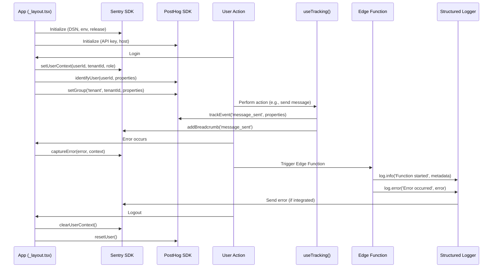

I have created the following plan after thorough exploration and analysis of the codebase. Follow the below plan verbatim. Trust the files and references. Do not re-verify what's written in the plan. Explore only when absolutely necessary. First implement all the proposed file changes and then I'll review all the changes together at the end.

## Observations

The codebase has Sentry (`@sentry/react-native`, `sentry-expo`) and PostHog (`posthog-react-native`) packages installed with test mocks configured, but **no actual implementation exists**. The architecture document (`file:claude_docs/03_service_architecture.md`) defines comprehensive event taxonomies for both services, but these are not yet integrated into the app or Edge Functions. The app entry point (`file:app/_layout.tsx`) initializes i18n, Tamagui, and auth guards but lacks monitoring setup. Edge Functions use basic `console.error` logging without structured logging or error tracking. The `.gitignore` properly excludes secrets, and documentation references exist in `file:agent_docs/04_release_and_ci.md` for GitHub Secrets configuration.

## Approach

This implementation follows the **SDD → TDD → DDD** workflow mandated by `file:CLAUDE.md`. First, create a comprehensive SDD specification for monitoring and observability that defines the integration architecture, event taxonomy, error handling patterns, and Edge Function logging standards. Then, write unit tests for event tracking helpers and integration patterns (TDD). Finally, implement the monitoring infrastructure in three layers: (1) **Client-side**: Sentry and PostHog initialization in `file:app/_layout.tsx` with context providers, event tracking utilities, and user identification hooks; (2) **Edge Functions**: structured logging with Sentry integration for error capture; (3) **Configuration**: environment variables, GitHub Secrets setup, and CI integration. This approach ensures tenant-scoped error tracking, locale-aware analytics, and production-ready observability without disrupting existing functionality.

---

## Implementation Steps

### 1. Write SDD Specification for Monitoring & Observability

**File**: `file:claude_docs/22_monitoring_and_observability.md`

Create a comprehensive SDD document covering:

- **Integration Architecture**: How Sentry and PostHog integrate with the app lifecycle (initialization in `_layout.tsx`, provider wrapping, cleanup on unmount)
- **Event Taxonomy Implementation**: Map the event taxonomy from `file:claude_docs/03_service_architecture.md` to actual tracking calls with TypeScript types
- **Error Tracking Patterns**: Define error boundaries, automatic error capture, manual error reporting, and context enrichment (tenant_id, user_role, locale)
- **User Identification Flow**: When and how to identify users (on login, tenant switch, profile update) with proper cleanup on logout
- **Breadcrumb Strategy**: What user actions to track as breadcrumbs (navigation, API calls, state changes)
- **Edge Function Logging**: Structured JSON logging format, log levels, Sentry integration for Edge Functions
- **Environment Variables**: Required env vars for both client and Edge Functions (SENTRY_DSN, EXPO_PUBLIC_POSTHOG_API_KEY, etc.)
- **Testing Strategy**: How to test tracking calls without hitting real services (mocks, test helpers)
- **Performance Considerations**: Sampling rates, batch sizes, network impact mitigation

**Subagents**: Backend_Expert, Product_Manager  
**MCPs**: None required for specification writing  
**Exit Criteria**: SDD document approved, covers all integration points, includes code examples and type definitions

---

### 2. Create Monitoring Utility Types & Interfaces

**Files**: 
- `file:src/lib/monitoring/types.ts` (new)
- `file:src/lib/monitoring/events.ts` (new)

Define TypeScript types for:

- **Sentry Event Types**: Error categories, severity levels, context tag interfaces
- **PostHog Event Types**: Event names as string literals, event property interfaces for each category (auth, chat, prayer, pastoral, settings)
- **User Properties**: Interface for user identification (tenant_count, primary_role, locale, created_at)
- **Group Properties**: Interface for tenant group analytics (name, member_count, created_at)
- **Breadcrumb Types**: Navigation, API, state change breadcrumb interfaces

Create event name constants and helper types to ensure type safety when tracking events.

**Subagents**: Frontend_Expert, Backend_Expert  
**MCPs**: `context7` (consult TypeScript best practices for event tracking types)  
**Exit Criteria**: All event types defined, exported, and documented with JSDoc comments

---

### 3. Write Unit Tests for Monitoring Utilities (TDD)

**Files**:
- `file:src/lib/monitoring/__tests__/sentry.test.ts` (new)
- `file:src/lib/monitoring/__tests__/posthog.test.ts` (new)
- `file:src/lib/monitoring/__tests__/tracking.test.ts` (new)

Write tests for:

- **Sentry initialization**: Verify DSN configuration, environment detection, release version, dist, tags setup
- **PostHog initialization**: Verify API key, host configuration, user identification
- **Event tracking helpers**: Test `trackEvent()`, `trackError()`, `identifyUser()`, `setUserContext()`, `addBreadcrumb()`
- **Context enrichment**: Verify tenant_id, user_role, locale are added to all events
- **Error scenarios**: Test behavior when services are unavailable or misconfigured
- **Cleanup**: Test reset/logout behavior (clear user context, reset session)

Use existing mocks from `file:jest.setup.js` and extend as needed.

**Subagents**: Quality_Assurance_Manager, Frontend_Expert  
**MCPs**: None (uses existing test infrastructure)  
**Exit Criteria**: All tests written and failing (TDD red phase), test coverage plan documented

---

### 4. Implement Sentry Integration

**Files**:
- `file:src/lib/monitoring/sentry.ts` (new)
- `file:app/_layout.tsx` (modify)

**Implementation**:

1. **Create Sentry utility** (`sentry.ts`):
   - Initialize Sentry with DSN from `SENTRY_DSN` env var
   - Configure environment (development/preview/production) from `EXPO_PUBLIC_ENV`
   - Set release version from `app.json` version
   - Set dist from EAS build ID (if available)
   - Configure default tags: `tenant_id`, `user_role`, `locale`, `app_version`
   - Export helper functions: `captureError()`, `captureMessage()`, `setUserContext()`, `clearUserContext()`, `addBreadcrumb()`
   - Implement error boundary wrapper component

2. **Integrate into app** (`_layout.tsx`):
   - Import and initialize Sentry before any other initialization
   - Wrap entire app tree with Sentry error boundary
   - Add navigation breadcrumbs using Expo Router navigation events
   - Set up automatic breadcrumbs for network requests (if feasible with Supabase client)

3. **Add context updates**:
   - In `file:src/hooks/useAuth.ts`: Call `setUserContext()` on login, `clearUserContext()` on logout
   - In `file:src/stores/tenantStore.ts`: Update tenant_id tag when tenant switches

**Subagents**: Frontend_Expert, Backend_Expert  
**MCPs**: `context7` (consult Sentry React Native documentation), `expo-docs` (verify Expo Router integration)  
**Exit Criteria**: Sentry initialized, errors captured, context tags set, tests passing

---

### 5. Implement PostHog Integration

**Files**:
- `file:src/lib/monitoring/posthog.ts` (new)
- `file:app/_layout.tsx` (modify)

**Implementation**:

1. **Create PostHog utility** (`posthog.ts`):
   - Initialize PostHog with API key from `EXPO_PUBLIC_POSTHOG_API_KEY` env var
   - Configure host (default: `https://app.posthog.com`)
   - Export helper functions: `trackEvent()`, `identifyUser()`, `resetUser()`, `setGroup()`
   - Implement type-safe event tracking with event name validation
   - Add automatic property enrichment (tenant_id, locale, app_version)

2. **Integrate into app** (`_layout.tsx`):
   - Wrap app tree with `PostHogProvider` from `posthog-react-native`
   - Initialize PostHog after i18n is ready

3. **Add user identification**:
   - In `file:src/hooks/useAuth.ts`: Call `identifyUser()` on login with user properties (tenant_count, primary_role, locale, created_at)
   - Call `resetUser()` on logout
   - In `file:src/stores/tenantStore.ts`: Call `setGroup('tenant', tenantId, properties)` when tenant is set

**Subagents**: Frontend_Expert, Backend_Expert  
**MCPs**: `context7` (consult PostHog React Native documentation)  
**Exit Criteria**: PostHog initialized, events tracked, user identified, group analytics configured, tests passing

---

### 6. Create Event Tracking Hooks & Utilities

**Files**:
- `file:src/lib/monitoring/tracking.ts` (new)
- `file:src/hooks/useTracking.ts` (new)

**Implementation**:

1. **Create tracking utility** (`tracking.ts`):
   - Implement `trackEvent(eventName, properties)` that calls both Sentry breadcrumb and PostHog event
   - Implement `trackError(error, context)` that captures to Sentry with enriched context
   - Implement `trackNavigation(screenName, params)` for screen view tracking
   - Implement `trackApiCall(endpoint, method, status, duration)` for API monitoring

2. **Create React hook** (`useTracking.ts`):
   - Export `useTracking()` hook that returns tracking functions with automatic context injection (current tenant, user, locale)
   - Memoize tracking functions to prevent unnecessary re-renders

3. **Add tracking to key features**:
   - **Auth**: Track `user_signed_in`, `user_signed_out`, `tenant_switched` in `file:src/hooks/useAuth.ts`
   - **Chat**: Track `message_sent`, `conversation_opened` in `file:src/features/chat/hooks/useSendMessage.ts`
   - **Prayer**: Track `prayer_card_created`, `prayer_answered` in `file:src/features/prayer/hooks/useCreatePrayerCard.ts` and `file:src/features/prayer/hooks/useMarkPrayerAnswered.ts`
   - **Pastoral**: Track `journal_submitted`, `journal_reviewed` in `file:src/features/pastoral/hooks/useCreatePastoralJournal.ts`
   - **Settings**: Track `locale_changed`, `notification_toggled` in `file:src/features/settings/hooks/useUpdateProfile.ts`

**Subagents**: Frontend_Expert  
**MCPs**: None  
**Exit Criteria**: Tracking utilities implemented, hooks created, key features instrumented, tests passing

---

### 7. Implement Edge Function Structured Logging

**Files**:
- `file:supabase/functions/_shared/logger.ts` (new)
- `file:supabase/functions/send-push-notification/index.ts` (modify)
- `file:supabase/functions/handle-message-sent/index.ts` (modify)
- `file:supabase/functions/handle-pastoral-journal-change/index.ts` (modify)
- `file:supabase/functions/handle-prayer-answered/index.ts` (modify)

**Implementation**:

1. **Create shared logger** (`_shared/logger.ts`):
   - Implement structured JSON logging following format from `file:claude_docs/03_service_architecture.md`
   - Export `log.debug()`, `log.info()`, `log.warn()`, `log.error()` functions
   - Include timestamp, level, function_name, tenant_id, user_id, request_id, duration_ms, message, metadata
   - Integrate with Sentry for error-level logs (optional, if Sentry Deno SDK is available)

2. **Replace console.error calls**:
   - In all Edge Functions, replace `console.error()` with `log.error()`
   - Replace `console.log()` with `log.info()`
   - Add structured logging at key points: function entry, database queries, external API calls, function exit

3. **Add request tracking**:
   - Generate request_id for each invocation
   - Log request start with input parameters (sanitized)
   - Log request end with duration and result summary
   - Log errors with full stack trace and context

**Subagents**: Backend_Expert  
**MCPs**: `supabase` (verify Edge Function logging best practices)  
**Exit Criteria**: Structured logging implemented, all Edge Functions instrumented, logs follow JSON format

---

### 8. Configure Environment Variables & Secrets

**Files**:
- `file:.env` (existing)
- `file:claude_docs/08_running_the_project.md` (modify)
- `file:agent_docs/04_release_and_ci.md` (modify)

**Implementation**:

1. **Utilize current `.env`** file that already includes the real key:
   ```bash
   # Supabase
   EXPO_PUBLIC_SUPABASE_URL=YOUR_SUPABASE_URL_HERE
   EXPO_PUBLIC_SUPABASE_ANON_KEY=YOUR_ANON_KEY_HERE
   
   # Sentry
   SENTRY_DSN=YOUR_SENTRY_DSN_HERE
   SENTRY_AUTH_TOKEN=YOUR_SENTRY_AUTH_TOKEN_HERE
   
   # PostHog
   EXPO_PUBLIC_POSTHOG_API_KEY=YOUR_POSTHOG_API_KEY_HERE
   EXPO_PUBLIC_POSTHOG_HOST=https://app.posthog.com
   
   # Environment
   EXPO_PUBLIC_ENV=development
   ```

2. **Update running docs** (`08_running_the_project.md`):
   - Add instructions for obtaining Sentry DSN (create project in Sentry)
   - Add instructions for obtaining PostHog API key (create project in PostHog)
   - Document optional nature for local development (can be left empty)

3. **Update CI/release docs** (`04_release_and_ci.md`):
   - Document GitHub Secrets required: `SENTRY_DSN`, `SENTRY_AUTH_TOKEN`, `POSTHOG_API_KEY`
   - Add EAS Secrets setup commands:
     ```bash
     eas secret:create --scope project --name SENTRY_DSN --value "..."
     eas secret:create --scope project --name POSTHOG_API_KEY --value "..."
     ```
   - Document Sentry release tracking integration with EAS Build

**Subagents**: Backend_Expert, Product_Manager  
**MCPs**: None  
**Exit Criteria**: Environment variables documented, secrets setup instructions clear, placeholders follow security guidelines

---

### 9. Write Unit Tests for Event Tracking Helpers

**Files**:
- `file:src/lib/monitoring/__tests__/tracking.test.ts` (expand)
- `file:src/hooks/__tests__/useTracking.test.tsx` (new)

**Implementation**:

Write comprehensive tests for:

- **Event tracking**: Verify `trackEvent()` calls PostHog with correct event name and properties
- **Error tracking**: Verify `trackError()` calls Sentry with enriched context
- **Navigation tracking**: Verify screen views are tracked with correct parameters
- **API tracking**: Verify API calls are logged with endpoint, method, status, duration
- **Context injection**: Verify tenant_id, user_role, locale are automatically added
- **Hook behavior**: Verify `useTracking()` returns memoized functions, injects current context
- **Edge cases**: Test behavior when services are disabled, when context is missing, when errors occur during tracking

Use mocks from `file:jest.setup.js` and verify tracking calls without hitting real services.

**Subagents**: Quality_Assurance_Manager, Frontend_Expert  
**MCPs**: None  
**Exit Criteria**: All tests passing, coverage >90% for monitoring utilities

---

### 10. Update SKILL.md with Monitoring Context

**File**: `file:skills/SKILL.md`

**Implementation**:

Add a new section documenting:

- **Monitoring Architecture**: Overview of Sentry + PostHog integration
- **Event Taxonomy**: Reference to `file:claude_docs/03_service_architecture.md` for full taxonomy
- **Common Patterns**: How to track events in new features (use `useTracking()` hook)
- **Debugging**: How to view events in Sentry and PostHog dashboards
- **Testing**: How to test tracking without hitting real services (use mocks)
- **Gotchas**: Common mistakes (forgetting to identify user, not clearing context on logout, hardcoding event names)
- **Edge Function Logging**: How to use structured logger in Edge Functions

**Subagents**: Product_Manager  
**MCPs**: None  
**Exit Criteria**: SKILL.md updated, monitoring patterns documented for future development

---

## Mermaid Diagram: Monitoring Integration Flow



---

## Summary Table: Files & Changes

| File | Action | Purpose |
|------|--------|---------|
| `file:claude_docs/22_monitoring_and_observability.md` | Create | SDD specification for monitoring architecture |
| `file:src/lib/monitoring/types.ts` | Create | TypeScript types for events and properties |
| `file:src/lib/monitoring/events.ts` | Create | Event name constants and helpers |
| `file:src/lib/monitoring/sentry.ts` | Create | Sentry initialization and utilities |
| `file:src/lib/monitoring/posthog.ts` | Create | PostHog initialization and utilities |
| `file:src/lib/monitoring/tracking.ts` | Create | Unified tracking utilities |
| `file:src/hooks/useTracking.ts` | Create | React hook for event tracking |
| `file:app/_layout.tsx` | Modify | Initialize Sentry and PostHog |
| `file:src/hooks/useAuth.ts` | Modify | Add user identification on login/logout |
| `file:src/stores/tenantStore.ts` | Modify | Update context on tenant switch |
| `file:src/features/chat/hooks/useSendMessage.ts` | Modify | Track message_sent event |
| `file:src/features/prayer/hooks/useCreatePrayerCard.ts` | Modify | Track prayer_card_created event |
| `file:src/features/prayer/hooks/useMarkPrayerAnswered.ts` | Modify | Track prayer_answered event |
| `file:src/features/pastoral/hooks/useCreatePastoralJournal.ts` | Modify | Track journal_submitted event |
| `file:src/features/settings/hooks/useUpdateProfile.ts` | Modify | Track locale_changed event |
| `file:supabase/functions/_shared/logger.ts` | Create | Structured logging for Edge Functions |
| `file:supabase/functions/send-push-notification/index.ts` | Modify | Replace console.error with structured logging |
| `file:supabase/functions/handle-message-sent/index.ts` | Modify | Replace console.error with structured logging |
| `file:supabase/functions/handle-pastoral-journal-change/index.ts` | Modify | Replace console.error with structured logging |
| `file:supabase/functions/handle-prayer-answered/index.ts` | Modify | Replace console.error with structured logging |
| `file:.env.example` | Create | Environment variable template |
| `file:claude_docs/08_running_the_project.md` | Modify | Document Sentry and PostHog setup |
| `file:agent_docs/04_release_and_ci.md` | Modify | Document GitHub Secrets and EAS Secrets |
| `file:src/lib/monitoring/__tests__/sentry.test.ts` | Create | Unit tests for Sentry utilities |
| `file:src/lib/monitoring/__tests__/posthog.test.ts` | Create | Unit tests for PostHog utilities |
| `file:src/lib/monitoring/__tests__/tracking.test.ts` | Create | Unit tests for tracking utilities |
| `file:src/hooks/__tests__/useTracking.test.tsx` | Create | Unit tests for useTracking hook |
| `file:skills/SKILL.md` | Modify | Document monitoring patterns |

---

## MCPs Used

- **context7**: Consult Sentry React Native, PostHog React Native, and TypeScript documentation for best practices
- **expo-docs**: Verify Expo Router integration patterns for navigation tracking
- **supabase**: Verify Edge Function logging best practices and Deno runtime capabilities

---

## Exit Criteria

✅ **SDD specification** (`file:claude_docs/22_monitoring_and_observability.md`) created and approved  
✅ **Sentry integrated**: Initialized in `file:app/_layout.tsx`, errors captured, context tags set  
✅ **PostHog integrated**: Initialized in `file:app/_layout.tsx`, events tracked, user identified  
✅ **Event tracking utilities** created with type safety and automatic context injection  
✅ **Key features instrumented**: Auth, chat, prayer, pastoral, settings track events  
✅ **Edge Functions** use structured JSON logging with request tracking  
✅ **Environment variables** documented in `file:.env.example` with placeholders  
✅ **GitHub Secrets** documented in `file:agent_docs/04_release_and_ci.md`  
✅ **Unit tests** written and passing with >90% coverage for monitoring utilities  
✅ **SKILL.md** updated with monitoring patterns and debugging guidance  
✅ **No hardcoded secrets**: All secrets use environment variables or GitHub Secrets  
✅ **Tenant isolation**: All events include tenant_id for multi-tenant analytics  
✅ **i18n support**: User locale tracked in all events for localization insights