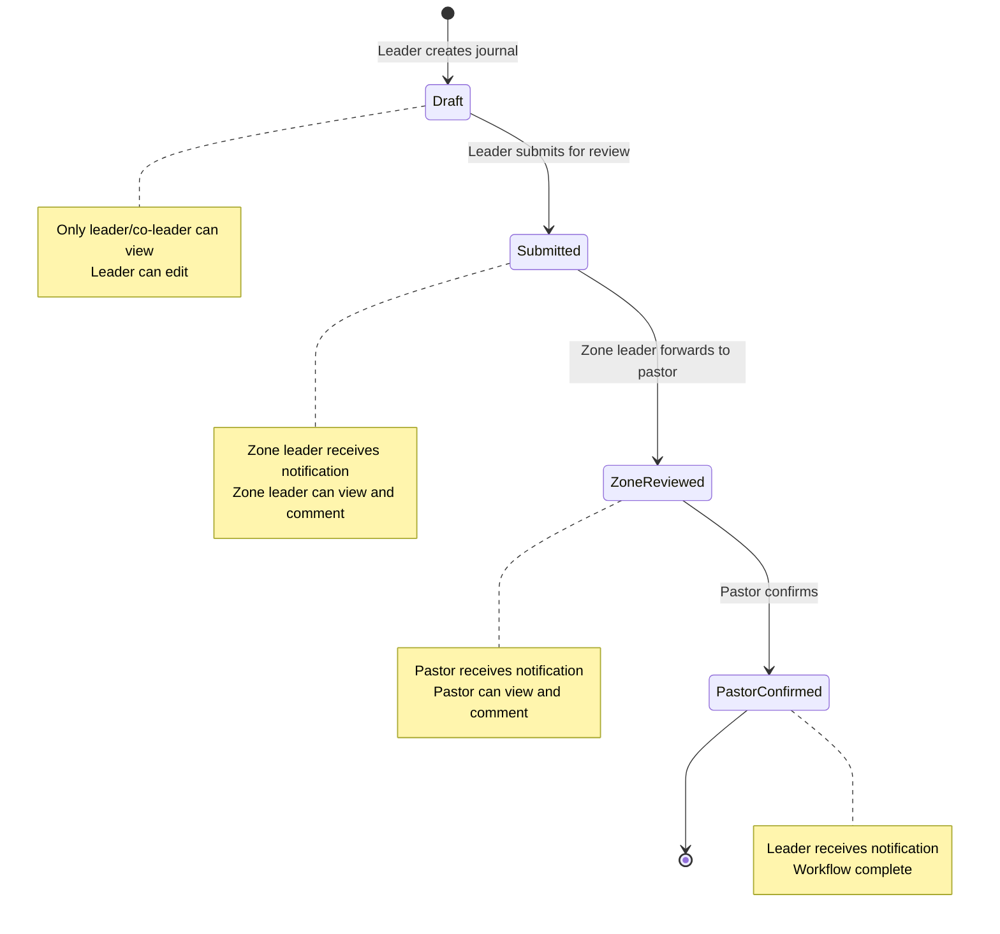
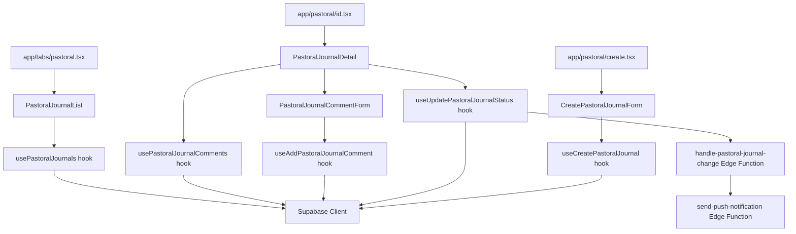
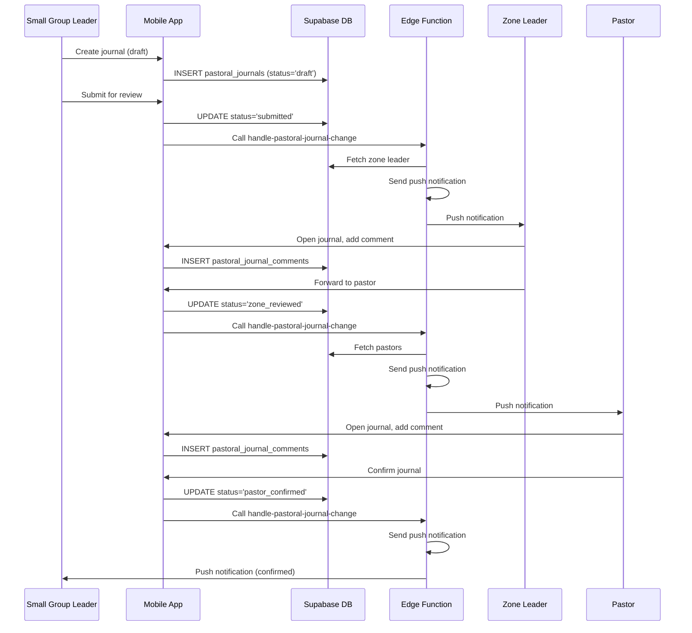

I have created the following plan after thorough exploration and analysis of the codebase. Follow the below plan verbatim. Trust the files and references. Do not re-verify what's written in the plan. Explore only when absolutely necessary. First implement all the proposed file changes and then I'll review all the changes together at the end.

# Implementation Plan: Pastoral Journal Feature

## Observations

The Gagyo codebase has **strong foundations** already in place for the Pastoral Journal feature:

- **Database schema is complete**: `pastoral_journals` and `pastoral_journal_comments` tables exist with proper tenant isolation, RLS policies, and role-based access control
- **Edge function exists**: `handle-pastoral-journal-change` implements the notification workflow (leader → zone leader → pastor → leader) with i18n support
- **i18n translations ready**: Both English and Korean translation keys are defined in `locales/en/pastoral.json` and `locales/ko/pastoral.json`
- **Notification infrastructure**: Deep linking, tenant context switching, and push notification patterns are well-established
- **Frontend scaffolding**: Basic screens exist at `app/(tabs)/pastoral.tsx` and `app/pastoral/[id].tsx` but contain only placeholders

**Key gaps**: The frontend implementation (components, hooks, business logic) and comprehensive tests are missing. The prayer request auto-conversion feature needs design and implementation.

---

## Approach

This plan follows the **SDD → TDD → DDD** workflow mandated by `CLAUDE.md` and `claude_docs/00a_sdd_rules.md`. The implementation will:

1. **Start with specification**: Create a detailed SDD document (`claude_docs/20_pastoral_journal.md`) covering workflows, role-based access, UI patterns, and test implications
2. **Write tests first (TDD)**: Define E2E tests for the complete workflow, integration tests for RLS enforcement, and unit tests for hooks/components
3. **Implement incrementally (DDD)**: Build feature-scoped components and hooks following established patterns from prayer cards and chat features
4. **Leverage existing patterns**: Reuse Tamagui components, Supabase hooks, notification handlers, and role-checking utilities
5. **Use MCP tools**: `supabase` MCP for backend verification, `context7` and `expo-docs` MCPs for API reference, `rn-debugger` and `ios-simulator` MCPs for testing

The plan prioritizes **role-based workflows** (leader, zone leader, pastor) and **tenant isolation** as non-negotiable constraints, aligning with the domain ontology in `claude_docs/01_domain_glossary.md`.

---

## Implementation Steps

### 1. Write SDD Specification Document

**Objective**: Create `claude_docs/20_pastoral_journal.md` as the canonical specification for the Pastoral Journal feature.

**Content Requirements** (per `claude_docs/00a_sdd_rules.md`):
- **WHAT**: Feature intent and scope
  - Pastoral journal creation by small group leaders/co-leaders
  - Hierarchical review workflow: draft → submitted → zone_reviewed → pastor_confirmed
  - Role-based visibility and actions
  - Comment system with AI-assisted suggestions for zone leaders
  - Prayer request auto-conversion to prayer cards
  - Notification flow at each status transition
- **WHY**: Constraints and rationale
  - Tenant isolation enforcement (all queries scoped to tenant_id)
  - Role-based access control (RLS policies already defined)
  - Security posture: only leaders can create/edit drafts, zone leaders can forward, pastors can confirm
  - Multi-tenant considerations: journals never cross tenant boundaries
- **HOW**: Implementation guidance
  - Data model touchpoints: `pastoral_journals`, `pastoral_journal_comments`, `small_groups`, `zones`, `memberships`
  - API boundaries: Supabase client queries with RLS enforcement
  - UI flows: list view (role-dependent), detail view with comments, creation/edit form
  - Status transition logic: client-side validation + server-side enforcement via RLS
  - Edge function integration: call `handle-pastoral-journal-change` on status updates
- **Test Implications**:
  - **E2E**: Full workflow from leader creation → zone leader review → pastor confirmation → notification to leader
  - **Integration**: RLS policies (positive: leader sees own journals, zone leader sees zone journals; negative: member cannot see journals)
  - **Unit**: Hooks for fetching journals, creating journals, updating status, adding comments

**Figma Reference**: Link to `https://www.figma.com/design/6gW1h8DfD1WYH29AmJqaeW/Gagyo?node-id=156-1028` and related flows in `claude_docs/00_product_spec.md`

**Acceptance Criteria** (Given/When/Then format per `agents/Product_Manager.md`):
```gherkin
Given a small group leader is logged in
When they create a pastoral journal for their group
Then the journal is saved with status 'draft'
And only the leader and co-leader can view it

Given a small group leader has a draft journal
When they submit it for review
Then the status changes to 'submitted'
And the zone leader receives a push notification
And the edge function is called with old_status='draft', new_status='submitted'

Given a zone leader views a submitted journal
When they add a comment and forward to pastor
Then the status changes to 'zone_reviewed'
And all pastors receive a push notification
And the comment is saved with author_id = zone leader's membership_id

Given a pastor views a zone-reviewed journal
When they add a comment and confirm
Then the status changes to 'pastor_confirmed'
And the original author receives a push notification
And the comment is saved with author_id = pastor's membership_id

Given a user is not a leader, zone leader, or pastor
When they attempt to view pastoral journals
Then they see no journals (RLS blocks access)
```

**Subagents Involved**: `Product_Manager` (primary), `Designer` (Figma alignment), `Backend_Expert` (RLS validation)

**MCPs Used**:
- `supabase` MCP: Verify RLS policies, test queries with different roles
- `context7` MCP: Reference Supabase RLS documentation if needed

**Exit Criteria**:
- `claude_docs/20_pastoral_journal.md` exists with all required sections
- Spec reviewed against Figma designs for completeness
- Acceptance criteria cover all status transitions and role-based access scenarios

---

### 2. Write Detox E2E Tests (TDD)

**Objective**: Define end-to-end test scenarios for the complete pastoral journal workflow before implementation.

**Test File**: `e2e/pastoral-journal.test.ts`

**Test Scenarios**:
1. **Leader creates and submits journal**:
   - Login as small group leader
   - Navigate to Pastoral tab
   - Create new journal for current week
   - Fill in content (attendance, prayer requests, highlights, concerns)
   - Save as draft
   - Verify draft appears in "My Journals" list
   - Submit for review
   - Verify status changes to "Submitted"
   - Verify zone leader receives notification (mock notification check)

2. **Zone leader reviews and forwards journal**:
   - Login as zone leader
   - Navigate to Pastoral tab
   - Verify submitted journal appears in "Submitted Journals" list
   - Open journal detail
   - Add comment
   - Forward to pastor
   - Verify status changes to "Zone Reviewed"
   - Verify pastor receives notification (mock notification check)

3. **Pastor confirms journal**:
   - Login as pastor
   - Navigate to Pastoral tab
   - Verify zone-reviewed journal appears in list
   - Open journal detail
   - Add comment
   - Confirm journal
   - Verify status changes to "Pastor Confirmed"
   - Verify original author receives notification (mock notification check)

4. **Role-based access control**:
   - Login as regular member (no leader role)
   - Navigate to Pastoral tab
   - Verify no journals are visible
   - Attempt to access journal detail via deep link
   - Verify access denied or empty state

5. **Prayer request auto-conversion** (if implemented):
   - Login as small group leader
   - Create journal with prayer requests section
   - Submit journal
   - Verify prayer cards are created for small group scope
   - Verify prayer cards appear in Prayer tab

**Helper Functions** (in `e2e/helpers/pastoral-helpers.ts`):
- `createPastoralJournal(content, status)`: Create journal via Supabase
- `submitJournal(journalId)`: Update status to 'submitted'
- `addComment(journalId, content, authorRole)`: Add comment as zone leader or pastor
- `verifyJournalStatus(journalId, expectedStatus)`: Assert journal status
- `verifyNotificationSent(userId, notificationType)`: Check notification was created

**Subagents Involved**: `Quality_Assurance_Manager` (primary), `Frontend_Expert` (test structure), `Backend_Expert` (test data setup)

**MCPs Used**:
- `supabase` MCP: Create test data (tenants, users, memberships, small groups, zones)
- `rn-debugger` MCP: Inspect runtime state during test execution
- `ios-simulator` MCP: Capture screenshots for test documentation

**Exit Criteria**:
- All E2E tests written and failing (red phase of TDD)
- Test helpers implemented for journal creation, status updates, and verification
- Tests cover all role-based access scenarios

---

### 3. Write Integration Tests for RLS Policies

**Objective**: Verify that RLS policies correctly enforce role-based access to pastoral journals and comments.

**Test File**: `__tests__/integration/pastoral-journal-rls.test.ts`

**Test Scenarios**:
1. **Positive tests**:
   - Small group leader can view own group's journals
   - Small group co-leader can view own group's journals
   - Zone leader can view journals from groups in their zone
   - Pastor can view all journals in tenant
   - Admin can view all journals in tenant

2. **Negative tests**:
   - Small group leader cannot view journals from other groups
   - Zone leader cannot view journals from other zones
   - Regular member cannot view any journals
   - User from tenant A cannot view journals from tenant B (tenant isolation)

3. **Status update tests**:
   - Leader can update draft journals
   - Leader cannot update submitted journals
   - Zone leader can update submitted and zone_reviewed journals
   - Pastor can update any journal
   - Regular member cannot update any journal

4. **Comment tests**:
   - Zone leader can add comments to submitted journals
   - Pastor can add comments to zone_reviewed journals
   - Regular member cannot add comments
   - Comments are visible to all users who can view the journal

**Test Setup**:
- Create test tenants, users, memberships with different roles
- Create small groups, zones, and pastoral journals
- Use Supabase service role client for setup
- Use user-scoped clients for RLS testing

**Subagents Involved**: `Backend_Expert` (primary), `Quality_Assurance_Manager` (test strategy)

**MCPs Used**:
- `supabase` MCP: Execute RLS policy tests, verify query results

**Exit Criteria**:
- All RLS tests written and failing (red phase)
- Tests cover positive and negative access scenarios
- Tenant isolation verified

---

### 4. Implement Frontend Hooks (TDD)

**Objective**: Create React hooks for pastoral journal data fetching, mutations, and status management.

**Hooks to Implement**:

#### 4.1. `usePastoralJournals` Hook
**File**: `src/features/pastoral/hooks/usePastoralJournals.ts`

**Purpose**: Fetch pastoral journals based on user's role and tenant context.

**API**:
```typescript
interface UsePastoralJournalsOptions {
  tenantId: string;
  role: Role;
  membershipId: string;
  smallGroupId?: string;
  zoneId?: string;
  status?: PastoralJournalStatus[];
}

interface UsePastoralJournalsReturn {
  journals: PastoralJournal[];
  isLoading: boolean;
  error: Error | null;
  refetch: () => Promise<void>;
}

function usePastoralJournals(options: UsePastoralJournalsOptions): UsePastoralJournalsReturn
```

**Logic**:
- Query `pastoral_journals` table with tenant_id filter
- Apply role-based filters:
  - Leader: `small_group_id = user's small_group_id`
  - Zone leader: `small_group_id IN (groups in user's zone)`
  - Pastor/Admin: all journals in tenant
- Order by `week_start_date DESC`
- Include related data: small group name, author name, comment counts
- Use Supabase real-time subscriptions for live updates

**Unit Test** (`src/features/pastoral/hooks/__tests__/usePastoralJournals.test.ts`):
- Mock Supabase client
- Test role-based filtering logic
- Test loading and error states
- Test refetch functionality

#### 4.2. `useCreatePastoralJournal` Hook
**File**: `src/features/pastoral/hooks/useCreatePastoralJournal.ts`

**Purpose**: Create a new pastoral journal for a small group.

**API**:
```typescript
interface CreatePastoralJournalInput {
  tenantId: string;
  smallGroupId: string;
  authorId: string;
  weekStartDate: string; // ISO date
  content: string;
}

interface UseCreatePastoralJournalReturn {
  createJournal: (input: CreatePastoralJournalInput) => Promise<PastoralJournal>;
  isCreating: boolean;
  error: Error | null;
}

function useCreatePastoralJournal(): UseCreatePastoralJournalReturn
```

**Logic**:
- Validate user is leader or co-leader of the small group
- Check for duplicate journal (same small_group_id + week_start_date)
- Insert into `pastoral_journals` table with status='draft'
- Return created journal

**Unit Test**:
- Test successful journal creation
- Test duplicate prevention
- Test permission validation
- Test error handling

#### 4.3. `useUpdatePastoralJournalStatus` Hook
**File**: `src/features/pastoral/hooks/useUpdatePastoralJournalStatus.ts`

**Purpose**: Update journal status and trigger notifications.

**API**:
```typescript
interface UpdateStatusInput {
  journalId: string;
  newStatus: PastoralJournalStatus;
  oldStatus: PastoralJournalStatus;
}

interface UseUpdatePastoralJournalStatusReturn {
  updateStatus: (input: UpdateStatusInput) => Promise<void>;
  isUpdating: boolean;
  error: Error | null;
}

function useUpdatePastoralJournalStatus(): UseUpdatePastoralJournalStatusReturn
```

**Logic**:
- Validate status transition (draft → submitted → zone_reviewed → pastor_confirmed)
- Update `pastoral_journals` table
- Call `handle-pastoral-journal-change` edge function with old_status and new_status
- Handle edge function errors gracefully

**Unit Test**:
- Test valid status transitions
- Test invalid status transitions (should fail)
- Test edge function call
- Test error handling

#### 4.4. `usePastoralJournalComments` Hook
**File**: `src/features/pastoral/hooks/usePastoralJournalComments.ts`

**Purpose**: Fetch comments for a pastoral journal.

**API**:
```typescript
interface UsePastoralJournalCommentsOptions {
  journalId: string;
}

interface UsePastoralJournalCommentsReturn {
  comments: PastoralJournalComment[];
  isLoading: boolean;
  error: Error | null;
  refetch: () => Promise<void>;
}

function usePastoralJournalComments(options: UsePastoralJournalCommentsOptions): UsePastoralJournalCommentsReturn
```

**Logic**:
- Query `pastoral_journal_comments` table filtered by `pastoral_journal_id`
- Include author information (name, role)
- Order by `created_at ASC`
- Use real-time subscriptions for live updates

**Unit Test**:
- Test comment fetching
- Test real-time updates
- Test error handling

#### 4.5. `useAddPastoralJournalComment` Hook
**File**: `src/features/pastoral/hooks/useAddPastoralJournalComment.ts`

**Purpose**: Add a comment to a pastoral journal.

**API**:
```typescript
interface AddCommentInput {
  journalId: string;
  authorId: string;
  content: string;
}

interface UseAddPastoralJournalCommentReturn {
  addComment: (input: AddCommentInput) => Promise<PastoralJournalComment>;
  isAdding: boolean;
  error: Error | null;
}

function useAddPastoralJournalComment(): UseAddPastoralJournalCommentReturn
```

**Logic**:
- Validate user is zone leader or pastor
- Insert into `pastoral_journal_comments` table
- Return created comment

**Unit Test**:
- Test successful comment creation
- Test permission validation
- Test error handling

**Subagents Involved**: `Frontend_Expert` (primary), `Backend_Expert` (Supabase query patterns)

**MCPs Used**:
- `supabase` MCP: Verify query patterns, test RLS enforcement
- `context7` MCP: Reference Supabase JS client documentation

**Exit Criteria**:
- All hooks implemented with TypeScript types
- Unit tests pass (green phase of TDD)
- Hooks follow established patterns from `src/features/prayer/hooks` and `src/features/chat/hooks`

---

### 5. Implement Frontend Components (DDD)

**Objective**: Build UI components for pastoral journal list, detail, creation, and commenting.

**Components to Implement**:

#### 5.1. `PastoralJournalList` Component
**File**: `src/features/pastoral/components/PastoralJournalList.tsx`

**Purpose**: Display list of pastoral journals based on user's role.

**Props**:
```typescript
interface PastoralJournalListProps {
  role: Role;
  tenantId: string;
  membershipId: string;
  smallGroupId?: string;
  zoneId?: string;
}
```

**UI Elements**:
- Section headers: "My Journals" (for leaders), "Submitted Journals" (for zone leaders), "All Journals" (for pastors)
- Journal cards showing:
  - Week start date
  - Small group name
  - Status badge (Draft, Submitted, Zone Reviewed, Pastor Confirmed)
  - Author name
  - Comment count
- Empty state: "No journals yet" with "Create Journal" button (for leaders)
- Pull-to-refresh
- Infinite scroll (if many journals)

**Behavior**:
- Use `usePastoralJournals` hook
- Navigate to journal detail on card tap
- Show loading skeleton while fetching

**Storybook**: `PastoralJournalList.stories.tsx` with different role scenarios

**Unit Test**: `__tests__/PastoralJournalList.test.tsx`
- Test rendering with different roles
- Test empty state
- Test navigation on card tap

#### 5.2. `PastoralJournalDetail` Component
**File**: `src/features/pastoral/components/PastoralJournalDetail.tsx`

**Purpose**: Display journal content, comments, and action buttons based on role and status.

**Props**:
```typescript
interface PastoralJournalDetailProps {
  journalId: string;
  role: Role;
  membershipId: string;
}
```

**UI Elements**:
- Journal header: week, small group name, author, status
- Journal content sections:
  - Attendance (present, absent, new visitors)
  - Prayer requests summary
  - Highlights
  - Concerns
  - Next steps
- Comments section:
  - Zone leader feedback (if exists)
  - Pastor feedback (if exists)
  - Comment form (for zone leaders and pastors)
- Action buttons (role and status dependent):
  - Leader + Draft: "Submit for Review"
  - Zone Leader + Submitted: "Add Comment & Forward to Pastor"
  - Pastor + Zone Reviewed: "Add Comment & Confirm"

**Behavior**:
- Use `usePastoralJournalComments` hook
- Use `useUpdatePastoralJournalStatus` hook for status transitions
- Use `useAddPastoralJournalComment` hook for adding comments
- Show confirmation dialog before status changes
- Show success toast after status update
- Scroll to comments section after adding comment

**Storybook**: `PastoralJournalDetail.stories.tsx` with different role and status combinations

**Unit Test**: `__tests__/PastoralJournalDetail.test.tsx`
- Test rendering with different roles and statuses
- Test action button visibility
- Test status update flow
- Test comment submission

#### 5.3. `CreatePastoralJournalForm` Component
**File**: `src/features/pastoral/components/CreatePastoralJournalForm.tsx`

**Purpose**: Form for creating a new pastoral journal.

**Props**:
```typescript
interface CreatePastoralJournalFormProps {
  tenantId: string;
  smallGroupId: string;
  authorId: string;
  onSuccess: (journal: PastoralJournal) => void;
  onCancel: () => void;
}
```

**UI Elements**:
- Week selector (date picker for week start date)
- Text areas for:
  - Attendance (present, absent, new visitors)
  - Prayer requests summary
  - Highlights
  - Concerns
  - Next steps
- Action buttons: "Save as Draft", "Cancel"

**Behavior**:
- Use `useCreatePastoralJournal` hook
- Validate required fields
- Show loading state while creating
- Call `onSuccess` callback after creation
- Show error toast on failure

**Storybook**: `CreatePastoralJournalForm.stories.tsx`

**Unit Test**: `__tests__/CreatePastoralJournalForm.test.tsx`
- Test form validation
- Test successful submission
- Test error handling
- Test cancel behavior

#### 5.4. `PastoralJournalCommentForm` Component
**File**: `src/features/pastoral/components/PastoralJournalCommentForm.tsx`

**Purpose**: Form for adding comments to a journal (zone leaders and pastors).

**Props**:
```typescript
interface PastoralJournalCommentFormProps {
  journalId: string;
  authorId: string;
  role: Role;
  onSuccess: (comment: PastoralJournalComment) => void;
}
```

**UI Elements**:
- Text area for comment content
- AI suggestion button (for zone leaders): "Get AI Suggestions"
- AI suggestions display (if requested): 2-3 suggested comments
- Action buttons: "Submit Comment", "Cancel"

**Behavior**:
- Use `useAddPastoralJournalComment` hook
- Validate comment is not empty
- Show loading state while submitting
- Call `onSuccess` callback after submission
- Show error toast on failure
- AI suggestions: Call OpenAI API (or similar) with journal content to generate suggested comments (optional feature, can be implemented later)

**Storybook**: `PastoralJournalCommentForm.stories.tsx`

**Unit Test**: `__tests__/PastoralJournalCommentForm.test.tsx`
- Test comment submission
- Test validation
- Test error handling

**Subagents Involved**: `Frontend_Expert` (primary), `Design_System_Manager` (Tamagui components), `Designer` (Figma alignment)

**MCPs Used**:
- `context7` MCP: Reference Tamagui component documentation
- `expo-docs` MCP: Reference Expo Router navigation patterns
- `rn-debugger` MCP: Debug component rendering and state

**Exit Criteria**:
- All components implemented with Tamagui
- Storybook stories created for each component
- Unit tests pass
- Components follow established patterns from `src/features/prayer/components` and `src/features/chat/components`

---

### 6. Implement Pastoral Journal Screens

**Objective**: Wire up components to Expo Router screens.

#### 6.1. Update `app/(tabs)/pastoral.tsx`
**Purpose**: Main pastoral journal screen with role-based list view.

**Implementation**:
- Use `useRequireAuth` hook to get user, tenantId, role
- Use `useCurrentMembership` hook to get membership details (small_group_id, zone_id)
- Render `PastoralJournalList` component with role-based props
- Add "Create Journal" button (for leaders only)
- Navigate to `/pastoral/create` on button tap

#### 6.2. Update `app/pastoral/[id].tsx`
**Purpose**: Journal detail screen with comments and actions.

**Implementation**:
- Get `id` from route params
- Use `useRequireAuth` hook to get user, tenantId, role
- Render `PastoralJournalDetail` component
- Handle back navigation

#### 6.3. Create `app/pastoral/create.tsx`
**Purpose**: Journal creation screen.

**Implementation**:
- Use `useRequireAuth` hook to get user, tenantId, membershipId
- Use `useCurrentMembership` hook to get small_group_id
- Render `CreatePastoralJournalForm` component
- Navigate to journal detail on success
- Navigate back on cancel

**Subagents Involved**: `Frontend_Expert` (primary)

**MCPs Used**:
- `expo-docs` MCP: Reference Expo Router navigation patterns

**Exit Criteria**:
- All screens implemented and navigable
- Deep linking works for `/pastoral/[id]` route
- Screens follow established patterns from `app/(tabs)/prayer.tsx` and `app/chat/[id].tsx`

---

### 7. Implement Prayer Request Auto-Conversion (Optional Feature)

**Objective**: Automatically convert prayer requests from pastoral journals into prayer cards.

**Design Decision Required**:
- **Trigger**: When journal is submitted (status changes to 'submitted')
- **Scope**: Prayer cards created with `recipient_scope='small_group'`
- **Content**: Extract prayer requests from journal content (requires parsing or dedicated field)
- **Author**: Journal author becomes prayer card author

**Implementation Options**:
1. **Client-side**: Extract prayer requests in `useUpdatePastoralJournalStatus` hook, create prayer cards via `useCreatePrayerCard` hook
2. **Server-side**: Add logic to `handle-pastoral-journal-change` edge function to create prayer cards when status changes to 'submitted'

**Recommendation**: Server-side implementation for consistency and to avoid client-side failures.

**Edge Function Update** (`supabase/functions/handle-pastoral-journal-change/index.ts`):
- Add `createPrayerCardsFromJournal` function
- Parse journal content for prayer requests (requires structured format or AI parsing)
- Create prayer cards with `recipient_scope='small_group'` and `recipient_small_group_id=journal.small_group_id`
- Call function when status changes from 'draft' to 'submitted'

**Test**:
- E2E test: Create journal with prayer requests, submit, verify prayer cards created
- Integration test: Verify prayer cards have correct scope and recipients

**Subagents Involved**: `Backend_Expert` (primary), `Product_Manager` (design decision)

**MCPs Used**:
- `supabase` MCP: Test prayer card creation logic

**Exit Criteria**:
- Prayer cards automatically created when journal is submitted
- Prayer cards visible in Prayer tab for small group members
- E2E test passes

---

### 8. Update Notification Handler for Pastoral Journal Deep Links

**Objective**: Ensure pastoral journal notifications navigate to the correct screen.

**File**: `src/features/notifications/useNotificationHandler.ts`

**Changes**:
- Verify `buildDeepLink` function handles `pastoral_journal_submitted`, `pastoral_journal_forwarded`, `pastoral_journal_confirmed` notification types
- Verify deep link format: `/pastoral/[journal_id]`
- Test tenant context switching for cross-tenant notifications (should not happen, but defensive)

**Test**:
- Unit test: Verify deep link generation for pastoral journal notification types
- E2E test: Tap notification, verify navigation to journal detail screen

**Subagents Involved**: `Frontend_Expert` (primary)

**MCPs Used**:
- `expo-docs` MCP: Reference Expo Notifications API

**Exit Criteria**:
- Notification handler correctly navigates to pastoral journal detail screen
- Tenant context is set before navigation
- Unit and E2E tests pass

---

### 9. Run Integration and E2E Tests

**Objective**: Verify all tests pass and the feature works end-to-end.

**Steps**:
1. Run integration tests: `bun test __tests__/integration/pastoral-journal-rls.test.ts`
2. Run unit tests: `bun test src/features/pastoral`
3. Run E2E tests: `bun test:e2e e2e/pastoral-journal.test.ts`
4. Fix any failing tests
5. Use `rn-debugger` MCP to inspect runtime state during E2E tests
6. Use `ios-simulator` MCP to capture screenshots for documentation

**Subagents Involved**: `Quality_Assurance_Manager` (primary), `Frontend_Expert` (fix failing tests), `Backend_Expert` (fix RLS issues)

**MCPs Used**:
- `supabase` MCP: Debug RLS policy issues
- `rn-debugger` MCP: Inspect app state during tests
- `ios-simulator` MCP: Capture test screenshots

**Exit Criteria**:
- All integration tests pass
- All unit tests pass
- All E2E tests pass
- Test coverage meets 90%+ threshold for critical paths

---

### 10. Update SKILL.md with Context

**Objective**: Document lessons learned and context for future development.

**File**: `skills/SKILL.md`

**Content to Add**:
- **Pastoral Journal Feature**: Overview of implementation approach
- **Role-Based Access Patterns**: How RLS policies enforce role-based access
- **Status Workflow**: State machine for journal status transitions
- **Notification Flow**: How edge functions trigger notifications at each stage
- **Prayer Card Auto-Conversion**: Design decision and implementation approach
- **Testing Strategy**: Integration tests for RLS, E2E tests for workflow
- **Gotchas**: Common issues encountered (e.g., RLS policy debugging, status transition validation)

**Subagents Involved**: `Product_Manager` (primary)

**Exit Criteria**:
- `skills/SKILL.md` updated with pastoral journal context
- Documentation reviewed for clarity and completeness

---

## Visual Aids

### Pastoral Journal Workflow State Machine



### Role-Based Access Matrix

| Role | View Journals | Create Journal | Submit Journal | Add Comment | Forward to Pastor | Confirm Journal |
|------|---------------|----------------|----------------|-------------|-------------------|-----------------|
| Member | ❌ | ❌ | ❌ | ❌ | ❌ | ❌ |
| Small Group Leader | Own group only | ✅ (own group) | ✅ (own drafts) | ❌ | ❌ | ❌ |
| Zone Leader | Zone groups | ❌ | ❌ | ✅ (submitted journals) | ✅ | ❌ |
| Pastor | All in tenant | ❌ | ❌ | ✅ (zone-reviewed journals) | ❌ | ✅ |
| Admin | All in tenant | ✅ | ✅ | ✅ | ✅ | ✅ |

### Component Hierarchy



### Notification Flow Sequence



---

## Summary

This implementation plan delivers a **complete, production-ready Pastoral Journal feature** by:

1. **Following SDD → TDD → DDD**: Spec first, tests first, implementation last
2. **Leveraging existing infrastructure**: Reusing schema, RLS policies, edge functions, notification patterns, and UI components
3. **Enforcing tenant isolation and role-based access**: All queries scoped to tenant_id, RLS policies enforce role hierarchy
4. **Providing comprehensive testing**: Integration tests for RLS, unit tests for hooks/components, E2E tests for full workflow
5. **Using MCP tools**: `supabase` MCP for backend verification, `rn-debugger` and `ios-simulator` MCPs for testing, `context7` and `expo-docs` MCPs for API reference
6. **Documenting context**: Updating `skills/SKILL.md` with lessons learned

The plan prioritizes **incremental delivery** (hooks → components → screens → tests) and **quality assurance** (TDD, RLS testing, E2E coverage) to ensure a robust, maintainable feature that aligns with the Gagyo codebase's high standards.