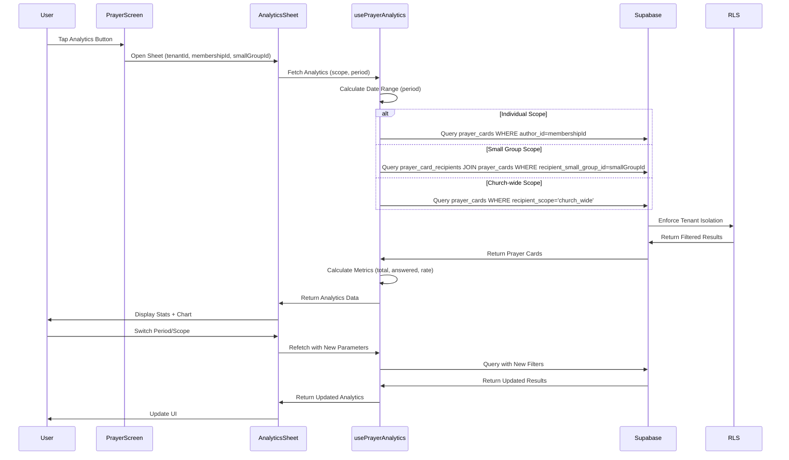

I have created the following plan after thorough exploration and analysis of the codebase. Follow the below plan verbatim. Trust the files and references. Do not re-verify what's written in the plan. Explore only when absolutely necessary. First implement all the proposed file changes and then I'll review all the changes together at the end.

## Observations

Prayer analytics implementation is **90% complete**. The `usePrayerAnalytics` hook, `PrayerAnalyticsSheet` component, database schema, and integration with the prayer screen are fully functional. Unit tests and E2E tests exist with comprehensive coverage. Translation keys are present in both English and Korean. The main gaps are: (1) dedicated SDD specification document, (2) potential charting library enhancement, (3) integration tests for analytics RLS enforcement, and (4) verification of all test scenarios against Figma designs.

## Approach

Follow **SDD → TDD → DDD** workflow by first creating the missing SDD specification document for prayer analytics, then verifying/enhancing existing tests to ensure full coverage, and finally implementing any missing features or enhancements. Use the `supabase` MCP for all backend analytics query verification and the `context7` MCP to research React Native charting libraries. Leverage existing implementation as the foundation and focus on documentation, test hardening, and optional UI enhancements.

## Implementation Steps

### 1. Create SDD Specification for Prayer Analytics

**Objective:** Document the prayer analytics feature in a dedicated SDD spec file following the project's specification standards.

**Subagents:** Product_Manager, Backend_Expert, Frontend_Expert

**Actions:**
- Create `file:claude_docs/19_prayer_analytics.md` following the structure of `file:claude_docs/18_prayer_cards.md`
- Document the three analytics scopes (individual, small group, church-wide) with precise visibility rules
- Specify the five time periods (weekly, monthly, quarterly, semi-annual, annual) with exact date range calculations
- Define the three metrics (total prayers, answered prayers, answer rate) with calculation formulas
- Document the UI components: bottom sheet, scope tabs, period selector, stat cards, bar chart
- Include query patterns for each scope with RLS policy references
- Add Figma reference: https://www.figma.com/design/6gW1h8DfD1WYH29AmJqaeW/Gagyo?node-id=354-39531
- Document i18n requirements with translation key mappings
- Specify test requirements: unit tests for calculations, integration tests for RLS, E2E tests for UI flows

**Validation:**
- SDD spec covers all three scopes with query patterns
- All five time periods documented with date range logic
- Metrics calculation formulas are explicit
- UI component hierarchy is clear
- Test requirements are comprehensive

---

### 2. Verify and Enhance Translation Keys

**Objective:** Ensure all analytics-related translation keys are complete and correctly used in the UI.

**Subagents:** Design_System_Manager, Frontend_Expert

**Actions:**
- Review `file:locales/en/prayer.json` and `file:locales/ko/prayer.json` for analytics keys
- Verify the following keys exist and are used:
  - `prayer.analytics_title` → used in `PrayerAnalyticsSheet` header
  - `prayer.my_statistics`, `prayer.small_group_statistics`, `prayer.church_wide_statistics` → scope tabs
  - `prayer.weekly`, `prayer.monthly`, `prayer.quarterly`, `prayer.semi_annual`, `prayer.annual` → period buttons
  - `prayer.total_prayers`, `prayer.answered_prayers`, `prayer.answered_rate` → stat cards
  - `prayer.total`, `prayer.answered`, `prayer.unanswered` → chart labels
  - `prayer.no_prayers`, `prayer.start_praying` → empty state
- Add missing keys if any are identified during review
- Run `bun run i18n:validate` to check for missing keys
- Update `file:src/features/prayer/components/PrayerAnalyticsSheet.tsx` if any hardcoded strings are found

**Validation:**
- All analytics UI strings use i18n keys
- Both English and Korean translations are complete
- i18n validation script passes without errors
- No hardcoded UI strings in analytics components

---

### 3. Evaluate and Integrate Charting Library (Optional Enhancement)

**Objective:** Assess whether a dedicated charting library would improve analytics visualization and integrate if beneficial.

**Subagents:** Frontend_Expert, Design_System_Manager

**MCPs Used:**
- `context7` MCP → research React Native charting libraries (react-native-chart-kit, victory-native, react-native-svg-charts)
- `expo-docs` MCP → verify compatibility with Expo SDK 54

**Actions:**
- Use `context7` MCP to research React Native charting libraries compatible with Expo and Tamagui
- Evaluate candidates: react-native-chart-kit, victory-native, react-native-svg-charts
- Consider criteria: bundle size, Expo compatibility, Tamagui theming support, accessibility, i18n support
- If a library is selected:
  - Install via `bun add <library>`
  - Create `file:src/features/prayer/components/PrayerAnalyticsChart.tsx` wrapping the library
  - Replace the simple bar chart in `PrayerAnalyticsSheet` with the new component
  - Add Storybook story: `file:src/features/prayer/components/PrayerAnalyticsChart.stories.tsx`
  - Write unit tests: `file:src/features/prayer/components/__tests__/PrayerAnalyticsChart.test.tsx`
- If no library is suitable, document the decision to keep the custom bar chart implementation

**Validation:**
- Charting library (if added) is Expo-compatible and works with Tamagui themes
- Chart component has Storybook story with light/dark theme variants
- Chart component has unit tests
- Chart respects i18n for labels and tooltips
- Decision is documented in `file:claude_docs/19_prayer_analytics.md`

---

### 4. Write Integration Tests for Analytics RLS Enforcement

**Objective:** Verify that analytics queries respect RLS policies and tenant isolation.

**Subagents:** Backend_Expert, Quality_Assurance_Manager

**MCPs Used:**
- `supabase` MCP → execute test queries and verify RLS enforcement

**Actions:**
- Create `file:__tests__/integration/prayer-analytics-rls.test.ts`
- Test individual scope analytics:
  - User can query their own authored prayers
  - User cannot see other users' individual analytics
- Test small group scope analytics:
  - User can query prayers addressed to their small group
  - User cannot see prayers addressed to other small groups
- Test church-wide scope analytics:
  - All tenant members can query church-wide prayers
  - Cross-tenant queries return empty results
- Test date range filtering:
  - Queries respect `created_at` filters for each period
  - Edge cases: prayers created exactly at period boundaries
- Use `supabase` MCP to execute queries with different user contexts and verify results

**Validation:**
- Integration tests cover all three scopes with positive and negative cases
- Tenant isolation is verified (cross-tenant queries fail)
- Date range filtering is tested for all five periods
- Tests pass in CI pipeline

---

### 5. Enhance Unit Tests for Analytics Calculations

**Objective:** Ensure comprehensive unit test coverage for analytics calculations and edge cases.

**Subagents:** Frontend_Expert, Quality_Assurance_Manager

**Actions:**
- Review `file:src/features/prayer/hooks/__tests__/usePrayerAnalytics.test.ts`
- Add test cases for edge scenarios:
  - Zero prayers (answer rate should be 0, not NaN or undefined)
  - All prayers answered (answer rate should be 100)
  - No prayers answered (answer rate should be 0)
  - Rounding behavior (answer rate rounded to 1 decimal place)
  - Date range edge cases (prayers created at exact period boundaries)
- Add test for `refetch` function behavior
- Add test for loading state transitions
- Add test for error handling (network failures, invalid tenant ID)
- Verify test coverage with `bun run test:coverage` (target: 90%+ for analytics hooks)

**Validation:**
- Unit tests cover all edge cases for answer rate calculation
- Zero-prayer scenario returns 0% answer rate (not NaN)
- Date range calculations are tested for all five periods
- Test coverage for analytics hooks is ≥90%

---

### 6. Verify E2E Tests Against Figma Designs

**Objective:** Ensure E2E tests comprehensively cover all analytics scenarios shown in Figma.

**Subagents:** Quality_Assurance_Manager, Designer

**MCPs Used:**
- `figma` MCP → fetch Figma designs for prayer analytics (node-id=354-39531)
- `rn-debugger` MCP → capture screenshots during E2E test runs for visual comparison
- `ios-simulator` MCP → control simulator for E2E test execution

**Actions:**
- Use `figma` MCP to review Figma designs for prayer analytics: https://www.figma.com/design/6gW1h8DfD1WYH29AmJqaeW/Gagyo?node-id=354-39531
- Review `file:e2e/prayer.test.ts` analytics test suite
- Verify the following scenarios are covered:
  - Opening analytics sheet from prayer screen
  - Switching between three scope tabs (individual, small group, church-wide)
  - Switching between five period buttons (weekly, monthly, quarterly, semi-annual, annual)
  - Displaying stat cards (total prayers, answered prayers, answer rate)
  - Displaying bar chart visualization
  - Empty state when no prayers exist
  - Closing analytics sheet
  - i18n: analytics UI in both English and Korean
- Add missing test scenarios if any gaps are identified
- Use `rn-debugger` MCP to capture screenshots during test runs for visual regression testing
- Use `ios-simulator` MCP to control simulator and verify UI elements

**Validation:**
- E2E tests cover all analytics UI interactions shown in Figma
- Tests verify scope and period switching behavior
- Tests verify stat card values update correctly
- Tests verify bar chart renders with correct proportions
- Tests run successfully in CI pipeline for both iOS and Android

---

### 7. Update SKILL.md with Analytics Implementation Context

**Objective:** Document lessons learned and implementation context for future development.

**Subagents:** Product_Manager, Frontend_Expert, Backend_Expert

**Actions:**
- Update `file:skills/SKILL.md` with prayer analytics implementation notes
- Document key decisions:
  - Why custom bar chart was chosen over external library (if applicable)
  - How analytics queries are optimized for performance
  - RLS policy design for analytics visibility
  - Date range calculation approach for different periods
- Document gotchas:
  - Answer rate calculation must handle zero-prayer case
  - Small group analytics require join with `prayer_card_recipients` table
  - Church-wide analytics filter by `recipient_scope='church_wide'`
- Document testing approach:
  - Unit tests for calculations
  - Integration tests for RLS enforcement
  - E2E tests for UI flows

**Validation:**
- SKILL.md includes analytics implementation section
- Key decisions and gotchas are documented
- Testing approach is clearly explained
- Future developers can understand the implementation without reading all code

---

## Test Strategy

### Unit Tests
- **Target:** `file:src/features/prayer/hooks/__tests__/usePrayerAnalytics.test.ts`
- **Coverage:** Analytics calculations, date range logic, error handling, edge cases (zero prayers, all answered, none answered)
- **Tools:** Jest, React Testing Library

### Integration Tests
- **Target:** `file:__tests__/integration/prayer-analytics-rls.test.ts`
- **Coverage:** RLS enforcement for all three scopes, tenant isolation, date range filtering
- **Tools:** Jest, Supabase client, `supabase` MCP

### E2E Tests
- **Target:** `file:e2e/prayer.test.ts` (Prayer Analytics section)
- **Coverage:** Analytics sheet UI, scope/period switching, stat card display, chart rendering, i18n
- **Tools:** Detox, `rn-debugger` MCP, `ios-simulator` MCP

---

## Exit Criteria

1. ✅ SDD specification document created at `file:claude_docs/19_prayer_analytics.md`
2. ✅ All translation keys verified and complete in both English and Korean
3. ✅ Charting library decision documented (integrated or custom bar chart retained)
4. ✅ Integration tests for analytics RLS enforcement pass in CI
5. ✅ Unit test coverage for analytics hooks ≥90%
6. ✅ E2E tests cover all analytics scenarios from Figma
7. ✅ SKILL.md updated with analytics implementation context
8. ✅ All tests pass in CI pipeline: `bun run ci:coverage`

---

## Mermaid Diagram: Prayer Analytics Data Flow



---

## Translation Keys Reference

| Key | English | Korean | Usage |
|-----|---------|--------|-------|
| `prayer.analytics_title` | Prayer Analytics | 기도 통계 | Sheet header |
| `prayer.my_statistics` | My Statistics | 내 통계 | Individual scope tab |
| `prayer.small_group_statistics` | Small Group Statistics | 소그룹 통계 | Small group scope tab |
| `prayer.church_wide_statistics` | Church-wide Statistics | 교회 전체 통계 | Church-wide scope tab |
| `prayer.total_prayers` | Total Prayers | 총 기도 | Stat card label |
| `prayer.answered_prayers` | Answered Prayers | 응답된 기도 | Stat card label |
| `prayer.answered_rate` | Answer Rate | 응답률 | Stat card label |
| `prayer.weekly` | Weekly | 주간 | Period button |
| `prayer.monthly` | Monthly | 월간 | Period button |
| `prayer.quarterly` | Quarterly | 분기 | Period button |
| `prayer.semi_annual` | Semi-annual | 반기 | Period button |
| `prayer.annual` | Annual | 연간 | Period button |
| `prayer.total` | Total | 전체 | Chart label |
| `prayer.answered` | Answered | 응답됨 | Chart label |
| `prayer.unanswered` | Unanswered | 기도 중 | Chart label |
| `prayer.no_prayers` | No prayer cards yet | 기도 카드가 없습니다 | Empty state |
| `prayer.start_praying` | Start by creating a prayer card | 기도 카드를 작성해 보세요 | Empty state |

---

## Analytics Query Patterns

### Individual Scope
```typescript
supabase
  .from('prayer_cards')
  .select('id, answered, created_at')
  .eq('tenant_id', tenantId)
  .eq('author_id', membershipId)
  .gte('created_at', startDate)
  .lte('created_at', endDate)
```

### Small Group Scope
```typescript
supabase
  .from('prayer_card_recipients')
  .select('prayer_cards!inner(id, answered, created_at, tenant_id)')
  .eq('prayer_cards.tenant_id', tenantId)
  .eq('recipient_small_group_id', smallGroupId)
  .gte('prayer_cards.created_at', startDate)
  .lte('prayer_cards.created_at', endDate)
```

### Church-wide Scope
```typescript
supabase
  .from('prayer_cards')
  .select('id, answered, created_at')
  .eq('tenant_id', tenantId)
  .eq('recipient_scope', 'church_wide')
  .gte('created_at', startDate)
  .lte('created_at', endDate)
```

---

## Date Range Calculations

| Period | Start Date | End Date |
|--------|-----------|----------|
| Weekly | `now - 7 days` | `now` |
| Monthly | `now - 30 days` | `now` |
| Quarterly | `now - 90 days` | `now` |
| Semi-annual | `now - 6 months` | `now` |
| Annual | `now - 12 months` | `now` |

---

## Metrics Calculation

```typescript
totalPrayers = prayerCards.length
answeredPrayers = prayerCards.filter(p => p.answered).length
answerRate = totalPrayers > 0 
  ? Math.round((answeredPrayers / totalPrayers) * 100 * 10) / 10 
  : 0
```

**Edge Cases:**
- Zero prayers: `answerRate = 0` (not NaN or undefined)
- All answered: `answerRate = 100.0`
- None answered: `answerRate = 0.0`
- Rounding: 1 decimal place (e.g., 66.7%)