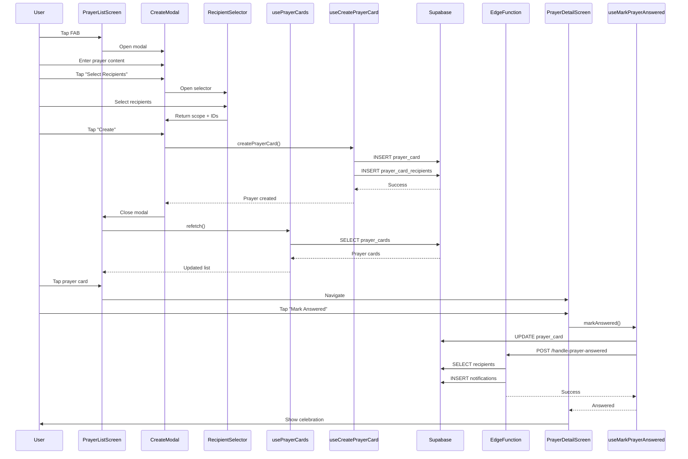

I have created the following plan after thorough exploration and analysis of the codebase. Follow the below plan verbatim. Trust the files and references. Do not re-verify what's written in the plan. Explore only when absolutely necessary. First implement all the proposed file changes and then I'll review all the changes together at the end.

## Observations

The Prayer Cards feature has foundational backend infrastructure in place: database schema (`prayer_cards`, `prayer_card_recipients` tables), RLS policies for tenant isolation and recipient scope enforcement, and an Edge Function for handling prayer answered notifications. Translation files exist with comprehensive keys for both English and Korean. However, the frontend implementation is minimal—only placeholder screens exist in `app/(tabs)/prayer.tsx` and `app/prayer/[id].tsx`. No data fetching hooks, UI components, recipient selection interface, analytics queries, or background music feature have been implemented. The database types in `src/types/database.ts` are also missing prayer-related type definitions.

## Approach

The implementation follows the established codebase patterns: create custom hooks for data fetching (similar to `useConversations`, `useImages`), build Tamagui-based UI components with i18n support, implement recipient selection using a modal pattern (like `EventChatSelector`), and write tests before implementation (TDD). The plan prioritizes core functionality first (create, list, mark answered), then adds analytics and optional features (background music). All work respects tenant isolation via RLS, uses the existing `supabase` MCP for backend operations, and follows the SDD → TDD → DDD workflow mandated by the project's execution rules.

## Implementation Instructions

### 1. Update Domain Types

**File**: `file:src/types/database.ts`

Add TypeScript type definitions for prayer cards to the `Database` interface:

```typescript
prayer_cards: {
  Row: {
    id: string;
    tenant_id: string;
    author_id: string;
    content: string;
    recipient_scope: 'individual' | 'small_group' | 'church_wide';
    answered: boolean;
    answered_at: string | null;
    created_at: string;
    updated_at: string;
  };
  Insert: {
    id?: string;
    tenant_id: string;
    author_id: string;
    content: string;
    recipient_scope: 'individual' | 'small_group' | 'church_wide';
    answered?: boolean;
    answered_at?: string | null;
    created_at?: string;
    updated_at?: string;
  };
  Update: {
    content?: string;
    recipient_scope?: 'individual' | 'small_group' | 'church_wide';
    answered?: boolean;
    answered_at?: string | null;
    updated_at?: string;
  };
};
prayer_card_recipients: {
  Row: {
    id: string;
    prayer_card_id: string;
    recipient_membership_id: string | null;
    recipient_small_group_id: string | null;
    created_at: string;
  };
  Insert: {
    id?: string;
    prayer_card_id: string;
    recipient_membership_id?: string | null;
    recipient_small_group_id?: string | null;
    created_at?: string;
  };
  Update: {
    recipient_membership_id?: string | null;
    recipient_small_group_id?: string | null;
  };
};
```

Add convenience types after the `Database` interface:

```typescript
export type PrayerCard = Database['public']['Tables']['prayer_cards']['Row'];
export type PrayerCardRecipient = Database['public']['Tables']['prayer_card_recipients']['Row'];
export type PrayerCardRecipientScope = PrayerCard['recipient_scope'];

export interface PrayerCardWithAuthor extends PrayerCard {
  author: {
    id: string;
    user: {
      id: string;
      display_name: string | null;
      photo_url: string | null;
    };
  };
}
```

**Subagents**: Backend_Expert  
**MCPs**: None (type definitions only)  
**Exit Criteria**: Types compile without errors; prayer card types are available for import

---

### 2. Create Prayer Card Data Hooks

**Directory**: `file:src/features/prayer/hooks/`

Create `usePrayerCards.ts` hook following the pattern from `useConversations`:

- Fetch prayer cards with author information joined
- Filter by recipient scope (my prayers, received prayers, church-wide)
- Support pagination with `limit` and `offset`
- Return `{ prayerCards, loading, error, hasMore, loadMore, refetch }`
- Implement tenant-scoped queries using `tenantId` parameter
- Transform raw Supabase data to `PrayerCardWithAuthor` type

Create `useCreatePrayerCard.ts` hook following the pattern from `useSendMessage`:

- Accept `{ content, recipientScope, recipientIds }` options
- Validate recipient scope and IDs
- Insert prayer card with `author_id = membershipId`
- Insert recipients into `prayer_card_recipients` table
- Return `{ createPrayerCard, creating, error }`
- Handle individual, small_group, and church_wide scopes

Create `useMarkPrayerAnswered.ts` hook:

- Accept `prayerCardId` parameter
- Update `answered = true` and `answered_at = NOW()`
- Call Edge Function `handle-prayer-answered` to trigger notifications
- Return `{ markAnswered, marking, error }`

**Unit Tests**: `file:src/features/prayer/hooks/__tests__/`

- Test `usePrayerCards` with different recipient scopes
- Test pagination and filtering
- Test `useCreatePrayerCard` with all recipient scope types
- Test validation (empty content, invalid recipients)
- Test `useMarkPrayerAnswered` success and error cases
- Mock Supabase client responses

**Subagents**: Frontend_Expert, Backend_Expert  
**MCPs**: `supabase` (for schema queries and RLS verification)  
**Exit Criteria**: All unit tests pass; hooks return correct data structures; tenant isolation enforced

---

### 3. Create Recipient Selection Component

**File**: `file:src/features/prayer/components/RecipientSelector.tsx`

Build a modal component following the `EventChatSelector` pattern:

- Display three tabs: Individual, Small Group, Church-wide
- Individual tab: list of tenant members with checkboxes (multi-select)
- Small Group tab: list of small groups with radio buttons (single-select)
- Church-wide tab: informational text (no selection needed)
- Fetch members/groups using Supabase queries with tenant scope
- Return selected recipients via `onConfirm(scope, recipientIds)`
- Support i18n for all UI strings (`prayer.recipient_selector_*`)
- Use Tamagui components (Sheet, Checkbox, Radio, Button)

**Storybook**: `file:src/features/prayer/components/RecipientSelector.stories.tsx`

- Story for each recipient scope tab
- Story with pre-selected recipients
- Story with loading state
- Story with error state

**Unit Tests**: `file:src/features/prayer/components/__tests__/RecipientSelector.test.tsx`

- Test tab switching
- Test recipient selection and deselection
- Test confirm/cancel callbacks
- Test i18n rendering (en/ko)

**Subagents**: Frontend_Expert, Designer, Design_System_Manager  
**MCPs**: `supabase` (for fetching members/groups)  
**Exit Criteria**: Component renders correctly; selection logic works; Storybook stories pass; unit tests pass

---

### 4. Implement Prayer Card List Screen

**File**: `file:app/(tabs)/prayer.tsx`

Replace placeholder with functional prayer list screen:

- Use `usePrayerCards` hook with tenant context
- Display three filter tabs: My Prayers, Received Prayers, All Prayers
- Render prayer cards in a FlatList with pagination (`onEndReached`)
- Show prayer card content (truncated), author name, answered status, timestamp
- Tap card to navigate to detail screen (`/prayer/[id]`)
- Add FAB (Floating Action Button) to create new prayer card
- Use i18n for all UI strings
- Apply Tamagui theming

**Unit Tests**: `file:app/(tabs)/__tests__/prayer.test.tsx`

- Test filter tab switching
- Test prayer card list rendering
- Test navigation to detail screen
- Test FAB tap opens create modal
- Test empty state display

**Subagents**: Frontend_Expert, Designer  
**MCPs**: None (uses hooks)  
**Exit Criteria**: Screen renders prayer cards; filtering works; navigation works; unit tests pass

---

### 5. Implement Prayer Card Detail Screen

**File**: `file:app/prayer/[id].tsx`

Build detail screen for viewing and marking prayers answered:

- Fetch single prayer card using `usePrayerCards` filtered by ID
- Display full content, author info, recipients, answered status, timestamp
- Show "Mark as Answered" button (only for author, only if unanswered)
- Use `useMarkPrayerAnswered` hook on button tap
- Show celebratory animation/feedback when marked answered
- Display answered timestamp if already answered
- Use i18n for all UI strings
- Apply Tamagui theming

**Unit Tests**: `file:app/prayer/__tests__/[id].test.tsx`

- Test prayer card detail rendering
- Test "Mark as Answered" button visibility (author only)
- Test marking answered updates UI
- Test answered state display

**Subagents**: Frontend_Expert, Designer  
**MCPs**: None (uses hooks)  
**Exit Criteria**: Detail screen displays correctly; mark answered works; unit tests pass

---

### 6. Implement Prayer Card Creation Modal

**File**: `file:src/features/prayer/components/CreatePrayerCardModal.tsx`

Build modal for creating new prayer cards:

- TextArea input for prayer content (required, max 1000 chars)
- Button to open `RecipientSelector` component
- Display selected recipients summary
- "Create" button (disabled if content empty or no recipients)
- Use `useCreatePrayerCard` hook on submit
- Show loading state during creation
- Close modal and refresh list on success
- Use i18n for all UI strings
- Apply Tamagui theming

**Storybook**: `file:src/features/prayer/components/CreatePrayerCardModal.stories.tsx`

- Story with empty form
- Story with filled form
- Story with loading state
- Story with error state

**Unit Tests**: `file:src/features/prayer/components/__tests__/CreatePrayerCardModal.test.tsx`

- Test form validation
- Test recipient selection flow
- Test create button disabled state
- Test successful creation

**Subagents**: Frontend_Expert, Designer, Design_System_Manager  
**MCPs**: None (uses hooks)  
**Exit Criteria**: Modal renders correctly; form validation works; creation succeeds; unit tests pass

---

### 7. Implement Prayer Analytics Queries

**File**: `file:src/features/prayer/hooks/usePrayerAnalytics.ts`

Create hook for fetching prayer statistics:

- Accept `{ scope, scopeId, period }` parameters
  - `scope`: 'individual' | 'small_group' | 'church_wide'
  - `scopeId`: membership ID or small group ID (null for church-wide)
  - `period`: 'weekly' | 'monthly' | 'quarterly' | 'semi_annual' | 'annual'
- Query prayer cards with date range filtering
- Calculate `totalPrayers`, `answeredPrayers`, `answerRate`
- Return `{ analytics, loading, error }`
- Use tenant-scoped queries with RLS enforcement

**Unit Tests**: `file:src/features/prayer/hooks/__tests__/usePrayerAnalytics.test.ts`

- Test analytics calculation for each scope
- Test date range filtering for each period
- Test answer rate calculation
- Test empty state (no prayers)

**Subagents**: Backend_Expert, Frontend_Expert  
**MCPs**: `supabase` (for analytics queries)  
**Exit Criteria**: Analytics queries return correct data; calculations accurate; unit tests pass

---

### 8. Implement Prayer Analytics Bottom Sheet

**File**: `file:src/features/prayer/components/PrayerAnalyticsSheet.tsx`

Build bottom-up sheet for displaying analytics:

- Three tabs: My Statistics, Small Group Statistics, Church-wide Statistics
- Period selector: Weekly, Monthly, Quarterly, Semi-annual, Annual
- Use `usePrayerAnalytics` hook with selected scope and period
- Display total prayers, answered prayers, answer rate
- Render charts using a charting library (e.g., `react-native-chart-kit`)
- Slide up from bottom with smooth animation
- Use i18n for all UI strings
- Apply Tamagui theming

**Storybook**: `file:src/features/prayer/components/PrayerAnalyticsSheet.stories.tsx`

- Story for each analytics scope
- Story for each time period
- Story with loading state
- Story with empty state

**Unit Tests**: `file:src/features/prayer/components/__tests__/PrayerAnalyticsSheet.test.tsx`

- Test tab switching
- Test period selector
- Test chart rendering
- Test i18n rendering

**Subagents**: Frontend_Expert, Designer, Design_System_Manager  
**MCPs**: None (uses hooks)  
**Exit Criteria**: Sheet renders correctly; analytics display accurately; charts render; unit tests pass

---

### 9. Implement Background Music Feature (Optional)

**File**: `file:src/features/prayer/hooks/useBackgroundMusic.ts`

Create hook for playing background music during prayer time:

- Use `expo-av` Audio API for playback
- Load music file from assets or remote URL
- Provide `{ play, pause, stop, isPlaying }` controls
- Store user preference in local storage (Zustand store)
- Handle audio interruptions (calls, notifications)

**File**: `file:src/features/prayer/components/BackgroundMusicToggle.tsx`

Build toggle component for enabling/disabling background music:

- Switch component with label
- Use `useBackgroundMusic` hook
- Persist preference to storage
- Use i18n for label text

**Unit Tests**: `file:src/features/prayer/hooks/__tests__/useBackgroundMusic.test.ts`

- Test play/pause/stop controls
- Test preference persistence
- Test audio interruption handling

**Subagents**: Frontend_Expert  
**MCPs**: `expo-docs` (for Audio API verification)  
**Exit Criteria**: Music plays/pauses correctly; preference persists; unit tests pass

---

### 10. Write E2E Tests for Prayer Card Flows

**File**: `file:e2e/prayer.test.ts`

Write Detox E2E tests following the pattern from `chat.test.ts`:

- Test: Navigate to prayer tab and see prayer list
- Test: Create new prayer card with individual recipient
- Test: Create new prayer card with small group recipient
- Test: Create new prayer card with church-wide scope
- Test: View prayer card detail
- Test: Mark prayer as answered (author only)
- Test: Filter prayers by "My Prayers", "Received Prayers", "All Prayers"
- Test: Open prayer analytics sheet
- Test: Switch analytics tabs and periods
- Test: i18n rendering (en/ko)

**File**: `file:e2e/helpers/prayer-helpers.ts`

Create helper functions:

- `navigateToPrayer()`: Navigate to prayer tab
- `createPrayerCard(content, scope, recipients)`: Create prayer card
- `openPrayerDetail(prayerId)`: Open detail screen
- `markPrayerAnswered(prayerId)`: Mark prayer as answered
- `openAnalytics()`: Open analytics sheet
- `expectPrayerCardVisible(content)`: Assert prayer card is visible

**Subagents**: Quality_Assurance_Manager, Frontend_Expert  
**MCPs**: `rn-debugger` (for runtime inspection), `ios-simulator` (for UI verification)  
**Exit Criteria**: All E2E tests pass on iOS and Android; critical flows covered

---

### 11. Write Integration Tests for RLS Policies

**File**: `file:__tests__/integration/prayer-card-rls.test.ts`

Write integration tests following the pattern from `rls-policies.test.ts`:

- Test: User can view their own prayer cards
- Test: User can view church-wide prayer cards
- Test: User can view small group prayer cards (if member)
- Test: User cannot view individual prayer cards not addressed to them
- Test: User can create prayer cards
- Test: User can update their own prayer cards (mark answered)
- Test: User cannot update other users' prayer cards
- Test: Cross-tenant prayer cards are not visible

**Subagents**: Quality_Assurance_Manager, Backend_Expert  
**MCPs**: `supabase` (for RLS policy verification)  
**Exit Criteria**: All RLS tests pass; tenant isolation verified; recipient scope enforcement confirmed

---

### 12. Update Translation Files

**Files**: `file:locales/en/prayer.json`, `file:locales/ko/prayer.json`

Add missing translation keys:

```json
{
  "recipient_selector_title": "Select Recipients",
  "recipient_selector_individual": "Individual",
  "recipient_selector_small_group": "Small Group",
  "recipient_selector_church_wide": "Church-wide",
  "create_prayer_card": "Create Prayer Card",
  "prayer_content_placeholder": "Enter your prayer request...",
  "select_recipients": "Select Recipients",
  "recipients_selected": "{{count}} recipients selected",
  "mark_answered_success": "Prayer marked as answered!",
  "analytics_title": "Prayer Analytics",
  "my_statistics": "My Statistics",
  "small_group_statistics": "Small Group Statistics",
  "church_wide_statistics": "Church-wide Statistics",
  "weekly": "Weekly",
  "monthly": "Monthly",
  "quarterly": "Quarterly",
  "semi_annual": "Semi-annual",
  "annual": "Annual",
  "background_music": "Background Music",
  "enable_background_music": "Enable background music during prayer"
}
```

Translate to Korean in `ko/prayer.json`.

**Subagents**: Design_System_Manager  
**MCPs**: None  
**Exit Criteria**: All UI strings have translations; i18n validation script passes

---

### 13. Write SDD Specification

**File**: `file:claude_docs/18_prayer_cards.md`

Document the Prayer Cards feature following the WHAT/WHY/HOW format:

- **WHAT**: Prayer card creation, sharing, and answered notifications
- **WHY**: Enable church members to share prayer requests and celebrate answered prayers
- **HOW**: Recipient selection (individual, small group, church-wide), RLS enforcement, push notifications, analytics

Include:
- Recipient scope rules and visibility matrix
- Analytics calculation formulas
- Notification flow diagram (Mermaid)
- RLS policy summary
- Test strategy (unit, integration, E2E)

**Subagents**: Product_Manager, Backend_Expert  
**MCPs**: None  
**Exit Criteria**: SDD document is complete; all acceptance criteria defined; diagrams included

---

## Architecture Diagram



---

## Summary Table

| Step | Subagents | MCPs | Exit Criteria |
|------|-----------|------|---------------|
| 1. Update Domain Types | Backend_Expert | None | Types compile; prayer types available |
| 2. Create Data Hooks | Frontend_Expert, Backend_Expert | supabase | Unit tests pass; tenant isolation enforced |
| 3. Recipient Selector | Frontend_Expert, Designer, Design_System_Manager | supabase | Component renders; Storybook stories pass |
| 4. Prayer List Screen | Frontend_Expert, Designer | None | Screen renders; filtering works; unit tests pass |
| 5. Prayer Detail Screen | Frontend_Expert, Designer | None | Detail displays; mark answered works; unit tests pass |
| 6. Create Modal | Frontend_Expert, Designer, Design_System_Manager | None | Modal renders; validation works; unit tests pass |
| 7. Analytics Queries | Backend_Expert, Frontend_Expert | supabase | Queries return correct data; unit tests pass |
| 8. Analytics Sheet | Frontend_Expert, Designer, Design_System_Manager | None | Sheet renders; charts display; unit tests pass |
| 9. Background Music | Frontend_Expert | expo-docs | Music plays; preference persists; unit tests pass |
| 10. E2E Tests | Quality_Assurance_Manager, Frontend_Expert | rn-debugger, ios-simulator | All E2E tests pass on iOS/Android |
| 11. RLS Integration Tests | Quality_Assurance_Manager, Backend_Expert | supabase | All RLS tests pass; tenant isolation verified |
| 12. Update Translations | Design_System_Manager | None | All strings translated; validation passes |
| 13. Write SDD | Product_Manager, Backend_Expert | None | SDD complete; acceptance criteria defined |