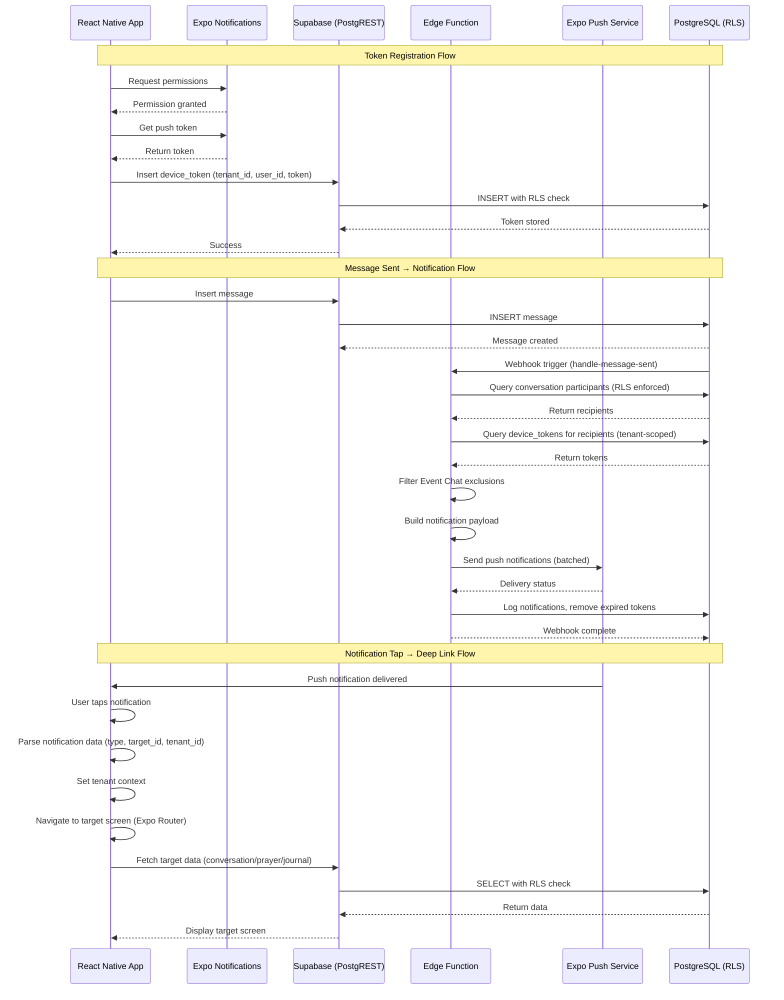

I have created the following plan after thorough exploration and analysis of the codebase. Follow the below plan verbatim. Trust the files and references. Do not re-verify what's written in the plan. Explore only when absolutely necessary. First implement all the proposed file changes and then I'll review all the changes together at the end.

## Observations

The push notification infrastructure is partially complete: the `device_tokens` table exists in the schema with proper tenant isolation, RLS policies are implemented and enforce user-scoped access within tenant memberships, and `expo-notifications` is installed. The service architecture document (`file:claude_docs/03_service_architecture.md`) already specifies Edge Functions (`send-push-notification`, `handle-message-sent`) with detailed request/response schemas. However, no client-side token management code, Edge Function implementations, or notification-specific tests exist yet. The existing integration test pattern (`file:__tests__/integration/rls-policies.test.ts`) and E2E test pattern (`file:e2e/chat.test.ts`) provide clear templates for testing approach.

## Approach

Following the strict SDD → TDD → DDD order, this phase will first create/update specification documents to capture push notification flows comprehensively, then write integration and E2E tests before any implementation. The implementation will leverage the existing `device_tokens` schema and RLS policies, focusing on client-side token lifecycle management (register, rotate, invalidate), Edge Function creation for notification delivery, and deep linking for notification tap handling. All work will use the `supabase` MCP for backend operations and `expo-docs` MCP to verify Expo Notifications APIs. The `rn-debugger` MCP will be used during test debugging to inspect runtime behavior and network requests.

## Implementation Steps

### 1. SDD: Create Push Notification Specification Document

**Objective:** Ensure `file:claude_docs/06_push_notifications.md` is comprehensive and includes all flows, test implications, and Figma references.

**Actions:**
- Review existing `file:claude_docs/06_push_notifications.md` for completeness
- Add detailed token lifecycle flows (register on app launch, rotate on token change, invalidate on logout/tenant switch)
- Document notification trigger scenarios: new message (respecting Event Chat exclusions), mention, prayer answered, pastoral journal workflow transitions
- Specify deep linking URL schemes and navigation targets for each notification type
- Add test implications section covering unit tests (token validation, payload builders), integration tests (token CRUD with RLS enforcement, tenant isolation), and E2E tests (mocked push provider, full notification flow)
- Reference Figma designs for notification UI if applicable (in-app notification display)
- Update `file:claude_docs/01_domain_glossary.md` if new domain concepts are introduced (e.g., NotificationPayload, DeepLinkTarget)

**Subagents:** Product_Manager, Backend_Expert

**MCPs:** `supabase` (verify schema alignment), `expo-docs` (verify Expo Notifications API capabilities)

**Exit Criteria:** SDD document is complete with WHAT/WHY/HOW, flows, security considerations, test implications, and Figma references; domain glossary updated if needed.

---

### 2. TDD: Write Integration Tests for Device Token Management

**Objective:** Write integration tests that verify device token CRUD operations respect RLS policies and enforce tenant isolation.

**Actions:**
- Create `file:__tests__/integration/device-token-management.test.ts` following the pattern in `file:__tests__/integration/rls-policies.test.ts`
- Write positive tests:
  - User can register device token for active tenant membership
  - User can update their own device token (token rotation scenario)
  - User can query their own device tokens within tenant scope
  - User can delete/revoke their own device token
- Write negative tests:
  - User cannot register token for tenant they're not a member of
  - User cannot access other users' device tokens
  - User cannot register token without active membership
  - Cross-tenant token access is blocked
- Use authenticated Supabase clients (anon key) with real user sessions
- Verify RLS policies enforce tenant_id and user_id constraints

**Subagents:** Quality_Assurance_Manager, Backend_Expert

**MCPs:** `supabase` (execute queries, verify RLS enforcement)

**Exit Criteria:** Integration tests written and failing (no implementation yet); tests cover positive and negative RLS scenarios for device tokens.

---

### 3. TDD: Write Unit Tests for Token Lifecycle Helpers

**Objective:** Write unit tests for client-side token management logic before implementation.

**Actions:**
- Create `file:src/features/notifications/__tests__/useDeviceToken.test.ts`
- Write tests for token registration flow:
  - Request permissions → get token → store in database
  - Handle permission denied scenario
  - Handle token retrieval failure
- Write tests for token rotation flow:
  - Detect token change on app launch
  - Update existing token record
  - Handle update failure
- Write tests for token invalidation flow:
  - Mark token as revoked on logout
  - Delete token on tenant switch
  - Handle invalidation failure
- Mock Expo Notifications API and Supabase client
- Verify correct error handling and retry logic

**Subagents:** Frontend_Expert, Quality_Assurance_Manager

**MCPs:** `expo-docs` (verify Expo Notifications API signatures)

**Exit Criteria:** Unit tests written and failing; tests cover all token lifecycle scenarios with proper mocking.

---

### 4. TDD: Write E2E Tests for Notification Flows (Mocked Provider)

**Objective:** Write E2E tests for end-to-end notification flows using mocked push provider.

**Actions:**
- Create `file:e2e/push-notifications.test.ts` following pattern in `file:e2e/chat.test.ts`
- Create helper functions in `file:e2e/helpers/notification-helpers.ts`:
  - `mockPushNotification(type, payload)` - simulate incoming push
  - `expectNotificationReceived(title, body)` - verify notification display
  - `tapNotification(notificationId)` - simulate notification tap
  - `expectDeepLinkNavigation(screen, params)` - verify navigation after tap
- Write test scenarios:
  - New message notification → tap → navigate to conversation
  - Mention notification → tap → navigate to message in conversation
  - Prayer answered notification → tap → navigate to prayer card
  - Pastoral journal notification → tap → navigate to journal entry
- Mock Expo Push Notification Service responses
- Verify notification permissions are requested on first launch
- Verify token registration happens after permission grant

**Subagents:** Quality_Assurance_Manager, Frontend_Expert

**MCPs:** `rn-debugger` (inspect runtime behavior during test execution), `ios-simulator` (capture screenshots of notification UI)

**Exit Criteria:** E2E tests written and failing; tests cover all notification types and deep linking scenarios with mocked provider.

---

### 5. TDD: Write Integration Tests for Edge Functions

**Objective:** Write integration tests for Edge Function logic before implementation.

**Actions:**
- Create `file:supabase/functions/send-push-notification/send-push-notification.test.ts`
- Write tests for notification sending logic:
  - Batch notifications in groups of 100 (Expo limit)
  - Query device tokens for target users within tenant scope
  - Build platform-specific notification payloads (iOS vs Android)
  - Handle expired/invalid tokens (remove from database)
  - Log notification delivery outcomes
  - Respect rate limits (1000 requests/minute per tenant)
- Write tests for error scenarios:
  - Invalid request (missing required fields) → 400 error
  - Unauthorized (invalid service role key) → 401 error
  - Rate limited → 429 error
  - Expo Push Service unavailable → 500 error
- Mock Expo Push Notification Service API
- Verify tenant isolation in token queries

**Subagents:** Backend_Expert, Quality_Assurance_Manager

**MCPs:** `supabase` (test database queries, verify RLS behavior)

**Exit Criteria:** Integration tests written for Edge Functions; tests cover success and error scenarios with proper mocking.

---

### 6. DDD: Implement Client-Side Token Registration

**Objective:** Implement device token registration with Expo Notifications following token lifecycle spec.

**Actions:**
- Create `file:src/features/notifications/hooks/useDeviceToken.ts`:
  - Request push notification permissions on app launch
  - Get Expo push token after permission grant
  - Store token in `device_tokens` table with tenant_id, user_id, platform
  - Handle permission denied gracefully (log, don't block app)
  - Implement token rotation: check on app launch, update if changed
- Create `file:src/features/notifications/hooks/useNotificationPermissions.ts`:
  - Check current permission status
  - Request permissions with proper user messaging
  - Handle iOS vs Android permission differences
- Create `file:src/features/notifications/utils/tokenManager.ts`:
  - `registerToken(token, tenantId, userId, platform)` - insert/update token
  - `invalidateToken(tokenId)` - mark as revoked
  - `deleteToken(tokenId)` - remove token
- Integrate token registration into auth flow (after tenant selection)
- Implement token invalidation on logout and tenant switch
- Use `useTenantContext()` to ensure tenant scope
- Add error tracking with Sentry for token registration failures

**Subagents:** Frontend_Expert, Backend_Expert

**MCPs:** `supabase` (insert/update device tokens), `expo-docs` (verify Expo Notifications API usage)

**Exit Criteria:** Token registration implemented; unit tests pass; tokens stored correctly with tenant scope; rotation and invalidation work as specified.

---

### 7. DDD: Implement Edge Function for Sending Push Notifications

**Objective:** Create `send-push-notification` Edge Function following service architecture spec.

**Actions:**
- Create `file:supabase/functions/send-push-notification/index.ts`:
  - Validate request body against schema (tenant_id, user_ids, notification object)
  - Verify service role authentication
  - Query active device tokens for target users within tenant scope
  - Build Expo push notification messages (title, body, data payload)
  - Batch messages in groups of 100
  - Send to Expo Push Notification Service
  - Handle expired tokens: remove from `device_tokens` table
  - Log all notifications to `notifications` table
  - Return success/failure counts and error details
- Implement rate limiting (1000 requests/minute per tenant)
- Add structured logging (JSON format as per `file:claude_docs/03_service_architecture.md`)
- Handle Expo Push Service errors gracefully (retry with exponential backoff)
- Create `file:supabase/functions/send-push-notification/types.ts` for request/response schemas
- Deploy Edge Function to Supabase project

**Subagents:** Backend_Expert

**MCPs:** `supabase` (deploy Edge Function, test execution, query device tokens)

**Exit Criteria:** Edge Function deployed and functional; integration tests pass; notifications sent successfully; expired tokens removed; logging works.

---

### 8. DDD: Implement Edge Function for Message Notification Trigger

**Objective:** Create `handle-message-sent` Edge Function to trigger notifications on new messages.

**Actions:**
- Create `file:supabase/functions/handle-message-sent/index.ts`:
  - Receive webhook payload from `messages` INSERT event
  - Determine notification recipients based on conversation type (church_wide, small_group, ministry, direct)
  - Filter out Event Chat excluded users (query `event_chat_exclusions` table)
  - Exclude message sender from recipients
  - Build notification payload with sender name, conversation name, message preview
  - Call `send-push-notification` Edge Function with recipient list
  - Update `conversations.updated_at` for conversation list sorting
- Set up database webhook in Supabase:
  - Trigger: `messages` table INSERT
  - Target: `handle-message-sent` Edge Function
  - Payload: full message record
- Add error handling and logging
- Verify tenant isolation in recipient queries

**Subagents:** Backend_Expert

**MCPs:** `supabase` (create webhook, deploy Edge Function, test trigger)

**Exit Criteria:** Edge Function deployed; webhook configured; notifications sent on new messages; Event Chat exclusions respected; integration tests pass.

---

### 9. DDD: Implement Notification Tap Handling and Deep Linking

**Objective:** Handle notification taps and navigate to appropriate screens with deep linking.

**Actions:**
- Create `file:src/features/notifications/hooks/useNotificationHandler.ts`:
  - Listen for notification received events (foreground)
  - Listen for notification tap events (background/killed state)
  - Parse notification data payload (type, target_id, tenant_id)
  - Navigate to appropriate screen based on notification type:
    - `new_message` → `/chat/[conversationId]`
    - `mention` → `/chat/[conversationId]?messageId=[messageId]`
    - `prayer_answered` → `/prayer/[prayerCardId]`
    - `pastoral_journal_submitted` → `/pastoral/[journalId]`
  - Ensure tenant context is set before navigation
  - Handle notification when app is not running (cold start)
- Create `file:src/features/notifications/utils/deepLinkParser.ts`:
  - Parse notification data into navigation params
  - Validate required fields (tenant_id, target_id)
  - Build Expo Router navigation paths
- Integrate notification handler into app root (`file:app/_layout.tsx`)
- Add in-app notification display for foreground notifications (toast/banner)
- Test deep linking with various notification types

**Subagents:** Frontend_Expert

**MCPs:** `expo-docs` (verify Expo Notifications API for tap handling), `rn-debugger` (inspect notification payloads and navigation behavior)

**Exit Criteria:** Notification tap handling implemented; deep linking works for all notification types; E2E tests pass; navigation respects tenant context.

---

### 10. DDD: Implement Additional Notification Triggers

**Objective:** Create Edge Functions for prayer answered and pastoral journal notification triggers.

**Actions:**
- Create `file:supabase/functions/handle-prayer-answered/index.ts`:
  - Receive webhook payload from `prayer_cards` UPDATE event (answered = true)
  - Query all recipients (individual, small_group, church_wide scope)
  - Build celebratory notification payload
  - Call `send-push-notification` with recipient list
  - Set up database webhook for `prayer_cards` UPDATE
- Create `file:supabase/functions/handle-pastoral-journal-status/index.ts`:
  - Receive webhook payload from `pastoral_journals` UPDATE event
  - Implement workflow logic:
    - `draft` → `submitted`: notify zone leader
    - `submitted` → `zone_reviewed`: notify pastors
    - `zone_reviewed` → `pastor_confirmed`: notify author
  - Query appropriate recipients based on status transition
  - Call `send-push-notification` with recipient list
  - Set up database webhook for `pastoral_journals` UPDATE
- Deploy Edge Functions and configure webhooks

**Subagents:** Backend_Expert

**MCPs:** `supabase` (deploy Edge Functions, configure webhooks, test triggers)

**Exit Criteria:** Edge Functions deployed; webhooks configured; notifications sent on prayer answered and pastoral journal status changes; integration tests pass.

---

### 11. Testing: Run Integration Tests and Verify RLS Enforcement

**Objective:** Execute integration tests to verify device token RLS policies and Edge Function behavior.

**Actions:**
- Run `file:__tests__/integration/device-token-management.test.ts`:
  - Verify positive tests pass (user can manage own tokens)
  - Verify negative tests pass (cross-tenant access blocked)
  - Confirm RLS policies enforce tenant isolation
- Run Edge Function integration tests:
  - Verify `send-push-notification` handles batching correctly
  - Verify expired tokens are removed
  - Verify rate limiting works
  - Verify error responses match spec
- Use `supabase` MCP to inspect database state after tests
- Fix any failing tests by adjusting implementation
- Document any RLS policy adjustments needed

**Subagents:** Quality_Assurance_Manager, Backend_Expert

**MCPs:** `supabase` (execute tests, inspect database, verify RLS)

**Exit Criteria:** All integration tests pass; RLS policies verified; tenant isolation confirmed; Edge Functions behave as specified.

---

### 12. Testing: Run E2E Tests with Mocked Push Provider

**Objective:** Execute E2E tests to verify end-to-end notification flows.

**Actions:**
- Run `file:e2e/push-notifications.test.ts`:
  - Verify notification permissions requested on first launch
  - Verify token registration after permission grant
  - Verify notification tap navigates to correct screen
  - Verify deep linking works for all notification types
  - Verify in-app notification display (foreground)
- Use `rn-debugger` MCP to inspect:
  - Network requests (token registration API calls)
  - Runtime logs (notification handler execution)
  - Navigation state after notification tap
- Use `ios-simulator` MCP to capture screenshots of notification UI
- Fix any failing tests by adjusting implementation
- Verify i18n is used for all notification text (title, body)

**Subagents:** Quality_Assurance_Manager, Frontend_Expert

**MCPs:** `rn-debugger` (inspect runtime behavior), `ios-simulator` (capture screenshots), `expo-docs` (verify API usage)

**Exit Criteria:** All E2E tests pass; notification flows work end-to-end; deep linking verified; screenshots captured for documentation.

---

### 13. Documentation: Update SKILL.md and Create Runbook

**Objective:** Document lessons learned and create operational runbook for push notifications.

**Actions:**
- Update `file:skills/SKILL.md`:
  - Document token lifecycle patterns learned
  - Note Expo Push Notification Service quirks/limitations
  - Document Edge Function deployment process
  - Capture debugging techniques for notification issues
- Create `file:agent_docs/06_push_notification_runbook.md`:
  - Troubleshooting guide for notification delivery failures
  - How to verify token registration
  - How to test notifications in development vs production
  - How to monitor notification delivery rates
  - How to handle Expo Push Service outages
- Update `file:claude_docs/06_push_notifications.md` with any implementation insights
- Document environment variable requirements (Expo Push Access Token)

**Subagents:** Backend_Expert, Frontend_Expert

**MCPs:** None required

**Exit Criteria:** SKILL.md updated with context; runbook created with troubleshooting steps; documentation reflects actual implementation.

---

## Mermaid Diagram: Push Notification Flow

---

## Summary Table: Implementation Phases

| Phase | Type | Subagents | MCPs | Exit Criteria |
|-------|------|-----------|------|---------------|
| 1. SDD Spec | Specification | Product_Manager, Backend_Expert | supabase, expo-docs | SDD complete with flows, test implications, Figma refs |
| 2. Integration Tests (Tokens) | Testing | QA_Manager, Backend_Expert | supabase | Tests written, failing, cover RLS scenarios |
| 3. Unit Tests (Lifecycle) | Testing | Frontend_Expert, QA_Manager | expo-docs | Tests written, failing, cover token lifecycle |
| 4. E2E Tests (Notifications) | Testing | QA_Manager, Frontend_Expert | rn-debugger, ios-simulator | Tests written, failing, cover notification flows |
| 5. Integration Tests (Edge Fns) | Testing | Backend_Expert, QA_Manager | supabase | Tests written for Edge Functions |
| 6. Token Registration | Implementation | Frontend_Expert, Backend_Expert | supabase, expo-docs | Token registration works, unit tests pass |
| 7. Edge Fn: Send Push | Implementation | Backend_Expert | supabase | Edge Function deployed, integration tests pass |
| 8. Edge Fn: Message Trigger | Implementation | Backend_Expert | supabase | Webhook configured, notifications sent on messages |
| 9. Notification Tap Handling | Implementation | Frontend_Expert | expo-docs, rn-debugger | Deep linking works, E2E tests pass |
| 10. Additional Triggers | Implementation | Backend_Expert | supabase | Prayer/journal notifications work |
| 11. Integration Test Execution | Validation | QA_Manager, Backend_Expert | supabase | All integration tests pass, RLS verified |
| 12. E2E Test Execution | Validation | QA_Manager, Frontend_Expert | rn-debugger, ios-simulator | All E2E tests pass, flows verified |
| 13. Documentation | Documentation | Backend_Expert, Frontend_Expert | None | SKILL.md updated, runbook created |

---

## Key Files to Create/Modify

### Create:
- `file:src/features/notifications/hooks/useDeviceToken.ts`
- `file:src/features/notifications/hooks/useNotificationPermissions.ts`
- `file:src/features/notifications/hooks/useNotificationHandler.ts`
- `file:src/features/notifications/utils/tokenManager.ts`
- `file:src/features/notifications/utils/deepLinkParser.ts`
- `file:src/features/notifications/__tests__/useDeviceToken.test.ts`
- `file:__tests__/integration/device-token-management.test.ts`
- `file:e2e/push-notifications.test.ts`
- `file:e2e/helpers/notification-helpers.ts`
- `file:supabase/functions/send-push-notification/index.ts`
- `file:supabase/functions/send-push-notification/types.ts`
- `file:supabase/functions/send-push-notification/send-push-notification.test.ts`
- `file:supabase/functions/handle-message-sent/index.ts`
- `file:supabase/functions/handle-prayer-answered/index.ts`
- `file:supabase/functions/handle-pastoral-journal-status/index.ts`
- `file:agent_docs/06_push_notification_runbook.md`

### Modify:
- `file:claude_docs/06_push_notifications.md` (ensure completeness)
- `file:claude_docs/01_domain_glossary.md` (add notification-related concepts if needed)
- `file:app/_layout.tsx` (integrate notification handler)
- `file:skills/SKILL.md` (document lessons learned)