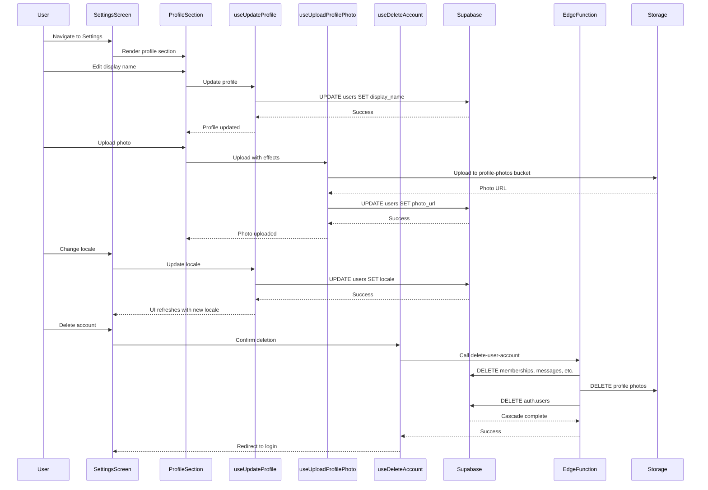

I have created the following plan after thorough exploration and analysis of the codebase. Follow the below plan verbatim. Trust the files and references. Do not re-verify what's written in the plan. Explore only when absolutely necessary. First implement all the proposed file changes and then I'll review all the changes together at the end.

## Observations

The Settings screen currently has minimal functionality—only a logout button. The database schema includes `users` table with `display_name`, `photo_url`, and `locale` columns, but lacks notification preferences storage. The i18n system and locale switching infrastructure exist via `useLocale` hook and preferences store. Translation files for Settings are complete in both English and Korean. The `imageUpload.ts` library is available for photo uploads but needs adaptation for profile photos (currently designed for message attachments). No SDD spec exists for Settings yet.

## Approach

Following SDD → TDD → DDD workflow, we'll first create a comprehensive Settings specification covering all Figma requirements (profile editing with photo effects, locale switching, notification preferences, account deletion). Then write Detox E2E tests for each Settings flow before implementation. For the backend, we'll extend the `users` table with notification preference columns and create an Edge Function for account deletion that cascades across all tenant-scoped tables. The frontend will use Tamagui components, reuse the existing `useLocale` hook, and create new hooks for profile updates and account deletion. Photo effects will use a third-party library or native image processing. All strings will use i18n keys from existing translation files.

## Implementation Steps

### 1. Create SDD Specification for Settings

**Subagents**: Product_Manager, Designer, Backend_Expert, Frontend_Expert

**Deliverable**: `file:claude_docs/21_settings.md`

Create comprehensive SDD spec covering:
- Feature scope: profile editing, locale switching, notification preferences, account management
- Figma reference: https://www.figma.com/design/6gW1h8DfD1WYH29AmJqaeW/Gagyo?node-id=221-30543
- Profile editing flows: photo upload with character effects (0%, 30%, 60%, 100%), display name editing, email display (read-only)
- Locale switching: dropdown selector with immediate UI refresh and persistence
- Notification preferences: toggles for message, prayer, journal, and system notifications
- Account deletion: confirmation dialog with warning, cascading deletion across all tenant data
- Data model: extend `users` table with notification preference columns
- Security: RLS policies for user profile updates, account deletion authorization
- Test implications: E2E tests for each Settings section, unit tests for hooks and components

**MCPs Used**:
- `figma` MCP: verify Settings UI design and photo effects feature
- `supabase` MCP: validate schema changes and RLS policies

**Exit Criteria**: SDD spec approved with complete WHAT/WHY/HOW sections, Figma references, data model changes, and test implications

---

### 2. Extend Database Schema for Notification Preferences

**Subagents**: Backend_Expert

**Deliverable**: Migration file `file:supabase/migrations/YYYYMMDD_add_notification_preferences.sql`

Add notification preference columns to `users` table:
```sql
ALTER TABLE users ADD COLUMN IF NOT EXISTS notification_preferences JSONB DEFAULT '{
  "messages": true,
  "prayers": true,
  "journals": true,
  "system": true
}'::jsonb;
```

Update `file:src/types/database.ts` to include `notification_preferences` field in `users` table type definition.

**MCPs Used**:
- `supabase` MCP: apply migration and verify schema changes

**Exit Criteria**: Migration applied successfully, types updated, notification preferences queryable

---

### 3. Create Account Deletion Edge Function

**Subagents**: Backend_Expert

**Deliverable**: `file:supabase/functions/delete-user-account/index.ts`

Implement Edge Function that:
- Verifies JWT authentication
- Cascades deletion across all user data: memberships, messages, prayer cards, pastoral journals, device tokens, notifications
- Deletes user profile photos from Supabase Storage
- Deletes auth.users record (triggers cascade to public.users)
- Returns success/error response

Include integration test: `file:supabase/functions/delete-user-account/delete-user-account.test.ts`

**MCPs Used**:
- `supabase` MCP: create Edge Function, test deletion logic, verify RLS enforcement

**Exit Criteria**: Edge Function deployed, integration tests pass, account deletion works end-to-end

---

### 4. Write Detox E2E Tests for Settings Flows (TDD)

**Subagents**: Quality_Assurance_Manager, Frontend_Expert

**Deliverable**: `file:e2e/settings.test.ts`

Write E2E tests covering:
- Navigate to Settings screen from Home
- Edit display name and save
- Upload profile photo (mock image picker)
- Apply photo effects (0%, 30%, 60%, 100%)
- Switch locale from English to Korean and verify UI refresh
- Toggle notification preferences and verify persistence
- Logout and verify redirect to login screen
- Delete account with confirmation dialog and verify account removal

Use existing E2E helpers from `file:e2e/helpers/auth-helpers.ts` and `file:e2e/helpers/navigation-helpers.ts`.

**MCPs Used**:
- `rn-debugger` MCP: inspect runtime state during test execution
- `ios-simulator` MCP: capture screenshots for visual verification

**Exit Criteria**: All E2E tests written and initially failing (TDD red phase)

---

### 5. Create Profile Update Hooks

**Subagents**: Frontend_Expert

**Deliverables**:
- `file:src/features/settings/hooks/useUpdateProfile.ts`
- `file:src/features/settings/hooks/useUploadProfilePhoto.ts`
- `file:src/features/settings/hooks/useDeleteAccount.ts`
- `file:src/features/settings/hooks/__tests__/useUpdateProfile.test.ts`
- `file:src/features/settings/hooks/__tests__/useUploadProfilePhoto.test.ts`
- `file:src/features/settings/hooks/__tests__/useDeleteAccount.test.ts`

**`useUpdateProfile` hook**:
- Accepts `{ displayName, locale, notificationPreferences }`
- Updates `users` table via Supabase
- Syncs locale change with `useLocale` hook
- Returns mutation state (loading, error, success)

**`useUploadProfilePhoto` hook**:
- Adapts `file:src/lib/imageUpload.ts` for profile photos
- Uploads to `profile-photos` storage bucket (create if needed)
- Updates `users.photo_url` column
- Handles photo effects transformation (integrate library like `expo-image-manipulator`)
- Returns upload progress and result

**`useDeleteAccount` hook**:
- Calls Edge Function `delete-user-account`
- Shows confirmation dialog before deletion
- Clears local state and redirects to login on success
- Returns mutation state

Write unit tests for each hook using Jest and mock Supabase client.

**MCPs Used**:
- `supabase` MCP: test profile updates and photo uploads
- `expo-docs` MCP: verify Expo ImagePicker and ImageManipulator APIs

**Exit Criteria**: All hooks implemented with passing unit tests

---

### 6. Create Settings UI Components

**Subagents**: Frontend_Expert, Design_System_Manager

**Deliverables**:
- `file:src/features/settings/components/ProfileSection.tsx`
- `file:src/features/settings/components/PhotoUploadButton.tsx`
- `file:src/features/settings/components/PhotoEffectsSlider.tsx`
- `file:src/features/settings/components/LocaleSelector.tsx`
- `file:src/features/settings/components/NotificationPreferences.tsx`
- `file:src/features/settings/components/AccountDeletionButton.tsx`
- `file:src/features/settings/components/__tests__/ProfileSection.test.tsx`
- `file:src/features/settings/components/__tests__/LocaleSelector.test.tsx`
- `file:src/features/settings/components/__tests__/NotificationPreferences.test.tsx`

**ProfileSection**:
- Displays current display name and email (read-only)
- Editable display name input using Tamagui `Input`
- Save button to trigger `useUpdateProfile`
- Uses i18n keys: `settings:display_name`, `settings:edit_profile`

**PhotoUploadButton**:
- Opens Expo ImagePicker on tap
- Shows current profile photo or placeholder
- Integrates with `useUploadProfilePhoto` hook
- Uses i18n key: `settings:change_avatar`

**PhotoEffectsSlider**:
- Tamagui `Slider` with values [0, 30, 60, 100]
- Preview of photo with selected effect intensity
- Applies effect on save
- Uses i18n key: `settings:photo_effects`

**LocaleSelector**:
- Tamagui `Select` component with options: English, 한국어
- Calls `useLocale().changeLocale()` on selection
- Shows current locale
- Uses i18n keys: `settings:language`, `settings:english`, `settings:korean`

**NotificationPreferences**:
- Tamagui `Switch` components for each notification type
- Toggles: messages, prayers, journals, system
- Calls `useUpdateProfile` to save preferences
- Uses i18n keys: `settings:message_notifications`, `settings:prayer_notifications`, `settings:journal_notifications`

**AccountDeletionButton**:
- Tamagui `Button` with danger variant
- Opens `AlertDialog` with warning message
- Calls `useDeleteAccount` on confirmation
- Uses i18n keys: `settings:delete_account`, `settings:delete_account_warning`

Write unit tests for each component using React Testing Library.

**MCPs Used**:
- `figma` MCP: verify component designs match Figma specs
- `expo-docs` MCP: verify ImagePicker integration

**Exit Criteria**: All components implemented with passing unit tests, Storybook stories created

---

### 7. Implement Settings Screen

**Subagents**: Frontend_Expert

**Deliverable**: Update `file:app/(tabs)/settings.tsx`

Refactor Settings screen to include:
- `ProfileSection` component at top
- `LocaleSelector` component in Appearance section
- `NotificationPreferences` component in Notifications section
- Logout button (existing)
- `AccountDeletionButton` in Danger Zone section
- Proper section grouping with Tamagui `YStack` and `Heading` components
- All strings use i18n keys from `file:locales/en/settings.json` and `file:locales/ko/settings.json`

**MCPs Used**:
- `figma` MCP: verify screen layout matches Figma design

**Exit Criteria**: Settings screen fully implemented with all sections, E2E tests pass

---

### 8. Create Profile Photo Storage Bucket and RLS Policies

**Subagents**: Backend_Expert

**Deliverable**: Migration file `file:supabase/migrations/YYYYMMDD_create_profile_photos_storage.sql`

Create Supabase Storage bucket `profile-photos` with RLS policies:
- Users can upload their own profile photos
- Users can read any profile photo (public read)
- Users can delete only their own profile photos
- Bucket size limit: 5 MB per file
- Allowed MIME types: image/jpeg, image/png, image/webp

**MCPs Used**:
- `supabase` MCP: create storage bucket, apply RLS policies, test upload/read/delete operations

**Exit Criteria**: Storage bucket created, RLS policies enforced, integration tests pass

---

### 9. Write Integration Tests for Profile Updates and Account Deletion

**Subagents**: Quality_Assurance_Manager, Backend_Expert

**Deliverables**:
- `file:__tests__/integration/profile-updates.test.ts`
- `file:__tests__/integration/account-deletion.test.ts`

**Profile Updates Integration Tests**:
- Test updating display name with valid/invalid inputs
- Test updating locale and verifying persistence
- Test updating notification preferences
- Test RLS enforcement (users can only update their own profile)

**Account Deletion Integration Tests**:
- Test account deletion cascades across all tables
- Test profile photo deletion from storage
- Test auth.users deletion
- Test unauthorized deletion attempts fail

**MCPs Used**:
- `supabase` MCP: execute integration tests against test database

**Exit Criteria**: All integration tests pass, RLS policies validated

---

### 10. Update SKILL.md with Settings Implementation Context

**Subagents**: Product_Manager

**Deliverable**: Update `file:skills/SKILL.md`

Document:
- Settings feature implementation approach
- Photo effects integration (library used, transformation logic)
- Account deletion cascade logic
- Notification preferences data model
- Lessons learned and gotchas
- Future improvements (e.g., profile photo cropping, more photo effects)

**Exit Criteria**: SKILL.md updated with comprehensive Settings context

---

### 11. Run Full E2E Test Suite and Verify Settings Flows

**Subagents**: Quality_Assurance_Manager

Run complete Detox E2E test suite including:
- `file:e2e/settings.test.ts` (new)
- `file:e2e/i18n.test.ts` (verify locale switching still works)
- `file:e2e/auth.test.ts` (verify logout still works)
- `file:e2e/home-navigation.test.ts` (verify Settings tab navigation)

**MCPs Used**:
- `rn-debugger` MCP: debug any test failures
- `ios-simulator` MCP: capture screenshots for visual regression testing

**Exit Criteria**: All E2E tests pass on both iOS and Android simulators

---

## Architecture Diagram



---

## Settings Feature Components

| Component | Purpose | Dependencies |
|-----------|---------|--------------|
| `ProfileSection` | Display and edit profile info | `useUpdateProfile`, `PhotoUploadButton` |
| `PhotoUploadButton` | Upload profile photo with effects | `useUploadProfilePhoto`, Expo ImagePicker |
| `PhotoEffectsSlider` | Select photo effect intensity | Tamagui Slider |
| `LocaleSelector` | Switch app language | `useLocale`, Tamagui Select |
| `NotificationPreferences` | Toggle notification types | `useUpdateProfile`, Tamagui Switch |
| `AccountDeletionButton` | Delete user account | `useDeleteAccount`, Tamagui AlertDialog |

---

## Database Schema Changes

| Table | Column | Type | Purpose |
|-------|--------|------|---------|
| `users` | `notification_preferences` | JSONB | Store notification toggle states |

---

## Storage Buckets

| Bucket | Purpose | RLS Policy |
|--------|---------|------------|
| `profile-photos` | User profile photos | Users can upload/delete own photos, public read |

---

## Edge Functions

| Function | Purpose | Trigger |
|----------|---------|---------|
| `delete-user-account` | Cascade delete user data | User-initiated account deletion |

---

## Test Coverage

| Test Type | File | Coverage |
|-----------|------|----------|
| E2E | `e2e/settings.test.ts` | All Settings flows |
| Integration | `__tests__/integration/profile-updates.test.ts` | Profile update RLS |
| Integration | `__tests__/integration/account-deletion.test.ts` | Account deletion cascade |
| Unit | `src/features/settings/hooks/__tests__/*.test.ts` | Hook logic |
| Unit | `src/features/settings/components/__tests__/*.test.tsx` | Component rendering |