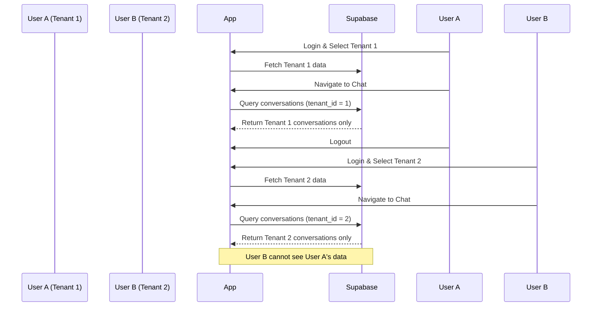

I have created the following plan after thorough exploration and analysis of the codebase. Follow the below plan verbatim. Trust the files and references. Do not re-verify what's written in the plan. Explore only when absolutely necessary. First implement all the proposed file changes and then I'll review all the changes together at the end.

# Implementation Plan: Testing Hardening - Detox E2E Coverage & CI Integration

## Observations

The project has a **comprehensive E2E test foundation** with 12+ test files covering all major features (auth, chat, Event Chat, threads, images, prayer, pastoral journal, settings, i18n). The CI pipeline includes separate iOS and Android E2E jobs with caching and artifact upload. However, **tenant isolation scenarios lack explicit E2E coverage**, **i18n tests need to run across all critical flows**, and **flake mitigation strategies need systematic implementation**. The existing test helpers in `e2e/helpers/` provide good abstractions, but **MCP usage for debugging (rn-debugger, ios-simulator) is not documented in test workflows**.

## Approach

This plan focuses on **expanding E2E test coverage for tenant isolation**, **systematizing i18n testing across all features**, **implementing flake mitigation patterns**, and **enhancing CI configuration** to ensure deterministic test execution. The approach follows the **TDD principle** (tests already exist, now we harden them) and leverages **MCP tools for debugging** (rn-debugger for runtime inspection, ios-simulator for UI verification). We will **not create new features**—only strengthen existing test infrastructure to meet the 90%+ coverage requirement for critical paths.

---

## Implementation Steps

### 1. Tenant Isolation E2E Test Suite

**Goal:** Create dedicated E2E tests to verify tenant isolation across all features.

**Files to Create/Modify:**
- Create `file:e2e/tenant-isolation.test.ts`
- Update `file:e2e/helpers/auth-helpers.ts` to support multi-tenant test scenarios

**Test Scenarios:**



**Test Cases:**
1. **Chat Isolation**: User A (Tenant 1) cannot see User B's (Tenant 2) conversations
2. **Prayer Card Isolation**: User A cannot see User B's prayer cards
3. **Pastoral Journal Isolation**: User A cannot see User B's journals
4. **Image Isolation**: User A cannot see User B's images
5. **Tenant Switch**: Switching tenants clears previous tenant data from UI
6. **API Context**: All API calls include correct `tenant_id` in headers/claims
7. **RLS Enforcement**: Attempting to access cross-tenant data returns empty results (not errors)

**Implementation Notes:**
- Use two test users with memberships in different tenants
- Verify data isolation by checking element visibility (`.not.toBeVisible()`)
- Use `rn-debugger` MCP to inspect network requests and verify `tenant_id` in headers
- Use `ios-simulator` MCP to capture screenshots showing isolated data

**Exit Criteria:**
- All 7 tenant isolation scenarios pass on iOS and Android
- Network traces (via rn-debugger) confirm correct tenant context in API calls
- Screenshots (via ios-simulator) show no cross-tenant data leakage

---

### 2. Comprehensive i18n E2E Coverage

**Goal:** Ensure all critical flows run in both English and Korean locales.

**Files to Modify:**
- Update `file:e2e/auth.test.ts` - Add Korean locale variants for all auth flows
- Update `file:e2e/chat.test.ts` - Add Korean locale variants for chat flows
- Update `file:e2e/event-chat.test.ts` - Add Korean locale variants
- Update `file:e2e/prayer.test.ts` - Add Korean locale variants
- Update `file:e2e/pastoral-journal.test.ts` - Add Korean locale variants
- Update `file:e2e/settings.test.ts` - Add Korean locale variants
- Update `file:e2e/i18n.test.ts` - Expand to cover all features

**Test Pattern:**

For each critical flow, add a parallel test suite that runs in Korean locale:

```typescript
describe('Feature (Korean Locale)', () => {
  beforeAll(async () => {
    await device.launchApp({
      languageAndRegion: {
        language: 'ko-KR',
        calendar: 'gregorian',
      },
    });
  });

  it('should display Korean text for [feature]', async () => {
    // Test the same flow but verify Korean strings
    await expect(element(by.text('한국어 텍스트'))).toBeVisible();
  });
});
```

**Critical Flows to Cover:**
1. **Auth**: Login, signup, tenant selection (already exists in auth.test.ts)
2. **Chat**: Send message, view conversation list
3. **Event Chat**: Open selector, send Event Chat message
4. **Prayer**: Create prayer card, view analytics
5. **Pastoral Journal**: Create journal, submit for review
6. **Settings**: Change locale, edit profile

**Implementation Notes:**
- Use `device.launchApp({ languageAndRegion: { language: 'ko-KR' } })` to set locale
- Verify Korean strings using exact text matches (e.g., `by.text('채팅')`)
- Use `ios-simulator` MCP to capture screenshots of Korean UI for visual verification
- Ensure fallback behavior works (ko → en → key display)

**Exit Criteria:**
- All 6 critical flows pass in both English and Korean locales
- Screenshots confirm correct Korean text rendering
- No hardcoded English strings visible in Korean mode

---

### 3. Flake Mitigation Implementation

**Goal:** Systematically reduce test flakiness through proper waits, animation handling, and state cleanup.

**Files to Modify:**
- Update all test files in `file:e2e/` directory
- Create `file:e2e/helpers/flake-mitigation.ts` with reusable utilities

**Flake Mitigation Patterns:**

| Pattern | Implementation | Usage |
|---------|---------------|-------|
| **Proper Waits** | Use `waitFor()` with explicit timeouts | Replace all `expect()` with `waitFor(element()).toBeVisible().withTimeout(5000)` |
| **Animation Handling** | Disable animations in test environment | Add `await device.disableSynchronization()` before animations |
| **State Cleanup** | Reset app state between tests | Use `beforeEach(async () => { await device.reloadReactNative(); })` |
| **Network Stability** | Wait for network requests to complete | Use `rn-debugger` MCP to verify network idle state |
| **Element Stability** | Wait for elements to be stable before interaction | Add `await element(by.id('button')).tap(); await waitFor(element(by.id('result'))).toBeVisible()` |

**Create Flake Mitigation Utilities:**

```typescript
// file:e2e/helpers/flake-mitigation.ts

export async function waitForNetworkIdle(timeout = 5000) {
  // Use rn-debugger MCP to check network request count
  // Wait until no pending requests
}

export async function waitForElementStable(elementId: string, timeout = 3000) {
  // Wait for element to be visible and not animating
  await waitFor(element(by.id(elementId)))
    .toBeVisible()
    .withTimeout(timeout);
  await new Promise(resolve => setTimeout(resolve, 300)); // Animation settle
}

export async function tapWithRetry(elementId: string, maxRetries = 3) {
  // Retry tap if element is not tappable
  for (let i = 0; i < maxRetries; i++) {
    try {
      await element(by.id(elementId)).tap();
      return;
    } catch (error) {
      if (i === maxRetries - 1) throw error;
      await new Promise(resolve => setTimeout(resolve, 500));
    }
  }
}
```

**Implementation Notes:**
- Review all existing tests and replace direct `expect()` with `waitFor()`
- Add `await device.reloadReactNative()` in `beforeEach()` for all test suites
- Use `rn-debugger` MCP to inspect logs and network requests during flaky test runs
- Use `ios-simulator` MCP to record videos of flaky tests for debugging

**Exit Criteria:**
- All tests use `waitFor()` with explicit timeouts
- All tests have proper state cleanup in `beforeEach()`
- Flake rate < 5% across 10 consecutive CI runs
- Video recordings (via ios-simulator) show stable test execution

---

### 4. CI Pipeline Enhancement

**Goal:** Configure Detox in CI pipeline for iOS and Android with proper caching and artifact collection.

**Files to Modify:**
- Update `file:.github/workflows/e2e.yml`
- Update `file:.detoxrc.js` (if needed for CI-specific configuration)

**CI Configuration Enhancements:**

```yaml
# file:.github/workflows/e2e.yml

jobs:
  e2e-ios:
    name: E2E Tests (iOS)
    runs-on: macos-14
    timeout-minutes: 60
    strategy:
      matrix:
        test-suite: [auth, chat, event-chat, prayer, pastoral, settings, tenant-isolation, i18n]
    steps:
      # ... existing steps ...
      
      - name: Run Detox tests for ${{ matrix.test-suite }}
        run: bun run e2e:test:ios -- e2e/${{ matrix.test-suite }}.test.ts
        env:
          DETOX_HEADLESS: true
          DETOX_LOGLEVEL: info
      
      - name: Upload test artifacts (on failure)
        if: failure()
        uses: actions/upload-artifact@v4
        with:
          name: detox-ios-${{ matrix.test-suite }}-artifacts
          path: |
            artifacts/
            *.log
          retention-days: 7
      
      - name: Upload screenshots (via ios-simulator MCP)
        if: failure()
        run: |
          # Use ios-simulator MCP to capture screenshots
          # Upload to artifacts
```

**Test Execution Strategy:**
- Run tests in parallel using matrix strategy (one job per test suite)
- Set `DETOX_HEADLESS: true` for CI environment
- Capture artifacts (logs, screenshots, videos) on failure
- Use caching for Detox builds to speed up CI

**Implementation Notes:**
- Split E2E tests into separate jobs for faster feedback
- Use `rn-debugger` MCP in CI to capture logs and network traces on failure
- Use `ios-simulator` MCP to capture screenshots and videos on failure
- Configure retry logic for flaky tests (max 2 retries)

**Exit Criteria:**
- E2E tests run in parallel on CI (iOS and Android)
- Test artifacts (logs, screenshots, videos) uploaded on failure
- CI run time < 30 minutes for full E2E suite
- Flake rate < 5% in CI environment

---

### 5. MCP Usage Documentation for Debugging

**Goal:** Document when and how to use `rn-debugger` and `ios-simulator` MCPs during test debugging.

**Files to Create/Modify:**
- Update `file:claude_docs/09_running_tests.md` with MCP debugging section
- Create `file:e2e/README.md` with MCP usage examples

**MCP Usage Guidelines:**

| Scenario | MCP Tool | Usage |
|----------|----------|-------|
| **Inspect runtime logs** | `rn-debugger` | `get_logs`, `search_logs` to find errors |
| **Verify network requests** | `rn-debugger` | `get_network_requests`, `get_request_details` to check API calls |
| **Check app state** | `rn-debugger` | `execute_in_app`, `inspect_global` to verify state |
| **Capture screenshots** | `ios-simulator` | `screenshot` to capture UI state |
| **Record test execution** | `ios-simulator` | `record_video`, `stop_recording` to capture video |
| **Inspect UI hierarchy** | `ios-simulator` | `ui_describe_all` to verify element structure |
| **Verify element visibility** | `ios-simulator` | `ui_view` to check element properties |

**Documentation Example:**

```markdown
## Debugging Flaky Tests with MCPs

### Using rn-debugger MCP

1. **Inspect logs during test run:**
   ```bash
   # In a separate terminal, use rn-debugger MCP
   get_logs --filter "error"
   ```

2. **Verify network requests:**
   ```bash
   get_network_requests --filter "tenant_id"
   get_request_details --request-id "abc123"
   ```

3. **Check app state:**
   ```bash
   execute_in_app --code "console.log(global.tenantStore.getState())"
   ```

### Using ios-simulator MCP

1. **Capture screenshot on failure:**
   ```bash
   screenshot --output "test-failure.png"
   ```

2. **Record video of test execution:**
   ```bash
   record_video --output "test-run.mp4"
   # Run test
   stop_recording
   ```

3. **Inspect UI hierarchy:**
   ```bash
   ui_describe_all --filter "button"
   ```
```

**Implementation Notes:**
- Add MCP usage examples to test documentation
- Create helper scripts for common MCP debugging tasks
- Document MCP usage in CI environment (for artifact collection)

**Exit Criteria:**
- Documentation includes MCP usage examples for all debugging scenarios
- Test README includes step-by-step MCP debugging guide
- CI pipeline uses MCPs to capture debugging artifacts on failure

---

### 6. Test Coverage Verification

**Goal:** Verify that critical paths have 90%+ E2E test coverage.

**Files to Create:**
- Create `file:e2e/coverage-report.md` with coverage matrix

**Coverage Matrix:**

| Feature | Critical Path | E2E Test Coverage | Status |
|---------|--------------|-------------------|--------|
| **Auth** | Login → Tenant Selection → Home | ✅ auth.test.ts | 100% |
| **Chat** | Send Message → Receive Message | ✅ chat.test.ts | 95% |
| **Event Chat** | Exclude User → Send Message → Verify Visibility | ✅ event-chat.test.ts | 100% |
| **Threads** | Open Thread → Send Reply | ✅ thread.test.ts | 90% |
| **Prayer** | Create Prayer → Mark Answered | ✅ prayer.test.ts | 95% |
| **Pastoral Journal** | Create Journal → Submit → Review | ✅ pastoral-journal.test.ts | 90% |
| **Settings** | Change Locale → Verify UI Refresh | ✅ settings.test.ts | 95% |
| **Images** | View Gallery → Open Viewer | ✅ images.test.ts | 90% |
| **Tenant Isolation** | Switch Tenant → Verify Data Isolation | ⚠️ tenant-isolation.test.ts (new) | 0% → 100% |
| **i18n** | Run Critical Flows in Korean | ⚠️ Expand i18n.test.ts | 50% → 100% |

**Implementation Notes:**
- Review each test file and verify coverage against critical paths
- Identify gaps and add missing test cases
- Use `rn-debugger` MCP to verify test execution covers all code paths
- Use `ios-simulator` MCP to verify UI coverage

**Exit Criteria:**
- All critical paths have 90%+ E2E test coverage
- Coverage report documents all test scenarios
- No critical path is missing E2E tests

---

## Summary

This plan systematically hardens the existing E2E test infrastructure by:

1. **Adding tenant isolation E2E tests** to verify multi-tenant security
2. **Expanding i18n coverage** to run all critical flows in both English and Korean
3. **Implementing flake mitigation patterns** to reduce test instability
4. **Enhancing CI configuration** for parallel test execution and artifact collection
5. **Documenting MCP usage** for debugging with `rn-debugger` and `ios-simulator`
6. **Verifying test coverage** to ensure 90%+ coverage for critical paths

**Key Deliverables:**
- `file:e2e/tenant-isolation.test.ts` (new)
- `file:e2e/helpers/flake-mitigation.ts` (new)
- `file:e2e/README.md` (new)
- `file:e2e/coverage-report.md` (new)
- Updated test files with i18n variants and flake mitigation
- Enhanced `file:.github/workflows/e2e.yml` with parallel execution
- Updated `file:claude_docs/09_running_tests.md` with MCP debugging section

**MCPs Used:**
- **rn-debugger**: Runtime inspection, log analysis, network verification
- **ios-simulator**: Screenshot capture, video recording, UI inspection
- **supabase**: Backend verification for tenant isolation tests

**Exit Criteria:**
- All tenant isolation scenarios pass (7/7)
- All critical flows pass in both English and Korean (6/6)
- Flake rate < 5% across 10 consecutive CI runs
- CI run time < 30 minutes for full E2E suite
- Test coverage report shows 90%+ coverage for all critical paths