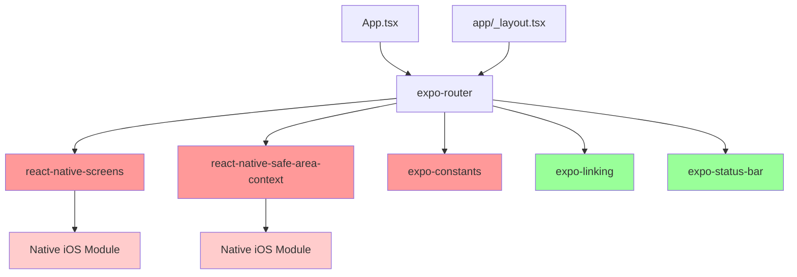

I have created the following plan after thorough exploration and analysis of the codebase. Follow the below plan verbatim. Trust the files and references. Do not re-verify what's written in the plan. Explore only when absolutely necessary. First implement all the proposed file changes and then I'll review all the changes together at the end.

## Observations

The app is experiencing a blank screen with the error "Failed to call into JavaScript module method RCTEventEmitter.receiveEvent()" because critical expo-router dependencies are missing from `file:package.json`. The codebase is already structured to use expo-router (importing from 'expo-router' in `file:App.tsx` and `file:app/_layout.tsx`), but the packages are not installed. The project uses Expo SDK 54 and Bun as the package manager.

## Approach

Install the missing expo-router dependencies using Expo's CLI to ensure SDK 54 compatibility. The `npx expo install` command automatically resolves compatible versions for the current Expo SDK. After adding dependencies to `file:package.json`, rebuild the iOS native project to link the new native modules properly, which will resolve the RCTEventEmitter error.

## Implementation Steps

### 1. Install Missing Expo Router Dependencies

Run the following command in the project root directory to install all required expo-router dependencies with SDK 54-compatible versions:

```bash
npx expo install expo-router react-native-safe-area-context react-native-screens expo-constants
```

**Why this command:**
- `npx expo install` ensures version compatibility with Expo SDK 54
- Installs the four missing packages:
  - `expo-router`: Core routing library for file-based navigation
  - `react-native-safe-area-context`: Required for safe area handling (native module)
  - `react-native-screens`: Required for native screen management (native module)
  - `expo-constants`: Required for accessing app configuration and constants

**Expected changes to `file:package.json`:**
The command will add these packages to the `dependencies` section with SDK 54-compatible versions (likely expo-router ~4.x, react-native-safe-area-context ~5.x, react-native-screens ~4.x, expo-constants ~17.x).

### 2. Verify Package Installation

After installation completes, verify that `file:package.json` contains the new dependencies:

```json
"dependencies": {
  "expo-router": "~4.x.x",
  "react-native-safe-area-context": "~5.x.x", 
  "react-native-screens": "~4.x.x",
  "expo-constants": "~17.x.x",
  // ... existing dependencies
}
```

Check that `bun.lock` has been updated with the new package resolutions.

### 3. Rebuild iOS Native Project

Since `react-native-safe-area-context` and `react-native-screens` include native iOS modules that need to be linked, rebuild the iOS app:

```bash
npx expo run:ios
```

**What this does:**
- Regenerates the iOS native project with the new native modules
- Links the native code from react-native-safe-area-context and react-native-screens
- Registers the native modules with React Native's module registry (fixing the RCTEventEmitter error)
- Builds and launches the app on iOS Simulator

**Alternative if issues persist:**
If the error continues, perform a clean rebuild:

```bash
# Clean iOS build artifacts
rm -rf ios/build

# Regenerate native projects
npx expo prebuild --clean

# Rebuild iOS
npx expo run:ios
```

### 4. Verify App Loads Successfully

After the rebuild completes and the app launches:

**Expected behavior:**
- The app should progress past the i18n initialization logs
- No "Failed to call into JavaScript module method RCTEventEmitter.receiveEvent()" error
- The app should render the authentication screen (login) or main tabs depending on auth state

**Console logs to verify:**
```
LOG  [App] i18n initialized successfully
LOG  [App] Setting i18n ready to true
```

Followed by successful navigation without RCTEventEmitter errors.

## Dependency Diagram



**Legend:**
- 🔴 Red: Missing dependencies (need to install)
- 🟢 Green: Already present in package.json
- 🔶 Pink: Native modules requiring rebuild

## Notes

- The `npx expo install` command is preferred over `bun add` because it ensures Expo SDK compatibility
- The native rebuild is critical - without it, the native modules won't be registered, causing the RCTEventEmitter error
- The warnings about "ExpoRouterNativeLinkPreview" are separate issues and won't prevent the app from loading
- The Linking scheme warning will be addressed in a subsequent phase