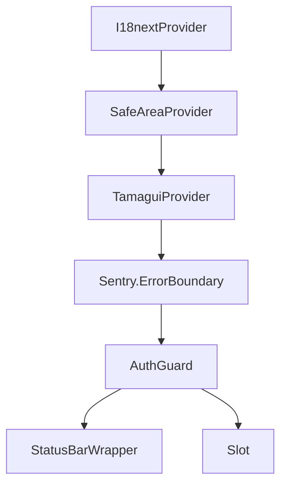

I have created the following plan after thorough exploration and analysis of the codebase. Follow the below plan verbatim. Trust the files and references. Do not re-verify what's written in the plan. Explore only when absolutely necessary. First implement all the proposed file changes and then I'll review all the changes together at the end.

## Observations

The current `file:app/_layout.tsx` has a proper expo-router structure with i18n initialization, Tamagui theming, and Sentry error boundary. However, it's missing the `SafeAreaProvider` wrapper from `react-native-safe-area-context`, which is essential for proper safe area handling and can resolve the `RCTEventEmitter` registration errors. The package `react-native-safe-area-context` (~5.6.0) is already installed as a peer dependency of expo-router, so only the import and component wrapping are needed.

## Approach

Add `SafeAreaProvider` from `react-native-safe-area-context` to wrap the app content in `file:app/_layout.tsx`. Position it between `I18nextProvider` and `TamaguiProvider` to ensure safe area context is available throughout the component tree. This follows expo-router best practices and should resolve the RCTEventEmitter errors by properly registering native event handlers for safe area insets.

## Implementation Steps

### 1. Add SafeAreaProvider Import

In `file:app/_layout.tsx`, add the import statement for `SafeAreaProvider` at the top of the file with other imports (around line 8-10):

```typescript
import { SafeAreaProvider } from 'react-native-safe-area-context';
```

### 2. Wrap Content with SafeAreaProvider

In the `RootLayout` component's return statement (currently lines 188-196), wrap the `TamaguiProvider` and its children with `SafeAreaProvider`. The new component hierarchy should be:

- `I18nextProvider` (outermost)
  - `SafeAreaProvider` (NEW)
    - `TamaguiProvider`
      - `Sentry.ErrorBoundary`
        - `AuthGuard`

Update the return statement structure:

```typescript
return (
  <I18nextProvider i18n={i18n}>
    <SafeAreaProvider>
      <TamaguiProvider config={config} defaultTheme={theme}>
        <Sentry.ErrorBoundary fallback={ErrorFallback}>
          <AuthGuard />
        </Sentry.ErrorBoundary>
      </TamaguiProvider>
    </SafeAreaProvider>
  </I18nextProvider>
);
```

### 3. Verify Component Hierarchy

Ensure the final component tree follows this structure:



### 4. No Additional Configuration Required

Since `react-native-safe-area-context` is already installed and is a peer dependency of expo-router, no additional package installation or configuration is needed. The SafeAreaProvider will automatically:
- Register native event handlers for safe area insets
- Provide safe area context to all child components via `useSafeAreaInsets` hook
- Resolve RCTEventEmitter registration issues

### 5. Testing Verification

After implementing the changes, verify:
- The app loads without the blank screen
- No RCTEventEmitter errors appear in console
- Safe area insets are properly applied (check on devices with notches/home indicators)
- All existing functionality remains intact

## Summary

| File | Changes |
|------|---------|
| `file:app/_layout.tsx` | Add `SafeAreaProvider` import and wrap `TamaguiProvider` with it |

This minimal change adds the missing safe area context provider, following expo-router best practices and resolving the RCTEventEmitter registration errors that prevent the app from loading properly.