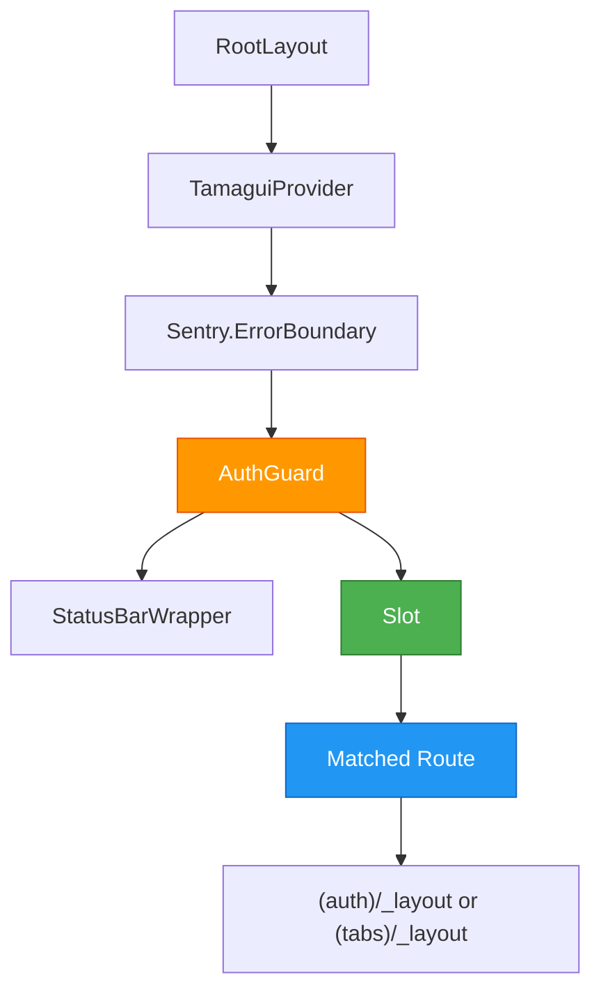

I have created the following plan after thorough exploration and analysis of the codebase. Follow the below plan verbatim. Trust the files and references. Do not re-verify what's written in the plan. Explore only when absolutely necessary. First implement all the proposed file changes and then I'll review all the changes together at the end.

## Observations

The current `file:app/_layout.tsx` incorrectly accepts a `children` prop and renders it directly (lines 109, 126). This violates expo-router's layout pattern. The nested layouts (`file:app/(auth)/_layout.tsx` and `file:app/(tabs)/_layout.tsx`) correctly use expo-router navigation components (`Stack`, `Tabs`) without accepting children. The root layout must use the `Slot` component from expo-router to properly render matched child routes. The `AuthGuard` component also incorrectly accepts and renders children (lines 76, 106).

## Approach

Replace the children-based pattern with expo-router's `Slot` component in both `RootLayout` and `AuthGuard`. Import `Slot` from 'expo-router', remove all `children` parameters and `ReactNode` type imports, and render `<Slot />` where child routes should appear. This aligns with expo-router's architecture where `Slot` acts as a placeholder for the current matched route, ensuring proper route rendering and navigation behavior.

## Implementation Steps

### 1. Update Imports in `file:app/_layout.tsx`

**Location**: Lines 4-15

**Changes**:
- Add `Slot` to the existing import from 'expo-router': `import { useRouter, useSegments, Slot } from 'expo-router';`
- Remove `type { ReactNode }` import from line 7 (no longer needed)

### 2. Refactor AuthGuard Component

**Location**: Lines 76-107

**Changes**:
- Remove the `children` parameter from the `AuthGuard` function signature
- Change line 76 from `function AuthGuard({ children }: { children: ReactNode })` to `function AuthGuard()`
- Replace line 106 `return <>{children}</>;` with `return <Slot />;`

**Rationale**: The `AuthGuard` should render the matched route via `Slot`, not accept children. The navigation logic (lines 83-104) remains unchanged as it correctly handles redirects based on auth state.

### 3. Refactor RootLayout Component

**Location**: Lines 109-131

**Changes**:
- Remove the `children` parameter from the `RootLayout` function signature
- Change line 109 from `export default function RootLayout({ children }: { children: ReactNode })` to `export default function RootLayout()`
- Replace line 126 `{children}` with `<Slot />`

**Rationale**: The root layout should use `Slot` to render the matched child route. The provider hierarchy (TamaguiProvider, ErrorBoundary, AuthGuard) remains the same, but the actual route rendering is delegated to `Slot`.

### 4. Verify Component Structure

**Final Structure** (lines 121-130):
```
<TamaguiProvider config={config} defaultTheme={theme}>
  <Sentry.ErrorBoundary fallback={ErrorFallback}>
    <AuthGuard>
      <StatusBarWrapper />
      <Slot />
    </AuthGuard>
  </Sentry.ErrorBoundary>
</TamaguiProvider>
```

**Note**: `StatusBarWrapper` (line 125) remains as a sibling to `Slot` since it's a global UI element, not a route-specific component.

## Architecture Diagram



## Expected Outcome

After these changes, expo-router will properly render matched routes through the `Slot` component. The navigation flow remains: unauthenticated users → login, authenticated without tenant → tenant-selection, authenticated with tenant → tabs. The error "Module has not been registered as callable" should be resolved as `Slot` properly integrates with expo-router's navigation system.