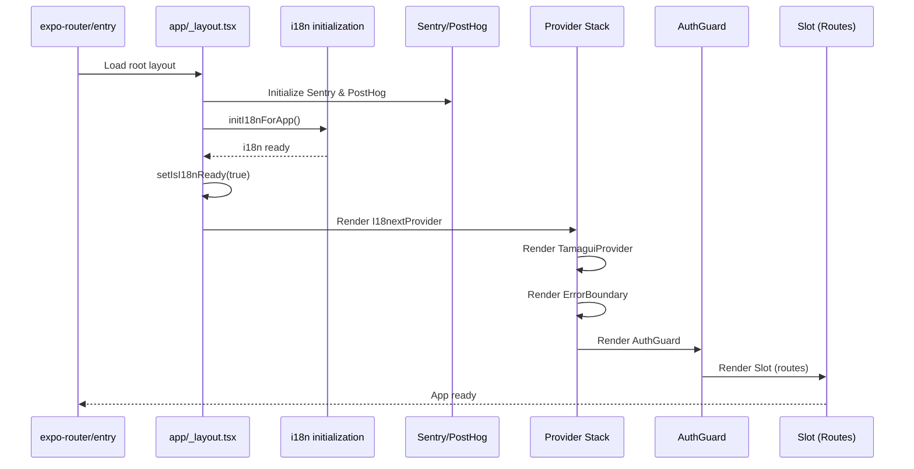

I have created the following plan after thorough exploration and analysis of the codebase. Follow the below plan verbatim. Trust the files and references. Do not re-verify what's written in the plan. Explore only when absolutely necessary. First implement all the proposed file changes and then I'll review all the changes together at the end.

## Observations

The app is experiencing a critical `RCTEventEmitter.receiveEvent()` error because it's using an incompatible architecture with expo-router. Currently, `file:index.ts` registers `file:App.tsx` which uses `ExpoRoot` with a custom context, while `file:app/_layout.tsx` also acts as a layout with `Slot`. This creates a double-layout conflict where native modules aren't properly registered. The i18n initialization works (logs show successful initialization), but the routing system fails afterward. All required dependencies (`expo-router`, `react-native-safe-area-context`, `react-native-screens`) are already installed.

## Approach

The solution follows expo-router's official architecture: use `expo-router/entry` as the entry point and consolidate all initialization logic into `file:app/_layout.tsx`. This eliminates the conflicting double-layout setup. We'll move i18n initialization, monitoring setup, and the `I18nextProvider` wrapper from `file:App.tsx` into `file:app/_layout.tsx`, using a loading state pattern to prevent rendering before i18n is ready. This ensures proper module registration and resolves the RCTEventEmitter error while maintaining all existing functionality.

## Implementation Steps

### 1. Update Package.json Entry Point

Modify `file:package.json` to change the `main` field from `"index.ts"` to `"expo-router/entry"`. This tells Expo to use the standard expo-router entry point instead of the custom `file:index.ts` file.

**File**: `file:package.json`
- Change line 4: `"main": "expo-router/entry"`

### 2. Remove Custom Entry Point Files

Delete or rename `file:App.tsx` and `file:index.ts` as they are no longer needed with `expo-router/entry`. You can rename them to `App.tsx.backup` and `index.ts.backup` if you want to keep them for reference.

**Files to remove/rename**:
- `file:App.tsx`
- `file:index.ts`

### 3. Consolidate Initialization in Root Layout

Update `file:app/_layout.tsx` to handle all initialization logic that was previously in `file:App.tsx`. This includes:

**Add imports** at the top of the file:
- Import `initI18nForApp` from `@/i18n/init`
- Import `i18nInstance` from `@/i18n`
- Import `I18nextProvider` from `react-i18next`
- Import `useState` from `react`
- Import `ActivityIndicator`, `StyleSheet` from `react-native`
- Import `initPostHog` from `@/lib/monitoring/posthog`
- Import `initSentry` from `@/lib/monitoring/sentry`

**Add initialization logic** in the `RootLayout` component:
- Add state: `const [isI18nReady, setIsI18nReady] = useState(false)`
- Add monitoring initialization in a `useEffect` (runs once on mount):
  ```
  useEffect(() => {
    try {
      initSentry({ dsn: process.env.SENTRY_DSN! });
    } catch (e) {
      console.error('[App] Sentry init failed:', e);
    }
    try {
      initPostHog({ apiKey: process.env.EXPO_PUBLIC_POSTHOG_API_KEY! });
    } catch (e) {
      console.error('[App] PostHog init failed:', e);
    }
  }, []);
  ```
- Add i18n initialization in a `useEffect` (runs once on mount):
  ```
  useEffect(() => {
    const initializeI18n = async () => {
      console.log('[App] Starting i18n initialization...');
      try {
        await initI18nForApp();
        console.log('[App] i18n initialized successfully');
      } catch (error) {
        console.error('[App] Failed to initialize i18n:', error);
      } finally {
        console.log('[App] Setting i18n ready to true');
        setIsI18nReady(true);
      }
    };
    void initializeI18n();
  }, []);
  ```

**Add loading screen component** before the `RootLayout` function:
```
function LoadingScreen() {
  return (
    <View style={styles.loadingContainer}>
      <ActivityIndicator size="large" color="#007AFF" />
    </View>
  );
}

const styles = StyleSheet.create({
  loadingContainer: {
    flex: 1,
    alignItems: 'center',
    justifyContent: 'center',
    backgroundColor: '#fff',
  },
});
```

**Update the return statement** in `RootLayout`:
- Add conditional rendering: `if (!isI18nReady) return <LoadingScreen />;`
- Wrap the existing `TamaguiProvider` with `I18nextProvider`:
  ```
  return (
    <I18nextProvider i18n={i18nInstance}>
      <TamaguiProvider config={config} defaultTheme={theme}>
        <Sentry.ErrorBoundary fallback={ErrorFallback}>
          <AuthGuard />
        </Sentry.ErrorBoundary>
      </TamaguiProvider>
    </I18nextProvider>
  );
  ```

**File**: `file:app/_layout.tsx`

### 4. Verify Provider Hierarchy

Ensure the provider hierarchy in `file:app/_layout.tsx` follows this order (outermost to innermost):
1. `I18nextProvider` - i18n context
2. `TamaguiProvider` - UI theme and components
3. `Sentry.ErrorBoundary` - Error handling
4. `AuthGuard` - Authentication and routing logic (contains `Slot`)

This order ensures i18n is available to all components, Tamagui can use translations, and errors are caught properly.

### 5. Clean Build After Changes

After making these changes, perform a complete clean build:
1. Stop the Metro bundler
2. Delete `node_modules` directory
3. Delete iOS build artifacts: `rm -rf ios/build`
4. Clear Metro cache: `npx expo start --clear`
5. Reinstall dependencies: `npm install` or `bun install`
6. Rebuild the app: `npx expo run:ios`

This ensures all native modules are properly linked and registered with the new entry point configuration.

## Architecture Diagram



## Key Files Modified

| File | Action | Purpose |
|------|--------|---------|
| `file:package.json` | Modify | Change entry point to `expo-router/entry` |
| `file:App.tsx` | Delete/Rename | Remove custom root component |
| `file:index.ts` | Delete/Rename | Remove custom entry point |
| `file:app/_layout.tsx` | Update | Consolidate all initialization logic |